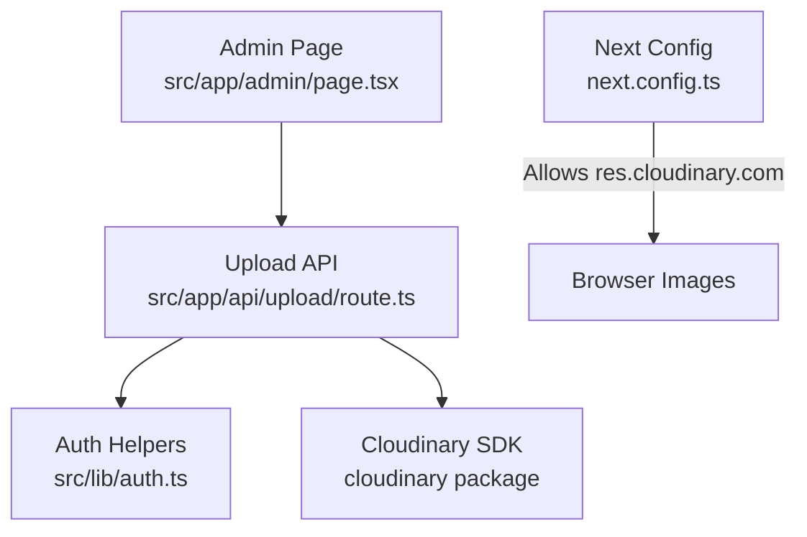
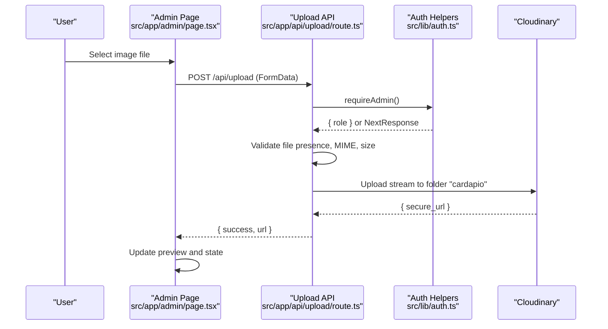
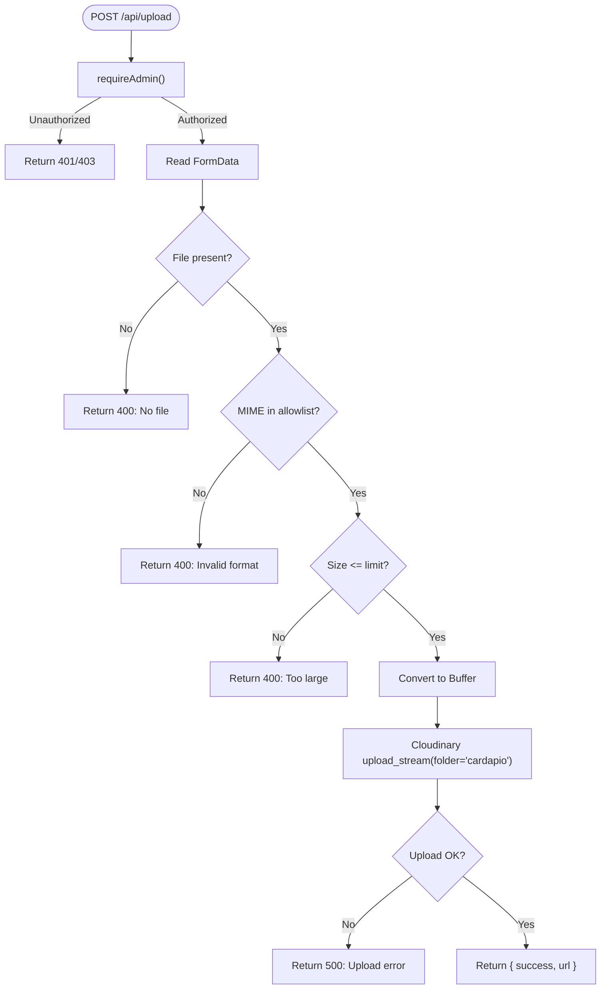
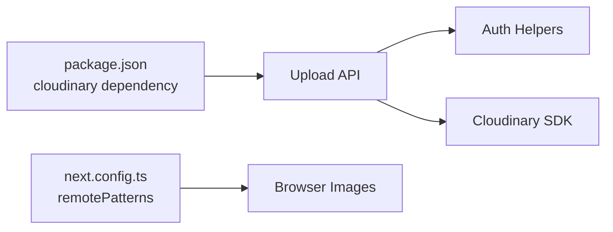

# File Upload & Media Management

<cite>
**Referenced Files in This Document**
- [route.ts](file://src/app/api/upload/route.ts)
- [auth.ts](file://src/lib/auth.ts)
- [page.tsx](file://src/app/admin/page.tsx)
- [next.config.ts](file://next.config.ts)
- [package.json](file://package.json)
</cite>

## Table of Contents
1. [Introduction](#introduction)
2. [Project Structure](#project-structure)
3. [Core Components](#core-components)
4. [Architecture Overview](#architecture-overview)
5. [Detailed Component Analysis](#detailed-component-analysis)
6. [Dependency Analysis](#dependency-analysis)
7. [Performance Considerations](#performance-considerations)
8. [Troubleshooting Guide](#troubleshooting-guide)
9. [Conclusion](#conclusion)
10. [Appendices](#appendices)

## Introduction
This document explains the file upload and media management functionality for product images and other assets, powered by Cloudinary. It covers the server-side upload API endpoint (validation, size limits, format restrictions, security), Cloudinary integration for image optimization and CDN delivery, the frontend upload interface behavior, processing workflows, security considerations, performance optimizations, and guidelines to extend the system for additional file types and custom processing.

## Project Structure
The upload feature spans a Next.js App Router API route, an admin UI page that triggers uploads, authentication helpers, and Next.js configuration for remote image domains.

**Diagram sources**
- [route.ts:1-58](file://src/app/api/upload/route.ts#L1-L58)
- [auth.ts:51-78](file://src/lib/auth.ts#L51-L78)
- [next.config.ts:3-11](file://next.config.ts#L3-L11)
- [package.json:17-30](file://package.json#L17-L30)

**Section sources**
- [route.ts:1-58](file://src/app/api/upload/route.ts#L1-L58)
- [page.tsx:76-103](file://src/app/admin/page.tsx#L76-L103)
- [auth.ts:51-78](file://src/lib/auth.ts#L51-L78)
- [next.config.ts:3-11](file://next.config.ts#L3-L11)
- [package.json:17-30](file://package.json#L17-L30)

## Core Components
- Upload API endpoint: Validates incoming files, enforces allowed formats and size limits, requires admin authorization, and uploads to Cloudinary using a streaming uploader into a dedicated folder.
- Authentication: Enforces admin-only access via cookie-based roles.
- Frontend: An admin page with a file input that sends FormData to the upload endpoint and updates the preview on success.
- Next.js configuration: Whitelists Cloudinary’s CDN domain for optimized image delivery.

Key responsibilities:
- Validate file presence, MIME type, and size.
- Protect the endpoint with admin role checks.
- Stream files to Cloudinary and return secure URLs.
- Display progress and errors in the UI.

**Section sources**
- [route.ts:11-53](file://src/app/api/upload/route.ts#L11-L53)
- [auth.ts:51-78](file://src/lib/auth.ts#L51-L78)
- [page.tsx:76-103](file://src/app/admin/page.tsx#L76-L103)
- [next.config.ts:3-11](file://next.config.ts#L3-L11)

## Architecture Overview
The end-to-end flow from browser to Cloudinary and back:

**Diagram sources**
- [route.ts:14-53](file://src/app/api/upload/route.ts#L14-L53)
- [auth.ts:51-78](file://src/lib/auth.ts#L51-L78)
- [page.tsx:76-103](file://src/app/admin/page.tsx#L76-L103)

## Detailed Component Analysis

### Upload API Endpoint
Responsibilities:
- Require admin authentication before processing any upload.
- Parse multipart form data and extract the file.
- Validate file presence, MIME type against an allowlist, and enforce a maximum size.
- Convert the file to a buffer and stream it to Cloudinary under a specific folder.
- Return a JSON response with a secure URL on success or appropriate error codes/messages.

Security measures:
- Role-based access control ensures only admins can upload.
- Strict allowlist of image MIME types prevents non-image uploads.
- Size limit protects against large payloads and resource exhaustion.
- Errors are sanitized to avoid leaking internal details.

Processing notes:
- Uses Cloudinary’s upload_stream to handle binary data efficiently.
- Stores assets under a dedicated folder for organization and easy cleanup.

Extensibility:
- Add new MIME types to the allowlist to support more image formats.
- Adjust size limits based on business needs.
- Integrate malware scanning or content inspection before uploading if required.

**Section sources**
- [route.ts:1-58](file://src/app/api/upload/route.ts#L1-L58)
- [auth.ts:51-78](file://src/lib/auth.ts#L51-L78)

#### Upload API Flowchart

**Diagram sources**
- [route.ts:14-53](file://src/app/api/upload/route.ts#L14-L53)

### Authentication Integration
- The upload endpoint calls a helper that reads session cookies and enforces admin-only access.
- If not authenticated or not authorized, the endpoint returns early with an appropriate response.

Operational impact:
- Prevents unauthorized users from consuming Cloudinary quotas or exposing endpoints.
- Centralizes role checks for reuse across protected routes.

**Section sources**
- [auth.ts:51-78](file://src/lib/auth.ts#L51-L78)
- [route.ts:14-16](file://src/app/api/upload/route.ts#L14-L16)

### Frontend Upload Interface
Behavior:
- The admin page provides a file input constrained to images.
- On selection, it creates FormData and posts to /api/upload.
- Displays a loading indicator while uploading and shows a preview upon success.
- Handles network and server errors with user-facing alerts.

Current limitations:
- No drag-and-drop implementation is present in the current codebase.
- No client-side validation beyond accept attribute; server-side validation is authoritative.
- No progress tracking during upload; status is inferred from a boolean flag.

Recommendations:
- Implement drag-and-drop zone with visual feedback.
- Add client-side checks for MIME and size to fail fast.
- Show real-time progress using chunked uploads or server-sent events if needed.

**Section sources**
- [page.tsx:76-103](file://src/app/admin/page.tsx#L76-L103)
- [page.tsx:266-284](file://src/app/admin/page.tsx#L266-L284)

### Cloudinary Integration and CDN Delivery
- The API configures the Cloudinary SDK using environment variables for cloud name, API key, and secret.
- Files are uploaded to a dedicated folder for organizational clarity.
- Next.js is configured to allow images from Cloudinary’s CDN, enabling optimized delivery and caching.

Optimization and transformations:
- The current upload does not specify transformation parameters; rely on Cloudinary’s default optimization.
- You can add transformations (resize, crop, quality, format) at upload time or via URL parameters for on-the-fly delivery.

**Section sources**
- [route.ts:5-9](file://src/app/api/upload/route.ts#L5-L9)
- [route.ts:43-51](file://src/app/api/upload/route.ts#L43-L51)
- [next.config.ts:3-11](file://next.config.ts#L3-L11)

## Dependency Analysis
External dependencies relevant to uploads:
- Cloudinary SDK: Used to authenticate and upload images securely to Cloudinary.
- Next.js Image Optimization: Configured to serve images from Cloudinary’s CDN.

Internal dependencies:
- Authentication helpers ensure only admins can trigger uploads.
- Admin UI composes the user experience for selecting and uploading images.

**Diagram sources**
- [package.json:17-30](file://package.json#L17-L30)
- [route.ts:1-58](file://src/app/api/upload/route.ts#L1-L58)
- [next.config.ts:3-11](file://next.config.ts#L3-L11)

**Section sources**
- [package.json:17-30](file://package.json#L17-L30)
- [route.ts:1-58](file://src/app/api/upload/route.ts#L1-L58)
- [next.config.ts:3-11](file://next.config.ts#L3-L11)

## Performance Considerations
- Streaming upload: The API uses a stream to send binary data directly to Cloudinary, minimizing memory usage and improving throughput for larger files.
- Allowed formats and size limits reduce unnecessary processing and protect resources.
- CDN delivery via Cloudinary improves load times globally through edge caching.

Recommended enhancements:
- Chunked uploads for very large files to improve resilience and perceived performance.
- Client-side compression or resizing before upload to reduce payload size.
- Parallel uploads for multiple assets when editing products with several images.
- Cache busting or versioned URLs when replacing images to ensure immediate propagation.

[No sources needed since this section provides general guidance]

## Troubleshooting Guide
Common issues and resolutions:
- Unauthorized access: Ensure the user has an active admin session; verify cookies and roles.
- Invalid file format: Only images in the allowlist are accepted; update the allowlist if supporting new formats.
- File too large: Reduce file size or adjust the size limit in the API.
- Network errors: Check connectivity and retry logic in the frontend; log detailed errors for debugging.
- Cloudinary upload failures: Inspect server logs for Cloudinary-specific errors; verify environment variables for credentials.

Operational tips:
- Log errors with context but avoid exposing sensitive details to clients.
- Use consistent error shapes to simplify client handling.
- Monitor Cloudinary usage and quota to prevent service disruptions.

**Section sources**
- [route.ts:14-58](file://src/app/api/upload/route.ts#L14-L58)
- [page.tsx:76-103](file://src/app/admin/page.tsx#L76-L103)

## Conclusion
The upload system provides a secure, validated, and efficient path for adding product images via Cloudinary. It enforces admin-only access, validates file types and sizes, streams uploads to Cloudinary, and delivers optimized images through the CDN. The frontend offers a simple upload flow with basic feedback. Future enhancements can include drag-and-drop, richer progress indicators, client-side preprocessing, and advanced transformations for further performance and flexibility.

[No sources needed since this section summarizes without analyzing specific files]

## Appendices

### API Definition: Upload Endpoint
- Method: POST
- Path: /api/upload
- Headers: None required (uses cookies for auth)
- Body: multipart/form-data with field named "file"
- Validation:
  - File must be present
  - MIME type must be one of the allowed image types
  - File size must not exceed the configured limit
- Security: Requires admin role
- Response:
  - Success: JSON with success flag and secure URL
  - Error: JSON with error message and appropriate HTTP status

**Section sources**
- [route.ts:14-53](file://src/app/api/upload/route.ts#L14-L53)

### Extending the System
To support additional file types:
- Update the allowlist of MIME types in the API.
- Optionally add client-side accept attributes and validation.
- Consider adding metadata tagging in Cloudinary for categorization.

To implement custom processing workflows:
- Configure Cloudinary transformations at upload time (e.g., resize, crop, quality).
- Use Cloudinary’s upload presets for predefined transformation pipelines.
- Integrate external services for malware scanning or content moderation before finalizing uploads.

[No sources needed since this section provides general guidance]