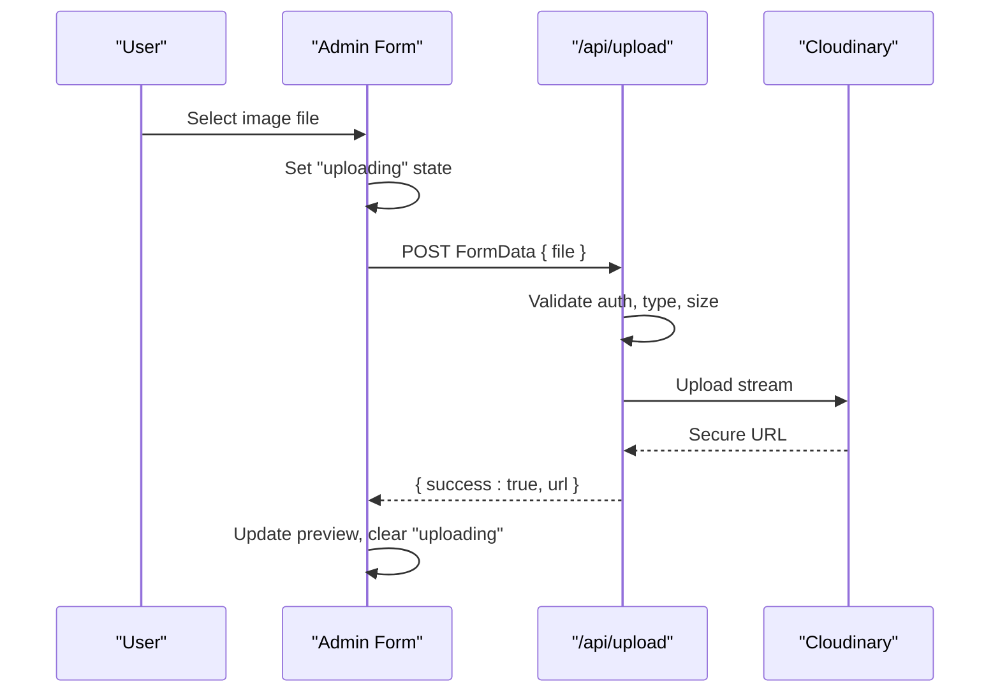
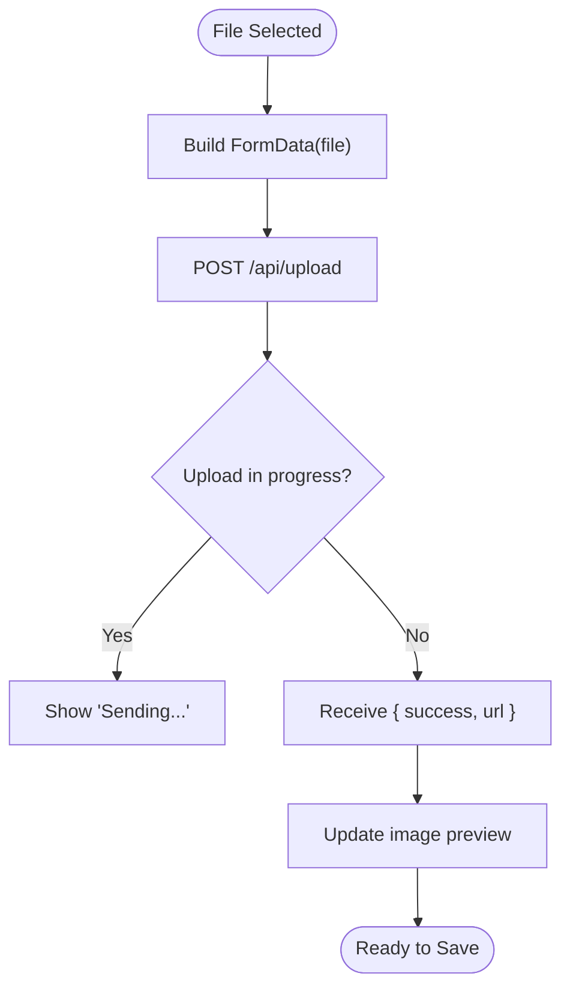
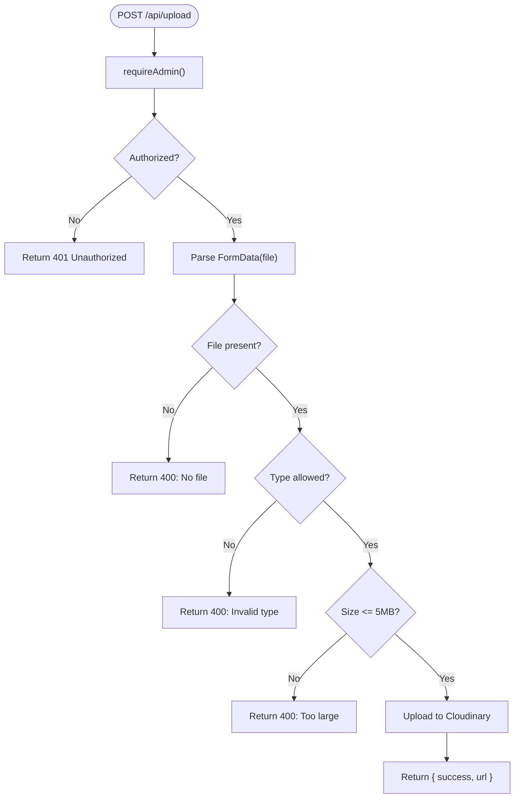
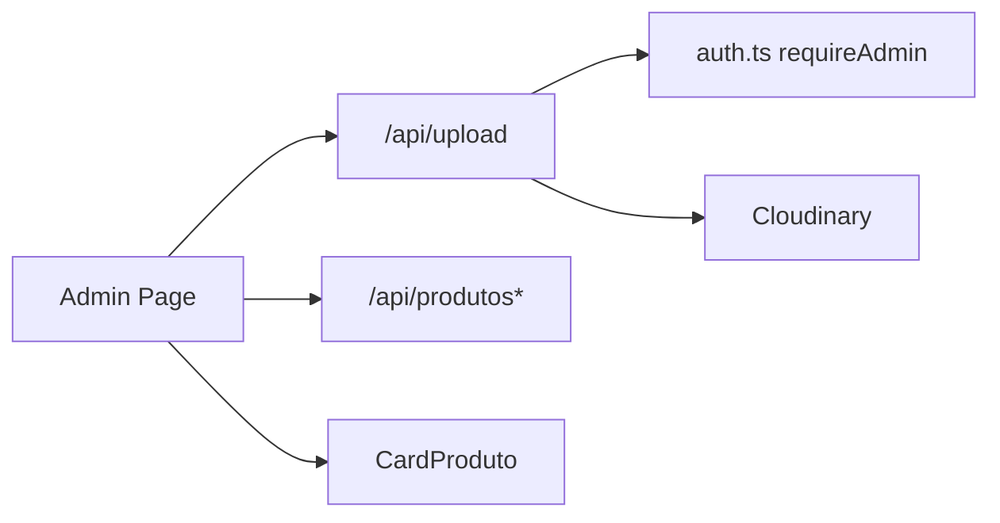

# Frontend Upload Interface

<cite>
**Referenced Files in This Document**
- [CardProduto.tsx](file://src/components/CardProduto.tsx)
- [admin/page.tsx](file://src/app/admin/page.tsx)
- [upload/route.ts](file://src/app/api/upload/route.ts)
- [auth.ts](file://src/lib/auth.ts)
- [globals.css](file://src/app/globals.css)
</cite>

## Table of Contents
1. [Introduction](#introduction)
2. [Project Structure](#project-structure)
3. [Core Components](#core-components)
4. [Architecture Overview](#architecture-overview)
5. [Detailed Component Analysis](#detailed-component-analysis)
6. [Dependency Analysis](#dependency-analysis)
7. [Performance Considerations](#performance-considerations)
8. [Troubleshooting Guide](#troubleshooting-guide)
9. [Conclusion](#conclusion)
10. [Appendices](#appendices)

## Introduction
This document explains the frontend upload interface for product images, focusing on user experience and component implementation. It covers how the admin form handles file selection, integrates with the upload API, provides progress feedback, and renders previews. It also documents responsive design considerations, accessibility features present in the codebase, and customization points for styling and validation.

## Project Structure
The upload flow spans a client-side admin page and a server-side API route:
- Admin UI: The admin page includes an image input that triggers uploads to the API endpoint.
- API Endpoint: The upload route validates and stores images via Cloudinary, returning a secure URL.
- Display: The product card displays uploaded images when available.

```mermaid
graph TB
subgraph "Client"
A["Admin Page<br/>Form + File Input"]
B["Product Card<br/>Image Display"]
end
subgraph "Server"
C["Upload API Route<br/>Validation + Cloudinary"]
end
A --> |POST /api/upload (FormData)| C
C --> |JSON { success, url }| A
A --> |Save product with image URL| C
B --> |Render image URL| A
```

**Diagram sources**
- [admin/page.tsx:77-103](file://src/app/admin/page.tsx#L77-L103)
- [upload/route.ts:14-57](file://src/app/api/upload/route.ts#L14-L57)
- [CardProduto.tsx:22-31](file://src/components/CardProduto.tsx#L22-L31)

**Section sources**
- [admin/page.tsx:185-306](file://src/app/admin/page.tsx#L185-L306)
- [upload/route.ts:1-58](file://src/app/api/upload/route.ts#L1-L58)
- [CardProduto.tsx:1-51](file://src/components/CardProduto.tsx#L1-L51)

## Core Components
- Admin Image Upload Form: Provides a native file input, shows a “sending” indicator while uploading, and previews the selected image after successful upload.
- Upload API Route: Validates file presence, MIME type, and size; uploads to Cloudinary; returns a JSON response with success status and image URL.
- Product Card: Displays the product image if provided; otherwise uses a default placeholder.

Key responsibilities:
- Client-side: Collect file, send FormData, update state on success, show loading/preview.
- Server-side: Enforce allowed types and size limits, authenticate admin access, persist to Cloudinary, return URL.

**Section sources**
- [admin/page.tsx:77-103](file://src/app/admin/page.tsx#L77-L103)
- [admin/page.tsx:266-284](file://src/app/admin/page.tsx#L266-L284)
- [upload/route.ts:11-38](file://src/app/api/upload/route.ts#L11-L38)
- [upload/route.ts:40-53](file://src/app/api/upload/route.ts#L40-L53)
- [CardProduto.tsx:22-31](file://src/components/CardProduto.tsx#L22-L31)

## Architecture Overview
The upload architecture follows a simple request/response pattern with clear separation between UI and backend logic.



**Diagram sources**
- [admin/page.tsx:77-103](file://src/app/admin/page.tsx#L77-L103)
- [upload/route.ts:14-53](file://src/app/api/upload/route.ts#L14-L53)

## Detailed Component Analysis

### Admin Image Upload Flow
- File selection: Uses a standard file input with accept="image/*".
- Upload handling: Creates FormData, posts to /api/upload, sets a loading flag during transfer.
- Feedback: Shows a pulsing text message while uploading; displays a small preview once the URL is received.
- Integration with save: Prevents saving until upload completes; disables submit during upload.



**Diagram sources**
- [admin/page.tsx:77-103](file://src/app/admin/page.tsx#L77-L103)
- [admin/page.tsx:266-284](file://src/app/admin/page.tsx#L266-L284)

**Section sources**
- [admin/page.tsx:77-103](file://src/app/admin/page.tsx#L77-L103)
- [admin/page.tsx:266-284](file://src/app/admin/page.tsx#L266-L284)

### Upload API Endpoint
- Authentication: Requires admin role before processing uploads.
- Validation: Checks for file presence, allowed MIME types, and maximum file size.
- Storage: Streams buffer to Cloudinary under a dedicated folder.
- Response: Returns success with secure URL or error messages with appropriate HTTP status codes.



**Diagram sources**
- [upload/route.ts:14-57](file://src/app/api/upload/route.ts#L14-L57)
- [auth.ts:76-78](file://src/lib/auth.ts#L76-L78)

**Section sources**
- [upload/route.ts:11-38](file://src/app/api/upload/route.ts#L11-L38)
- [upload/route.ts:40-57](file://src/app/api/upload/route.ts#L40-L57)
- [auth.ts:76-78](file://src/lib/auth.ts#L76-L78)

### Product Card Image Rendering
- Displays the uploaded image URL when provided; otherwise falls back to a default placeholder.
- Uses lazy loading for performance.

**Section sources**
- [CardProduto.tsx:22-31](file://src/components/CardProduto.tsx#L22-L31)

## Dependency Analysis
- Admin page depends on:
  - Upload API route for storing images.
  - Product API routes for saving product data including the image URL.
- Upload API route depends on:
  - Authentication utilities to enforce admin-only access.
  - Cloudinary SDK for storage.
- Product card depends on:
  - Data passed from parent components/pages containing the image URL.



**Diagram sources**
- [admin/page.tsx:77-103](file://src/app/admin/page.tsx#L77-L103)
- [upload/route.ts:14-53](file://src/app/api/upload/route.ts#L14-L53)
- [auth.ts:76-78](file://src/lib/auth.ts#L76-L78)
- [CardProduto.tsx:22-31](file://src/components/CardProduto.tsx#L22-L31)

**Section sources**
- [admin/page.tsx:77-103](file://src/app/admin/page.tsx#L77-L103)
- [upload/route.ts:14-53](file://src/app/api/upload/route.ts#L14-L53)
- [auth.ts:76-78](file://src/lib/auth.ts#L76-L78)
- [CardProduto.tsx:22-31](file://src/components/CardProduto.tsx#L22-L31)

## Performance Considerations
- Lazy image loading: The product card uses lazy loading to defer offscreen images.
- Streamed upload: The API streams buffers directly to Cloudinary, avoiding unnecessary memory spikes.
- Minimal payload: Only the file is sent to the upload endpoint; metadata is handled server-side.

[No sources needed since this section provides general guidance]

## Troubleshooting Guide
Common issues and where they are handled:
- Missing file: API returns a 400 error indicating no file was sent.
- Invalid file type: API returns a 400 error listing allowed formats.
- File too large: API returns a 400 error with the maximum size limit.
- Network errors: Client catches fetch exceptions and notifies the user.
- Unauthorized access: API enforces admin authentication; non-admin requests receive a 401 response.

Recommended checks:
- Ensure environment variables for Cloudinary are set.
- Verify the user has admin privileges when accessing the upload endpoint.
- Confirm the browser supports the expected file types and sizes.

**Section sources**
- [upload/route.ts:22-38](file://src/app/api/upload/route.ts#L22-L38)
- [upload/route.ts:54-57](file://src/app/api/upload/route.ts#L54-L57)
- [admin/page.tsx:85-103](file://src/app/admin/page.tsx#L85-L103)
- [auth.ts:76-78](file://src/lib/auth.ts#L76-L78)

## Conclusion
The upload interface combines a straightforward admin form with a robust server-side validation and storage pipeline. Users receive immediate visual feedback during uploads and see previews upon success. The system enforces security through admin-only access and protects resources by validating file types and sizes. Responsive styles and accessible labels improve usability across devices and assistive technologies.

[No sources needed since this section summarizes without analyzing specific files]

## Appendices

### User Experience and Interaction Details
- Drag-and-drop support: Not implemented in the current codebase; only a native file input is used.
- File selection dialog: Provided by the native file input with accept="image/*".
- Progress indicators: A pulsing text message indicates upload in progress; no percentage-based progress bar is implemented.
- Success/failure feedback: Success updates the preview; failures use alerts and console logging.

**Section sources**
- [admin/page.tsx:266-284](file://src/app/admin/page.tsx#L266-L284)
- [admin/page.tsx:85-103](file://src/app/admin/page.tsx#L85-L103)

### Responsive Design and Touch Interactions
- Responsive layout: Tailwind utility classes adjust spacing and sizing across breakpoints (e.g., sm:, lg:).
- Touch-friendly controls: Buttons and inputs have adequate padding and clear focus states.
- Safe area: Global CSS includes safe-area-inset-bottom for mobile devices.

**Section sources**
- [admin/page.tsx:185-306](file://src/app/admin/page.tsx#L185-L306)
- [globals.css:12-30](file://src/app/globals.css#L12-L30)

### Accessibility Features
- Keyboard navigation: Native form elements are keyboard-accessible by default.
- Screen reader support: Labels and alt attributes provide context for images and inputs.
- Visual focus: Inputs and buttons include focus outlines for visibility.

**Section sources**
- [admin/page.tsx:266-284](file://src/app/admin/page.tsx#L266-L284)
- [CardProduto.tsx:22-31](file://src/components/CardProduto.tsx#L22-L31)

### Customization Options
- Styling upload areas: Adjust Tailwind classes around the file input and preview container to change appearance.
- Modifying validation rules: Extend allowed MIME types and size limits in the upload route.
- Extending functionality: Add drag-and-drop handlers, progress bars, or additional metadata fields by enhancing the admin form and API route.

**Section sources**
- [upload/route.ts:11-38](file://src/app/api/upload/route.ts#L11-L38)
- [admin/page.tsx:266-284](file://src/app/admin/page.tsx#L266-L284)