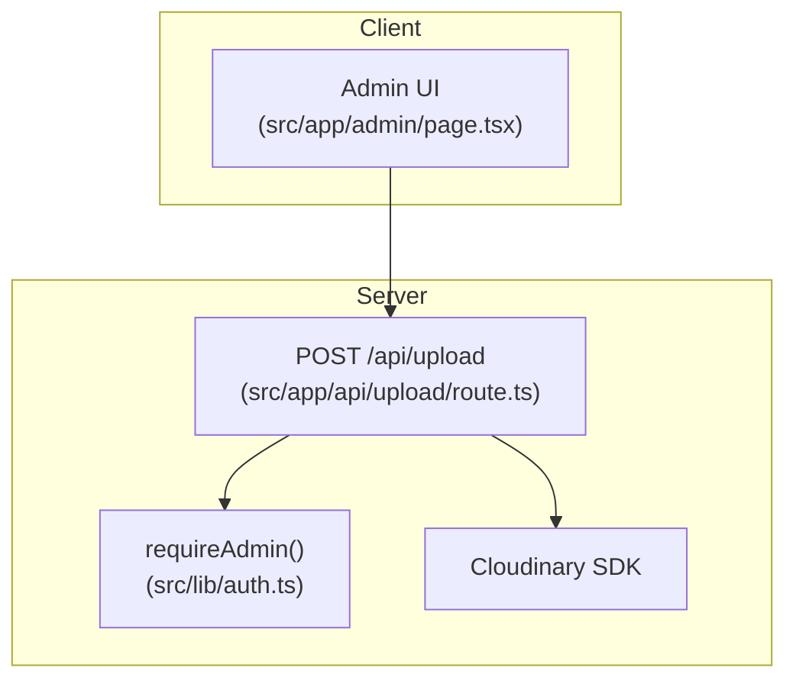
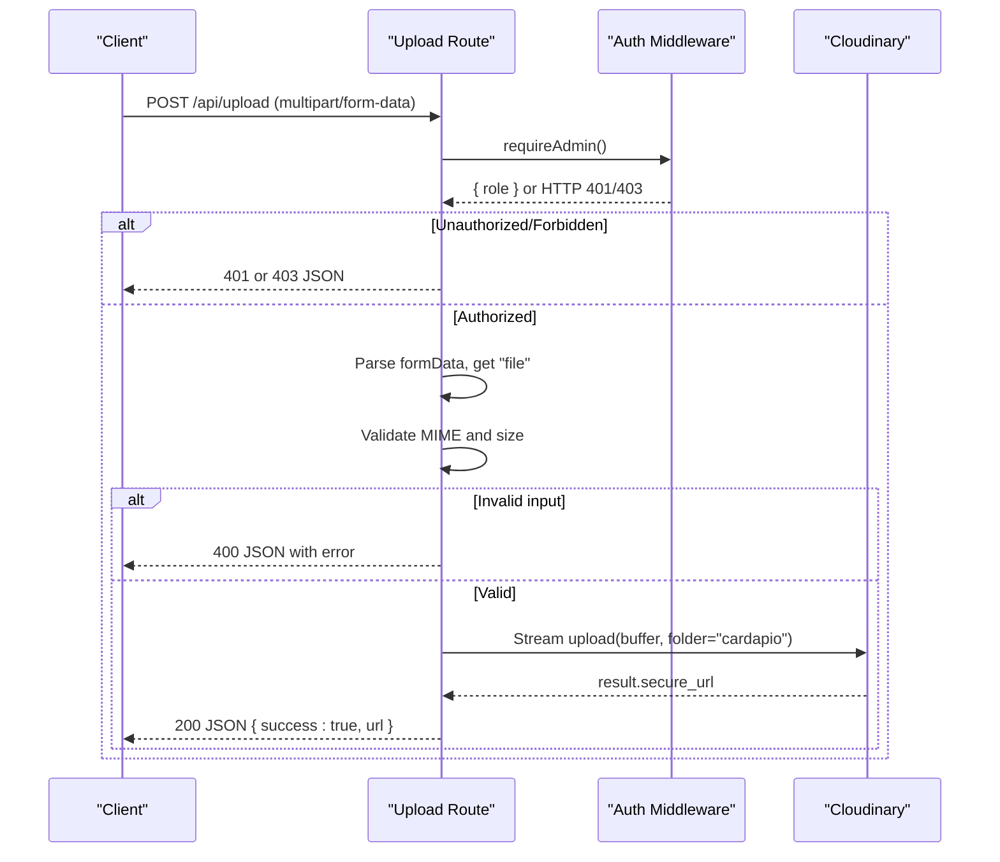
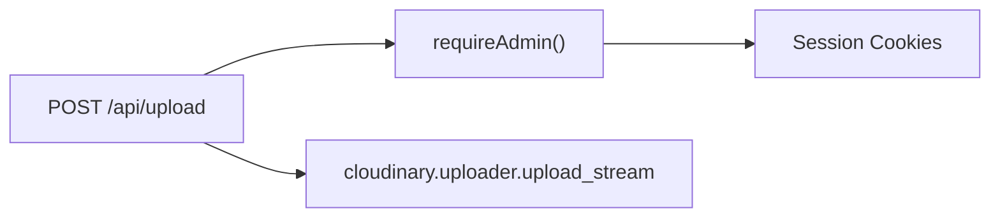

# Upload API Endpoint

<cite>
**Referenced Files in This Document**
- [route.ts](file://src/app/api/upload/route.ts)
- [auth.ts](file://src/lib/auth.ts)
- [page.tsx](file://src/app/admin/page.tsx)
- [package.json](file://package.json)
</cite>

## Table of Contents
1. [Introduction](#introduction)
2. [Project Structure](#project-structure)
3. [Core Components](#core-components)
4. [Architecture Overview](#architecture-overview)
5. [Detailed Component Analysis](#detailed-component-analysis)
6. [Dependency Analysis](#dependency-analysis)
7. [Performance Considerations](#performance-considerations)
8. [Troubleshooting Guide](#troubleshooting-guide)
9. [Conclusion](#conclusion)
10. [Appendices](#appendices)

## Introduction
This document describes the POST /api/upload endpoint for secure image uploads. It covers authentication, request format, validation rules, response structure, error handling, and client-side integration guidance. The endpoint requires admin authentication and validates file type and size before uploading to Cloudinary.

## Project Structure
The upload functionality is implemented as a Next.js Route Handler under the API directory. Authentication is enforced via a shared middleware utility. Client code demonstrates how to call the endpoint from an admin page.

**Diagram sources**
- [route.ts:14-57](file://src/app/api/upload/route.ts#L14-L57)
- [auth.ts:76-78](file://src/lib/auth.ts#L76-L78)
- [page.tsx:77-103](file://src/app/admin/page.tsx#L77-L103)

**Section sources**
- [route.ts:1-58](file://src/app/api/upload/route.ts#L1-L58)
- [auth.ts:1-82](file://src/lib/auth.ts#L1-L82)
- [page.tsx:77-103](file://src/app/admin/page.tsx#L77-L103)

## Core Components
- POST /api/upload route handler: parses multipart form data, enforces auth, validates file type and size, uploads to Cloudinary, and returns a JSON response with the uploaded image URL.
- requireAdmin middleware: ensures the caller has admin privileges by checking session cookies; returns appropriate HTTP errors when unauthorized or forbidden.
- Cloudinary integration: configured via environment variables and used to stream the file into the cloud storage bucket.

Key responsibilities:
- Authentication gating using requireAdmin.
- File presence check.
- MIME type allowlist validation.
- Size limit enforcement (5MB).
- Streaming upload to Cloudinary.
- Consistent JSON responses for success and error cases.

**Section sources**
- [route.ts:14-57](file://src/app/api/upload/route.ts#L14-L57)
- [auth.ts:51-78](file://src/lib/auth.ts#L51-L78)

## Architecture Overview
The endpoint follows a clear flow: authenticate → parse body → validate → upload → respond.

**Diagram sources**
- [route.ts:14-57](file://src/app/api/upload/route.ts#L14-L57)
- [auth.ts:63-78](file://src/lib/auth.ts#L63-L78)

## Detailed Component Analysis

### Authentication: requireAdmin
- Reads session cookies to determine user role.
- Returns a NextResponse with status 401 if no role is present, or 403 if the role is not allowed.
- The upload route checks whether the returned value is a NextResponse and short-circuits on auth failures.

Security notes:
- Cookies are set with httpOnly and sameSite attributes for security.
- Only users with the admin role can access this endpoint.

**Section sources**
- [auth.ts:13-19](file://src/lib/auth.ts#L13-L19)
- [auth.ts:51-78](file://src/lib/auth.ts#L51-L78)
- [route.ts:14-16](file://src/app/api/upload/route.ts#L14-L16)

### Request Body and File Requirements
- Content-Type: multipart/form-data
- Field name: file
- Allowed MIME types: image/jpeg, image/png, image/webp, image/gif
- Maximum file size: 5 MB

Validation behavior:
- Missing file field returns 400 with an error message.
- Disallowed MIME type returns 400 with an error message.
- Oversized file returns 400 with an error message.

**Section sources**
- [route.ts:19-38](file://src/app/api/upload/route.ts#L19-L38)

### Upload Processing and Response
- The file is converted to a buffer and streamed to Cloudinary with a fixed folder.
- On success, returns 200 with JSON containing success flag and secure URL.
- On server-side errors during upload, returns 500 with an error message.

**Section sources**
- [route.ts:40-57](file://src/app/api/upload/route.ts#L40-L57)

### Client-Side Usage Example
The admin page demonstrates calling the endpoint:
- Creates FormData with a single "file" field.
- Sends POST to /api/upload.
- Handles success by storing the returned URL.
- Shows alerts on network or server errors.

Best practices shown:
- Disable further actions while upload is in progress.
- Provide user feedback on success/failure.

**Section sources**
- [page.tsx:77-103](file://src/app/admin/page.tsx#L77-L103)

## Dependency Analysis
- The upload route depends on:
  - Next.js server utilities for responses.
  - Cloudinary SDK for streaming uploads.
  - Shared auth utilities for authorization.
- Environment configuration for Cloudinary is required at runtime.

**Diagram sources**
- [route.ts:1-9](file://src/app/api/upload/route.ts#L1-L9)
- [auth.ts:51-78](file://src/lib/auth.ts#L51-L78)

**Section sources**
- [package.json:17-30](file://package.json#L17-L30)
- [route.ts:1-9](file://src/app/api/upload/route.ts#L1-L9)

## Performance Considerations
- Streaming upload reduces memory usage compared to loading entire files into memory.
- Enforcing strict MIME and size limits early prevents unnecessary processing and bandwidth waste.
- Keep Cloudinary credentials secure and use environment variables only.

[No sources needed since this section provides general guidance]

## Troubleshooting Guide
Common issues and resolutions:
- 401 Unauthorized: No valid admin session cookie. Ensure the user is logged in as admin.
- 403 Forbidden: Session exists but role is not admin. Verify role assignment.
- 400 Bad Request:
  - Missing file field: Include a "file" field in multipart/form-data.
  - Invalid MIME type: Use one of the allowed image types.
  - File too large: Reduce size to 5 MB or less.
- 500 Internal Server Error:
  - Cloudinary configuration missing or invalid: Check environment variables for cloud name, API key, and secret.
  - Network or service outage: Retry with exponential backoff and surface a user-friendly message.

Operational tips:
- Log server-side errors for diagnostics.
- On the client, show meaningful messages based on status codes and response bodies.

**Section sources**
- [route.ts:22-38](file://src/app/api/upload/route.ts#L22-L38)
- [route.ts:54-57](file://src/app/api/upload/route.ts#L54-L57)
- [auth.ts:63-78](file://src/lib/auth.ts#L63-L78)

## Conclusion
The POST /api/upload endpoint provides a secure, validated, and efficient way to upload images to Cloudinary. It enforces admin-only access, validates file types and sizes, and returns consistent JSON responses. Following the client guidelines will ensure robust user experiences and reliable error handling.

[No sources needed since this section summarizes without analyzing specific files]

## Appendices

### API Specification

- Endpoint: POST /api/upload
- Authentication: Admin session required (via cookies)
- Content-Type: multipart/form-data
- Request fields:
  - file: Required. One of image/jpeg, image/png, image/webp, image/gif. Max 5 MB.
- Success response:
  - Status: 200
  - Body: { success: true, url: "<secure_url>" }
- Error responses:
  - 401 Unauthorized: No admin session.
  - 403 Forbidden: Session present but not admin.
  - 400 Bad Request: Missing file, invalid MIME type, or file exceeds size limit.
  - 500 Internal Server Error: Upload failed (e.g., Cloudinary error).

Example requests and responses (conceptual):
- Request headers:
  - Authorization: N/A (uses session cookies)
  - Content-Type: multipart/form-data
- Request body:
  - file: <binary image data>
- Success response:
  - 200 OK
  - { "success": true, "url": "https://res.cloudinary.com/.../image.jpg" }
- Validation error:
  - 400 Bad Request
  - { "error": "Invalid or disallowed file." }
- Authentication error:
  - 401 Unauthorized
  - { "error": "Unauthorized." }
  - 403 Forbidden
  - { "error": "Forbidden." }
- Server error:
  - 500 Internal Server Error
  - { "error": "Upload failed." }

[No sources needed since this section provides conceptual examples]

### Client Implementation Guidelines
- Build a FormData object and append the selected file under the field name "file".
- Send a POST request to /api/upload with Content-Type set automatically by FormData.
- Handle success by reading the URL from the response JSON.
- Handle errors:
  - 401/403: Prompt login or inform the user they lack permission.
  - 400: Show validation feedback (wrong type or too large).
  - 5xx: Inform the user of a temporary issue and suggest retrying later.
- Provide visual feedback during upload (loading indicator) and disable submit until complete.

**Section sources**
- [page.tsx:77-103](file://src/app/admin/page.tsx#L77-L103)