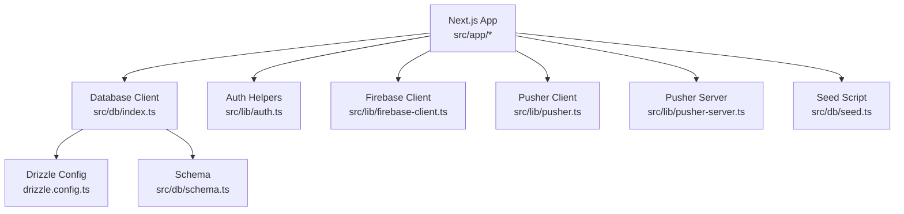
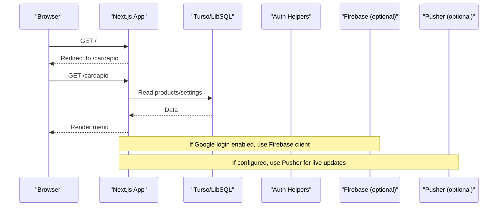

# Getting Started

<cite>
**Referenced Files in This Document**
- [package.json](file://package.json)
- [drizzle.config.ts](file://drizzle.config.ts)
- [next.config.ts](file://next.config.ts)
- [src/db/index.ts](file://src/db/index.ts)
- [src/db/schema.ts](file://src/db/schema.ts)
- [src/db/seed.ts](file://src/db/seed.ts)
- [src/lib/firebase-client.ts](file://src/lib/firebase-client.ts)
- [src/lib/pusher.ts](file://src/lib/pusher.ts)
- [src/lib/pusher-server.ts](file://src/lib/pusher-server.ts)
- [src/lib/auth.ts](file://src/lib/auth.ts)
- [src/app/layout.tsx](file://src/app/layout.tsx)
- [src/app/page.tsx](file://src/app/page.tsx)
</cite>

## Table of Contents
1. Introduction
2. Project Structure
3. Core Components
4. Architecture Overview
5. Detailed Component Analysis
6. Dependency Analysis
7. Performance Considerations
8. Troubleshooting Guide
9. Conclusion
10. Appendices

## Introduction
This guide helps new developers set up and run the Meu Cardápio application quickly. It covers prerequisites, environment configuration, database setup with Drizzle migrations, optional integrations (Firebase and Pusher), running the development server, accessing key interfaces (customer menu, admin panel, kitchen dashboard), and verifying that everything works. The instructions are beginner-friendly but include enough technical detail for experienced developers to understand how the pieces fit together.

## Project Structure
Meu Cardápio is a Next.js application using:
- Drizzle ORM with Turso/LibSQL for data persistence
- Optional Firebase Authentication (Google sign-in) on the client
- Optional Pusher for real-time updates
- Role-based access control for Admin, Kitchen, and Waitstaff

**Diagram sources**
- [src/app/layout.tsx:1-34](file://src/app/layout.tsx#L1-L34)
- [src/app/page.tsx:1-17](file://src/app/page.tsx#L1-L17)
- [src/db/index.ts:1-14](file://src/db/index.ts#L1-L14)
- [drizzle.config.ts:1-14](file://drizzle.config.ts#L1-L14)
- [src/db/schema.ts:1-56](file://src/db/schema.ts#L1-L56)
- [src/db/seed.ts:1-57](file://src/db/seed.ts#L1-L57)
- [src/lib/firebase-client.ts:1-26](file://src/lib/firebase-client.ts#L1-L26)
- [src/lib/pusher.ts:1-9](file://src/lib/pusher.ts#L1-L9)
- [src/lib/pusher-server.ts:1-10](file://src/lib/pusher-server.ts#L1-L10)

**Section sources**
- [package.json:1-45](file://package.json#L1-L45)
- [next.config.ts:1-14](file://next.config.ts#L1-L14)
- [src/app/layout.tsx:1-34](file://src/app/layout.tsx#L1-L34)
- [src/app/page.tsx:1-17](file://src/app/page.tsx#L1-L17)

## Core Components
- Database layer: Drizzle ORM configured via drizzle.config.ts and connected through src/db/index.ts. Schema defines tables for products, orders, order items, settings, users, and login attempts.
- Authentication: Role-based helpers in src/lib/auth.ts manage cookies and role checks for admin, kitchen, and waitstaff.
- Real-time: Optional Pusher client/server modules enable live updates when configured.
- Client-side auth: Optional Firebase Google sign-in integration via src/lib/firebase-client.ts.
- Data seeding: Initial sample data via src/db/seed.ts.

**Section sources**
- [src/db/index.ts:1-14](file://src/db/index.ts#L1-L14)
- [src/db/schema.ts:1-56](file://src/db/schema.ts#L1-L56)
- [src/lib/auth.ts:1-82](file://src/lib/auth.ts#L1-L82)
- [src/lib/pusher.ts:1-9](file://src/lib/pusher.ts#L1-L9)
- [src/lib/pusher-server.ts:1-10](file://src/lib/pusher-server.ts#L1-L10)
- [src/lib/firebase-client.ts:1-26](file://src/lib/firebase-client.ts#L1-L26)
- [src/db/seed.ts:1-57](file://src/db/seed.ts#L1-L57)

## Architecture Overview
The app runs as a Next.js server and client. On first request, it may redirect to the customer menu or a specific table. Data operations go through Drizzle to a Turso/LibSQL database. Optional integrations provide authentication and real-time features.

**Diagram sources**
- [src/app/page.tsx:1-17](file://src/app/page.tsx#L1-L17)
- [src/db/index.ts:1-14](file://src/db/index.ts#L1-L14)
- [src/lib/firebase-client.ts:1-26](file://src/lib/firebase-client.ts#L1-L26)
- [src/lib/pusher.ts:1-9](file://src/lib/pusher.ts#L1-L9)
- [src/lib/pusher-server.ts:1-10](file://src/lib/pusher-server.ts#L1-L10)

## Detailed Component Analysis

### Prerequisites
- Node.js: Use a version compatible with Next.js 16.x. The project uses modern tooling; ensure your Node.js version supports the required features.
- Package manager: npm or yarn.
- Database: Local SQLite file by default; optionally configure Turso/LibSQL for cloud storage.
- Optional services:
  - Firebase (Google sign-in): Requires client-side keys and domain configuration in the Firebase console.
  - Pusher: Requires an app ID, key, secret, and cluster for real-time features.

**Section sources**
- [package.json:1-45](file://package.json#L1-L45)
- [next.config.ts:1-14](file://next.config.ts#L1-L14)

### Environment Configuration
Create a .env file at the project root with the following variables:

- Database (required if not using local file):
  - TURSO_DATABASE_URL: Your Turso/LibSQL connection URL
  - TURSO_AUTH_TOKEN: Required only for remote Turso databases

- Firebase (optional, client-side Google sign-in):
  - NEXT_PUBLIC_FIREBASE_API_KEY
  - NEXT_PUBLIC_FIREBASE_AUTH_DOMAIN
  - NEXT_PUBLIC_FIREBASE_PROJECT_ID
  - NEXT_PUBLIC_FIREBASE_APP_ID

- Pusher (optional, real-time updates):
  - PUSHER_APP_ID
  - NEXT_PUBLIC_PUSHER_KEY
  - PUSHER_SECRET
  - NEXT_PUBLIC_PUSHER_CLUSTER

Notes:
- Without TURSO_DATABASE_URL, the app uses a local SQLite file named dev.db.
- Firebase client initialization will throw an error if any required public variable is missing.
- Pusher client/server modules initialize only when all required variables are present.

**Section sources**
- [src/db/index.ts:1-14](file://src/db/index.ts#L1-L14)
- [drizzle.config.ts:1-14](file://drizzle.config.ts#L1-L14)
- [src/lib/firebase-client.ts:1-26](file://src/lib/firebase-client.ts#L1-L26)
- [src/lib/pusher.ts:1-9](file://src/lib/pusher.ts#L1-L9)
- [src/lib/pusher-server.ts:1-10](file://src/lib/pusher-server.ts#L1-L10)

### Installation Steps
1. Install dependencies:
   - npm install
   - or yarn install

2. Initialize the database:
   - Run migrations and push schema:
     - npm run db:migrate
     - or npm run db:push
   - Seed initial data:
     - npm run db:seed
   - Or run the combined setup:
     - npm run db:setup

3. Verify database:
   - Optionally open the Drizzle Studio:
     - npm run db:studio

**Section sources**
- [package.json:1-45](file://package.json#L1-L45)
- [src/db/index.ts:1-14](file://src/db/index.ts#L1-L14)
- [src/db/seed.ts:1-57](file://src/db/seed.ts#L1-L57)

### Running the Development Server
- Start the dev server:
  - npm run dev
- Open in browser:
  - http://localhost:3000
- The root route redirects to the customer menu (/cardapio). You can also navigate directly to:
  - Customer menu: /cardapio
  - With a table parameter: /cardapio?mesa=1

**Section sources**
- [package.json:1-45](file://package.json#L1-L45)
- [src/app/page.tsx:1-17](file://src/app/page.tsx#L1-L17)

### Accessing Interfaces
- Customer menu:
  - URL: /cardapio
  - Purpose: Browse products and place orders
- Admin panel:
  - URL: /admin
  - Purpose: Manage products, categories, users, and settings
  - Requires admin role cookie set via login flow
- Kitchen dashboard:
  - URL: /cozinha
  - Purpose: View and update orders in real time
  - Requires kitchen or admin role cookie set via login flow
- Waitstaff interface:
  - URL: /atendimento
  - Purpose: Assist customers and manage orders
  - Requires waitstaff or admin role cookie set via login flow

Role enforcement is handled by server-side helpers that check cookies and return appropriate responses.

**Section sources**
- [src/lib/auth.ts:1-82](file://src/lib/auth.ts#L1-L82)

### Verifying Setup
- Confirm the menu loads at /cardapio and shows seeded products.
- Try logging in with a valid user PIN to access protected routes (/admin, /cozinha, /atendimento).
- If Firebase is configured, test Google sign-in from the login page.
- If Pusher is configured, verify real-time updates when orders change.

**Section sources**
- [src/db/seed.ts:1-57](file://src/db/seed.ts#L1-L57)
- [src/lib/auth.ts:1-82](file://src/lib/auth.ts#L1-L82)
- [src/lib/firebase-client.ts:1-26](file://src/lib/firebase-client.ts#L1-L26)
- [src/lib/pusher.ts:1-9](file://src/lib/pusher.ts#L1-L9)
- [src/lib/pusher-server.ts:1-10](file://src/lib/pusher-server.ts#L1-L10)

## Dependency Analysis
Key runtime dependencies and their roles:
- next: Framework for server-rendered pages and API routes
- react/react-dom: UI libraries
- drizzle-orm/@libsql/client: Database ORM and client
- firebase: Client-side Google authentication
- pusher/pusher-js: Real-time messaging server and client
- bcryptjs: Secure PIN hashing for user authentication
- cloudinary: Image upload support (via Next.js image optimization)

Optional integrations are guarded by environment variables and will gracefully degrade if not configured.

**Section sources**
- [package.json:1-45](file://package.json#L1-L45)
- [next.config.ts:1-14](file://next.config.ts#L1-L14)

## Performance Considerations
- Images: Next.js image optimization is configured to serve AVIF/WebP and allow images from Cloudinary and Unsplash.
- Database: Using LibSQL/Turso provides fast local or cloud-backed storage. For high concurrency, prefer a remote Turso database with proper indexing on frequently queried columns.
- Real-time: Pusher enables efficient live updates without polling. Ensure you only subscribe to necessary channels and events.

[No sources needed since this section provides general guidance]

## Troubleshooting Guide
Common issues and resolutions:

- Missing environment variables:
  - Symptom: Firebase login fails with an error indicating login is not configured.
  - Resolution: Set all NEXT_PUBLIC_FIREBASE_* variables correctly.

- Database connection errors:
  - Symptom: Migrations or queries fail to connect.
  - Resolution: Ensure TURSO_DATABASE_URL and TURSO_AUTH_TOKEN are set for remote databases. For local development, leave them unset to use the local SQLite file.

- Pusher not working:
  - Symptom: Real-time updates do not appear.
  - Resolution: Set PUSHER_APP_ID, NEXT_PUBLIC_PUSHER_KEY, PUSHER_SECRET, and NEXT_PUBLIC_PUSHER_CLUSTER. Verify network connectivity to Pusher endpoints.

- Role access denied:
  - Symptom: Navigating to /admin or /cozinha returns unauthorized or forbidden.
  - Resolution: Log in with a valid user PIN to set the appropriate role cookie. Check that the user’s cargo matches the required role.

- Images not loading:
  - Symptom: Remote images fail to load.
  - Resolution: Ensure allowed hosts include the image domains in next.config.ts.

**Section sources**
- [src/lib/firebase-client.ts:1-26](file://src/lib/firebase-client.ts#L1-L26)
- [src/db/index.ts:1-14](file://src/db/index.ts#L1-L14)
- [src/lib/pusher.ts:1-9](file://src/lib/pusher.ts#L1-L9)
- [src/lib/pusher-server.ts:1-10](file://src/lib/pusher-server.ts#L1-L10)
- [src/lib/auth.ts:1-82](file://src/lib/auth.ts#L1-L82)
- [next.config.ts:1-14](file://next.config.ts#L1-L14)

## Conclusion
You now have the essential steps to set up, run, and verify Meu Cardápio locally. Start with the database and basic environment, then add Firebase and Pusher as needed. Use the provided scripts to migrate, seed, and explore the database. Explore the customer menu, admin panel, kitchen dashboard, and waitstaff interface to understand the full workflow.

[No sources needed since this section summarizes without analyzing specific files]

## Appendices

### First-Time User Guidance
- Create or obtain a user PIN for each role (admin, kitchen, waitstaff) and log in to access protected areas.
- Add products and categories via the admin panel to populate the menu.
- Place test orders from the customer menu and observe status changes in the kitchen dashboard.

**Section sources**
- [src/lib/auth.ts:1-82](file://src/lib/auth.ts#L1-L82)
- [src/db/schema.ts:1-56](file://src/db/schema.ts#L1-L56)

### Environment Variables Reference
- Database:
  - TURSO_DATABASE_URL
  - TURSO_AUTH_TOKEN
- Firebase (client-side):
  - NEXT_PUBLIC_FIREBASE_API_KEY
  - NEXT_PUBLIC_FIREBASE_AUTH_DOMAIN
  - NEXT_PUBLIC_FIREBASE_PROJECT_ID
  - NEXT_PUBLIC_FIREBASE_APP_ID
- Pusher:
  - PUSHER_APP_ID
  - NEXT_PUBLIC_PUSHER_KEY
  - PUSHER_SECRET
  - NEXT_PUBLIC_PUSHER_CLUSTER

**Section sources**
- [src/db/index.ts:1-14](file://src/db/index.ts#L1-L14)
- [drizzle.config.ts:1-14](file://drizzle.config.ts#L1-L14)
- [src/lib/firebase-client.ts:1-26](file://src/lib/firebase-client.ts#L1-L26)
- [src/lib/pusher.ts:1-9](file://src/lib/pusher.ts#L1-L9)
- [src/lib/pusher-server.ts:1-10](file://src/lib/pusher-server.ts#L1-L10)