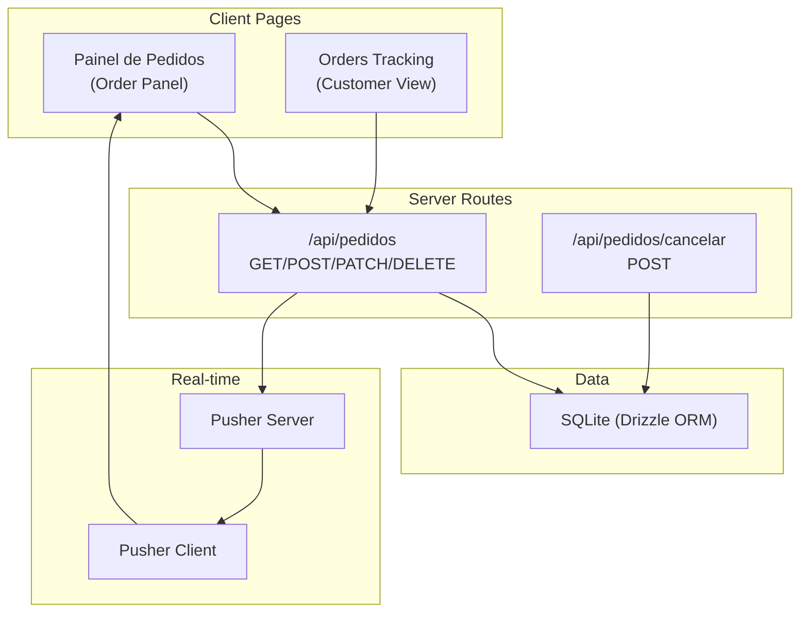
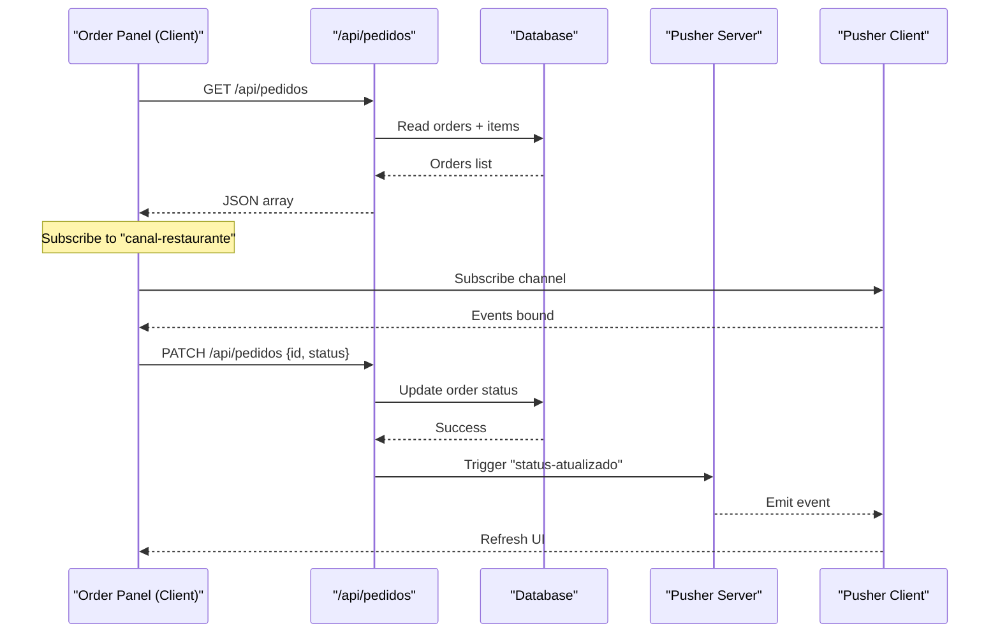
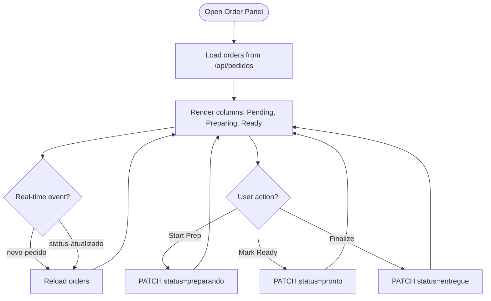
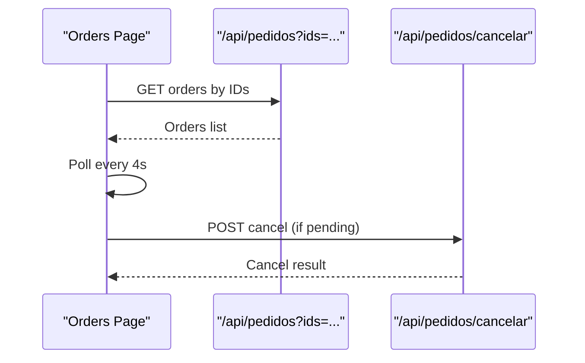
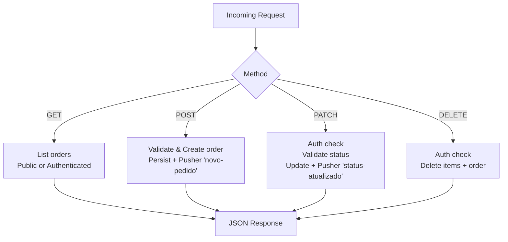
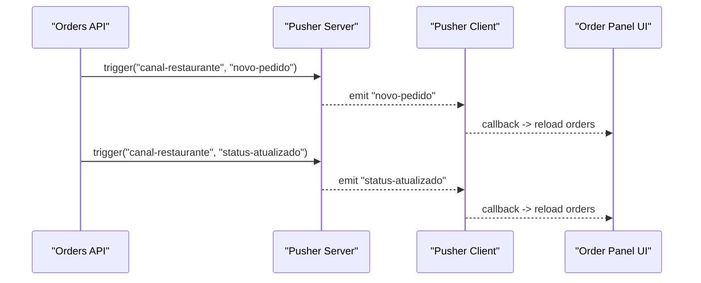
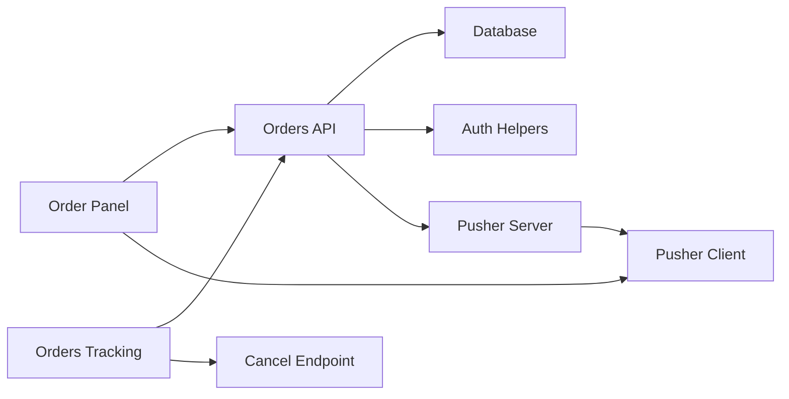

# Kitchen Dashboard

<cite>
**Referenced Files in This Document**
- [painel-pedidos/page.tsx](file://src/app/painel-pedidos/page.tsx)
- [orders/page.tsx](file://src/app/orders/page.tsx)
- [pedidos/route.ts](file://src/app/api/pedidos/route.ts)
- [cancelar/route.ts](file://src/app/api/pedidos/cancelar/route.ts)
- [pusher-server.ts](file://src/lib/pusher-server.ts)
- [pusher.ts](file://src/lib/pusher.ts)
- [auth.ts](file://src/lib/auth.ts)
- [schema.ts](file://src/db/schema.ts)
</cite>

## Table of Contents
1. [Introduction](#introduction)
2. [Project Structure](#project-structure)
3. [Core Components](#core-components)
4. [Architecture Overview](#architecture-overview)
5. [Detailed Component Analysis](#detailed-component-analysis)
6. [Dependency Analysis](#dependency-analysis)
7. [Performance Considerations](#performance-considerations)
8. [Troubleshooting Guide](#troubleshooting-guide)
9. [Conclusion](#conclusion)

## Introduction
This document explains the kitchen management dashboard focused on order processing and fulfillment workflows. It covers the order panel interface for viewing incoming orders, managing order status, and coordinating kitchen operations. It also documents real-time order updates using Pusher integration for live notifications when new orders arrive or existing orders change status. The order lifecycle is defined with clear transitions from received to preparing, ready, and completed (delivered), including cancellation flows. Guidance is provided for performance considerations under high concurrency, real-time synchronization across multiple kitchen displays, and offline capability considerations. Finally, it outlines user experience design principles for efficient kitchen workflows and accessibility in fast-paced environments.

## Project Structure
The kitchen dashboard is implemented as a Next.js application with:
- Client-side pages for the order panel and customer order tracking
- Server routes for order creation, listing, status updates, and cancellation
- Real-time event publishing via Pusher server and client subscriptions
- Authentication middleware protecting kitchen-only actions
- Database schema defining orders, items, products, settings, and users

**Diagram sources**
- [painel-pedidos/page.tsx:34-76](file://src/app/painel-pedidos/page.tsx#L34-L76)
- [orders/page.tsx:33-58](file://src/app/orders/page.tsx#L33-L58)
- [pedidos/route.ts:15-235](file://src/app/api/pedidos/route.ts#L15-L235)
- [cancelar/route.ts:6-20](file://src/app/api/pedidos/cancelar/route.ts#L6-L20)
- [pusher-server.ts:1-11](file://src/lib/pusher-server.ts#L1-L11)
- [pusher.ts:1-9](file://src/lib/pusher.ts#L1-L9)
- [schema.ts:14-32](file://src/db/schema.ts#L14-L32)

**Section sources**
- [painel-pedidos/page.tsx:1-295](file://src/app/painel-pedidos/page.tsx#L1-L295)
- [orders/page.tsx:1-156](file://src/app/orders/page.tsx#L1-L156)
- [pedidos/route.ts:1-253](file://src/app/api/pedidos/route.ts#L1-L253)
- [cancelar/route.ts:1-21](file://src/app/api/pedidos/cancelar/route.ts#L1-L21)
- [pusher-server.ts:1-11](file://src/lib/pusher-server.ts#L1-L11)
- [pusher.ts:1-9](file://src/lib/pusher.ts#L1-L9)
- [auth.ts:1-82](file://src/lib/auth.ts#L1-L82)
- [schema.ts:1-56](file://src/db/schema.ts#L1-L56)

## Core Components
- Order Panel (Painel de Pedidos): Displays incoming orders grouped by status, allows kitchen staff to transition statuses, and shows special requests. Subscribes to real-time events to refresh automatically.
- Orders Tracking (Customer View): Shows a table’s recent orders with status badges and cancellation options for pending orders.
- API Layer: Handles order creation, listing, status updates, and cancellation with validation and authorization.
- Real-time Integration: Publishes “new order” and “status updated” events; clients subscribe to receive live updates.
- Authentication: Protects kitchen-only endpoints and enforces roles.
- Data Model: Defines orders, order items, products, settings, and users.

**Section sources**
- [painel-pedidos/page.tsx:26-95](file://src/app/painel-pedidos/page.tsx#L26-L95)
- [orders/page.tsx:18-67](file://src/app/orders/page.tsx#L18-L67)
- [pedidos/route.ts:15-235](file://src/app/api/pedidos/route.ts#L15-L235)
- [pusher-server.ts:1-11](file://src/lib/pusher-server.ts#L1-L11)
- [pusher.ts:1-9](file://src/lib/pusher.ts#L1-L9)
- [auth.ts:51-82](file://src/lib/auth.ts#L51-L82)
- [schema.ts:14-32](file://src/db/schema.ts#L14-L32)

## Architecture Overview
The system uses a client-server architecture with real-time eventing:
- Clients fetch orders via REST APIs and subscribe to Pusher channels for live updates.
- Server routes enforce authentication and validate inputs before persisting changes.
- After successful writes, server triggers Pusher events to notify all subscribed clients.

**Diagram sources**
- [painel-pedidos/page.tsx:53-76](file://src/app/painel-pedidos/page.tsx#L53-L76)
- [pedidos/route.ts:192-235](file://src/app/api/pedidos/route.ts#L192-L235)
- [pusher-server.ts:1-11](file://src/lib/pusher-server.ts#L1-L11)
- [pusher.ts:1-9](file://src/lib/pusher.ts#L1-L9)

## Detailed Component Analysis

### Order Panel (Painel de Pedidos)
Responsibilities:
- Load orders on mount and refresh periodically or on real-time events.
- Display orders grouped into columns: New (pending), Preparing (preparando), Ready (pronto).
- Allow kitchen staff to move orders through the lifecycle:
  - Start preparation: pending → preparing
  - Mark as ready: preparing → ready
  - Finalize delivery: ready → delivered (entregue)
- Show special requests/observations prominently.
- Provide logout and navigation controls.

Real-time behavior:
- Subscribes to the restaurant channel and listens for:
  - novo-pedido: triggers a full reload of orders
  - status-atualizado: triggers a full reload of orders

Status transitions are performed via PATCH to the orders API.

**Diagram sources**
- [painel-pedidos/page.tsx:34-76](file://src/app/painel-pedidos/page.tsx#L34-L76)
- [painel-pedidos/page.tsx:78-95](file://src/app/painel-pedidos/page.tsx#L78-L95)
- [pedidos/route.ts:192-235](file://src/app/api/pedidos/route.ts#L192-L235)

**Section sources**
- [painel-pedidos/page.tsx:26-95](file://src/app/painel-pedidos/page.tsx#L26-L95)
- [painel-pedidos/page.tsx:107-267](file://src/app/painel-pedidos/page.tsx#L107-L267)

### Customer Orders Tracking
Responsibilities:
- Retrieve orders associated with the current table using stored IDs.
- Poll periodically to reflect status changes.
- Allow cancellation only for pending orders.
- Remove orders from local tracking list after completion or manual removal.

**Diagram sources**
- [orders/page.tsx:33-67](file://src/app/orders/page.tsx#L33-L67)
- [pedidos/route.ts:15-44](file://src/app/api/pedidos/route.ts#L15-L44)
- [cancelar/route.ts:6-20](file://src/app/api/pedidos/cancelar/route.ts#L6-L20)

**Section sources**
- [orders/page.tsx:18-67](file://src/app/orders/page.tsx#L18-L67)
- [pedidos/route.ts:15-44](file://src/app/api/pedidos/route.ts#L15-L44)
- [cancelar/route.ts:6-20](file://src/app/api/pedidos/cancelar/route.ts#L6-L20)

### API Layer: Orders
Endpoints:
- GET /api/pedidos
  - Public mode: returns orders for specific IDs (no auth required)
  - Authenticated mode: returns all orders for admin/kitchen/serving roles
- POST /api/pedidos
  - Validates store status, request body, item quantities/prices, totals
  - Persists order and items in a transaction
  - Triggers Pusher event “novo-pedido”
- PATCH /api/pedidos
  - Requires kitchen/admin role
  - Validates allowed statuses
  - Updates order status and triggers “status-atualizado”
- DELETE /api/pedidos
  - Requires kitchen/admin role
  - Deletes order items and order

**Diagram sources**
- [pedidos/route.ts:15-235](file://src/app/api/pedidos/route.ts#L15-L235)
- [pedidos/route.ts:237-253](file://src/app/api/pedidos/route.ts#L237-L253)

**Section sources**
- [pedidos/route.ts:15-235](file://src/app/api/pedidos/route.ts#L15-L235)
- [pedidos/route.ts:237-253](file://src/app/api/pedidos/route.ts#L237-L253)

### Real-time Integration (Pusher)
- Server publishes:
  - Channel: canal-restaurante
  - Events:
    - novo-pedido: triggered after creating an order
    - status-atualizado: triggered after updating order status
- Client subscribes to the same channel and listens for these events to refresh the UI.

**Diagram sources**
- [pedidos/route.ts:173-180](file://src/app/api/pedidos/route.ts#L173-L180)
- [pedidos/route.ts:220-228](file://src/app/api/pedidos/route.ts#L220-L228)
- [pusher-server.ts:1-11](file://src/lib/pusher-server.ts#L1-L11)
- [pusher.ts:1-9](file://src/lib/pusher.ts#L1-L9)
- [painel-pedidos/page.tsx:53-76](file://src/app/painel-pedidos/page.tsx#L53-L76)

**Section sources**
- [pedidos/route.ts:173-180](file://src/app/api/pedidos/route.ts#L173-L180)
- [pedidos/route.ts:220-228](file://src/app/api/pedidos/route.ts#L220-L228)
- [pusher-server.ts:1-11](file://src/lib/pusher-server.ts#L1-L11)
- [pusher.ts:1-9](file://src/lib/pusher.ts#L1-L9)
- [painel-pedidos/page.tsx:53-76](file://src/app/painel-pedidos/page.tsx#L53-L76)

### Authentication and Authorization
- Roles: admin, cozinha (kitchen), atendente (serving)
- Middleware functions protect endpoints:
  - requireAuth(allowedRoles)
  - requireKitchen() for kitchen-only operations
- Cookies manage session state for roles.

**Section sources**
- [auth.ts:5-11](file://src/lib/auth.ts#L5-L11)
- [auth.ts:39-57](file://src/lib/auth.ts#L39-L57)
- [auth.ts:63-82](file://src/lib/auth.ts#L63-L82)
- [pedidos/route.ts:46-48](file://src/app/api/pedidos/route.ts#L46-L48)
- [pedidos/route.ts:192-194](file://src/app/api/pedidos/route.ts#L192-L194)

### Data Model
- pedidos: order metadata (table, customer, status, observation, total, created timestamp)
- itens_pedido: order line items (product name, quantity, unit price)
- produtos: menu items (name, description, price, category, status, image)
- configuracoes: system settings (store name, open/close status, prep time)
- usuarios: staff accounts (name, role, pin)

**Section sources**
- [schema.ts:4-12](file://src/db/schema.ts#L4-L12)
- [schema.ts:14-32](file://src/db/schema.ts#L14-L32)
- [schema.ts:34-40](file://src/db/schema.ts#L34-L40)
- [schema.ts:42-48](file://src/db/schema.ts#L42-L48)

## Dependency Analysis
Key dependencies and relationships:
- Order Panel depends on:
  - Orders API for data retrieval and status updates
  - Pusher client for real-time events
- Orders API depends on:
  - Database via Drizzle ORM
  - Authentication helpers
  - Pusher server for event publishing
- Customer Orders page depends on:
  - Orders API (public mode by IDs)
  - Cancellation endpoint
- Real-time layer depends on environment variables for Pusher configuration.

**Diagram sources**
- [painel-pedidos/page.tsx:34-76](file://src/app/painel-pedidos/page.tsx#L34-L76)
- [orders/page.tsx:33-67](file://src/app/orders/page.tsx#L33-L67)
- [pedidos/route.ts:15-235](file://src/app/api/pedidos/route.ts#L15-L235)
- [pusher-server.ts:1-11](file://src/lib/pusher-server.ts#L1-L11)
- [pusher.ts:1-9](file://src/lib/pusher.ts#L1-L9)
- [auth.ts:63-82](file://src/lib/auth.ts#L63-L82)

**Section sources**
- [painel-pedidos/page.tsx:34-76](file://src/app/painel-pedidos/page.tsx#L34-L76)
- [orders/page.tsx:33-67](file://src/app/orders/page.tsx#L33-L67)
- [pedidos/route.ts:15-235](file://src/app/api/pedidos/route.ts#L15-L235)
- [pusher-server.ts:1-11](file://src/lib/pusher-server.ts#L1-L11)
- [pusher.ts:1-9](file://src/lib/pusher.ts#L1-L9)
- [auth.ts:63-82](file://src/lib/auth.ts#L63-L82)

## Performance Considerations
- Real-time vs polling:
  - Use Pusher for immediate updates to reduce polling overhead and network load.
  - Keep client-side subscriptions lightweight; avoid heavy computations inside event handlers.
- Batch updates:
  - When many orders update simultaneously, consider debouncing UI refreshes to prevent excessive re-renders.
- Database efficiency:
  - Ensure indexes on frequently queried fields (e.g., status, created_at) to speed up filtering and sorting.
- Concurrency:
  - Use transactions for order creation and item insertion to maintain consistency.
  - Validate inputs early to fail fast and reduce unnecessary work.
- Offline capability:
  - Cache last known orders locally and queue status updates when offline; sync when connectivity resumes.
  - Implement optimistic UI updates with rollback on failure.
- Scalability:
  - Offload heavy tasks (e.g., analytics, reporting) to background jobs to keep API responses fast.
  - Monitor Pusher connection stability and implement reconnection logic on the client.

[No sources needed since this section provides general guidance]

## Troubleshooting Guide
Common issues and resolutions:
- Real-time not updating:
  - Verify Pusher environment variables are set correctly on both server and client.
  - Confirm that the client subscribes to the correct channel and binds to expected events.
  - Check server logs for Pusher trigger errors.
- Status update fails:
  - Ensure the user has kitchen/admin permissions.
  - Validate that the requested status is allowed and the order exists.
- Order creation errors:
  - Validate store open status and input fields (items, quantities, prices).
  - Confirm product availability and pricing rules.
- Cancellation restrictions:
  - Only pending orders can be canceled; attempts on prepared orders will be rejected.

**Section sources**
- [pedidos/route.ts:65-189](file://src/app/api/pedidos/route.ts#L65-L189)
- [pedidos/route.ts:192-235](file://src/app/api/pedidos/route.ts#L192-L235)
- [cancelar/route.ts:6-20](file://src/app/api/pedidos/cancelar/route.ts#L6-L20)
- [painel-pedidos/page.tsx:53-76](file://src/app/painel-pedidos/page.tsx#L53-L76)

## Conclusion
The kitchen dashboard provides a robust, real-time workflow for managing orders from receipt to delivery. The order panel enables kitchen staff to efficiently process orders, while the customer-facing tracking page offers transparency. Pusher integration ensures live synchronization across devices, improving coordination in busy kitchens. With proper authentication, validation, and database transactions, the system maintains data integrity and security. For production readiness, focus on performance optimizations, offline resilience, and accessibility to support fast-paced environments.

[No sources needed since this section summarizes without analyzing specific files]