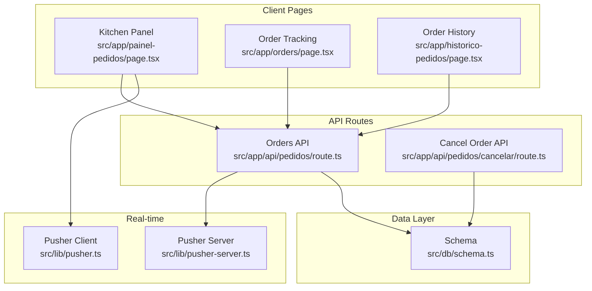
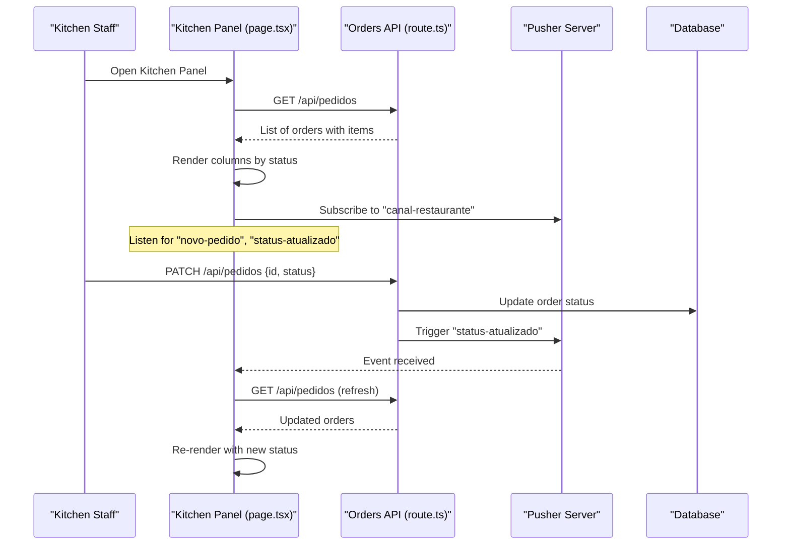
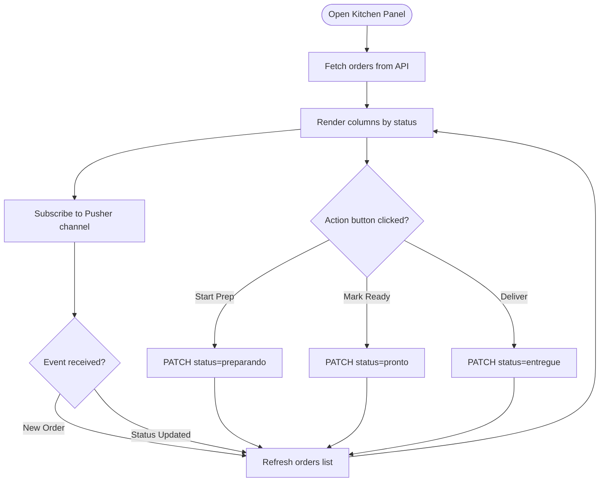
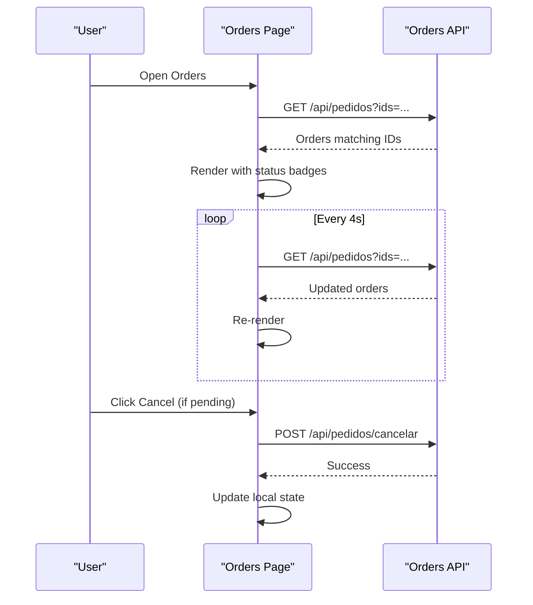
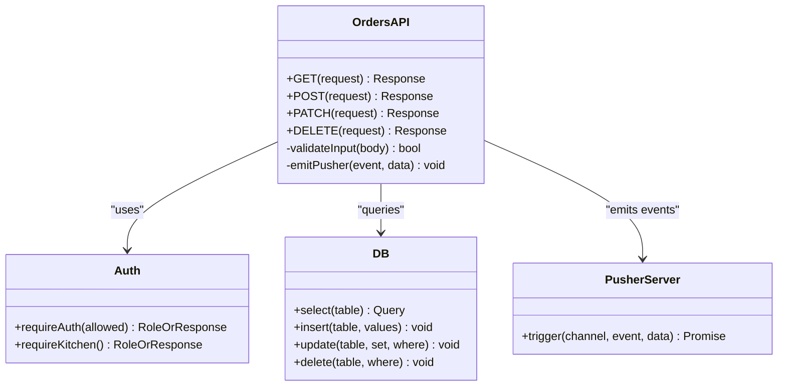
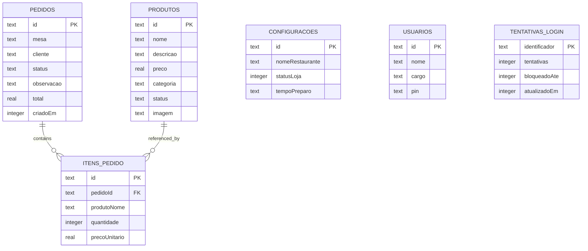
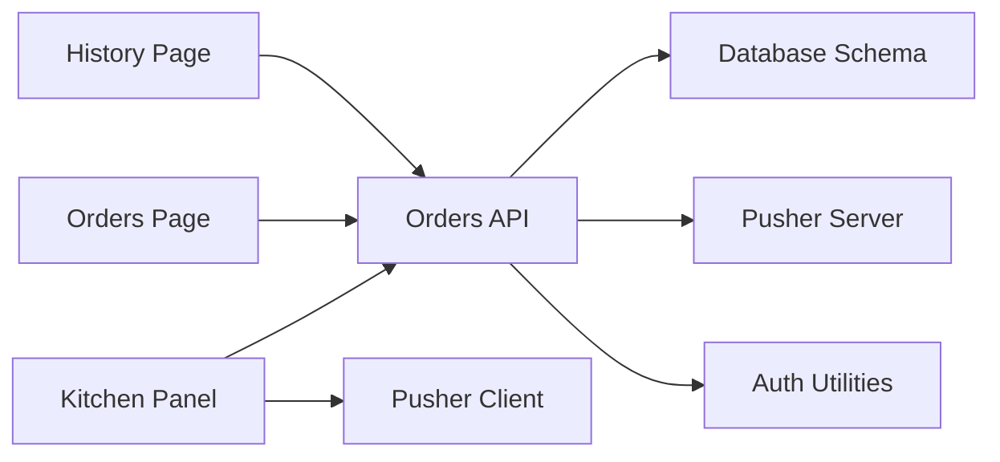

# Kitchen Workflow Optimization

<cite>
**Referenced Files in This Document**
- [painel-pedidos/page.tsx](file://src/app/painel-pedidos/page.tsx)
- [orders/page.tsx](file://src/app/orders/page.tsx)
- [api/pedidos/route.ts](file://src/app/api/pedidos/route.ts)
- [api/pedidos/cancelar/route.ts](file://src/app/api/pedidos/cancelar/route.ts)
- [lib/pusher-server.ts](file://src/lib/pusher-server.ts)
- [lib/pusher.ts](file://src/lib/pusher.ts)
- [db/schema.ts](file://src/db/schema.ts)
- [app/globals.css](file://src/app/globals.css)
- [auth.ts](file://src/lib/auth.ts)
- [historico-pedidos/page.tsx](file://src/app/historico-pedidos/page.tsx)
</cite>

## Table of Contents
1. [Introduction](#introduction)
2. [Project Structure](#project-structure)
3. [Core Components](#core-components)
4. [Architecture Overview](#architecture-overview)
5. [Detailed Component Analysis](#detailed-component-analysis)
6. [Dependency Analysis](#dependency-analysis)
7. [Performance Considerations](#performance-considerations)
8. [Troubleshooting Guide](#troubleshooting-guide)
9. [Conclusion](#conclusion)
10. [Appendices](#appendices)

## Introduction
This document explains the kitchen workflow optimization features designed for fast-paced restaurant environments. It focuses on visual design patterns that help kitchen staff quickly identify urgent orders, including color-coded statuses and time indicators, prominent action buttons for status transitions, real-time updates via Pusher, and robust error handling. It also addresses offline considerations, accessibility, multi-language support, and scalability for peak hours with multiple kitchen displays.

## Project Structure
The kitchen workflow spans a Next.js application with client-side pages for the kitchen panel and order tracking, server-side API routes for order management, and real-time signaling through Pusher. The database schema defines orders, items, products, settings, users, and login attempts.

**Diagram sources**
- [painel-pedidos/page.tsx:1-295](file://src/app/painel-pedidos/page.tsx#L1-L295)
- [orders/page.tsx:1-156](file://src/app/orders/page.tsx#L1-L156)
- [historico-pedidos/page.tsx:1-25](file://src/app/historico-pedidos/page.tsx#L1-L25)
- [api/pedidos/route.ts:1-253](file://src/app/api/pedidos/route.ts#L1-L253)
- [api/pedidos/cancelar/route.ts:1-21](file://src/app/api/pedidos/cancelar/route.ts#L1-L21)
- [lib/pusher-server.ts:1-11](file://src/lib/pusher-server.ts#L1-L11)
- [lib/pusher.ts:1-9](file://src/lib/pusher.ts#L1-L9)
- [db/schema.ts:1-56](file://src/db/schema.ts#L1-L56)

**Section sources**
- [painel-pedidos/page.tsx:1-295](file://src/app/painel-pedidos/page.tsx#L1-L295)
- [orders/page.tsx:1-156](file://src/app/orders/page.tsx#L1-L156)
- [api/pedidos/route.ts:1-253](file://src/app/api/pedidos/route.ts#L1-L253)
- [lib/pusher-server.ts:1-11](file://src/lib/pusher-server.ts#L1-L11)
- [lib/pusher.ts:1-9](file://src/lib/pusher.ts#L1-L9)
- [db/schema.ts:1-56](file://src/db/schema.ts#L1-L56)

## Core Components
- Kitchen Panel (Painel de Pedidos): Displays orders grouped by status (Pending, Preparing, Ready), shows timestamps, highlights observations, and provides large action buttons to transition statuses. Real-time updates are handled via Pusher events.
- Order Tracking (Orders): Shows customer-facing or staff-facing order status with color-coded badges and actions like cancel when allowed.
- Orders API: Handles listing orders, creating new orders, updating status, and deleting orders. Emits Pusher events after successful operations.
- Cancel Order API: Allows cancellation only for pending orders.
- Pusher Integration: Server-side Pusher triggers events; client-side subscribes to channel and listens for new orders and status updates.
- Database Schema: Defines tables for products, orders, order items, settings, users, and login attempts.

Key implementation references:
- Kitchen panel UI and real-time subscription: [painel-pedidos/page.tsx:1-295](file://src/app/painel-pedidos/page.tsx#L1-L295)
- Order tracking UI and polling: [orders/page.tsx:1-156](file://src/app/orders/page.tsx#L1-L156)
- Orders API endpoints (GET/POST/PATCH/DELETE): [api/pedidos/route.ts:1-253](file://src/app/api/pedidos/route.ts#L1-L253)
- Cancel endpoint: [api/pedidos/cancelar/route.ts:1-21](file://src/app/api/pedidos/cancelar/route.ts#L1-L21)
- Pusher server/client setup: [lib/pusher-server.ts:1-11](file://src/lib/pusher-server.ts#L1-L11), [lib/pusher.ts:1-9](file://src/lib/pusher.ts#L1-L9)
- Data model definitions: [db/schema.ts:1-56](file://src/db/schema.ts#L1-L56)

**Section sources**
- [painel-pedidos/page.tsx:1-295](file://src/app/painel-pedidos/page.tsx#L1-L295)
- [orders/page.tsx:1-156](file://src/app/orders/page.tsx#L1-L156)
- [api/pedidos/route.ts:1-253](file://src/app/api/pedidos/route.ts#L1-L253)
- [api/pedidos/cancelar/route.ts:1-21](file://src/app/api/pedidos/cancelar/route.ts#L1-L21)
- [lib/pusher-server.ts:1-11](file://src/lib/pusher-server.ts#L1-L11)
- [lib/pusher.ts:1-9](file://src/lib/pusher.ts#L1-L9)
- [db/schema.ts:1-56](file://src/db/schema.ts#L1-L56)

## Architecture Overview
The system uses a Next.js app with client components for the kitchen panel and order tracking, backed by REST APIs and real-time notifications via Pusher. Authentication is enforced at the API layer for protected routes.

**Diagram sources**
- [painel-pedidos/page.tsx:54-76](file://src/app/painel-pedidos/page.tsx#L54-L76)
- [api/pedidos/route.ts:192-235](file://src/app/api/pedidos/route.ts#L192-L235)
- [lib/pusher-server.ts:1-11](file://src/lib/pusher-server.ts#L1-L11)

**Section sources**
- [painel-pedidos/page.tsx:1-295](file://src/app/painel-pedidos/page.tsx#L1-L295)
- [api/pedidos/route.ts:1-253](file://src/app/api/pedidos/route.ts#L1-L253)
- [lib/pusher-server.ts:1-11](file://src/lib/pusher-server.ts#L1-L11)

## Detailed Component Analysis

### Kitchen Panel (Painel de Pedidos)
- Visual Design Patterns:
  - Color coding: Distinct sections for Pending, Preparing, and Ready with consistent borders and background tints.
  - Time indicators: Each card shows creation time using a localized formatter.
  - Prominent actions: Large buttons labeled to transition from Pending to Preparing, then to Ready, and finally to Delivered.
  - Observations: Highlighted warnings for special notes.
- Real-time Updates:
  - Subscribes to Pusher channel and refreshes data on new order and status update events.
- Touch-friendly Interface:
  - Full-width buttons and clear spacing optimized for quick taps during busy service.
- Keyboard Shortcuts:
  - Not implemented in this component; focus management could be added for keyboard navigation.

**Diagram sources**
- [painel-pedidos/page.tsx:34-46](file://src/app/painel-pedidos/page.tsx#L34-L46)
- [painel-pedidos/page.tsx:54-76](file://src/app/painel-pedidos/page.tsx#L54-L76)
- [painel-pedidos/page.tsx:78-95](file://src/app/painel-pedidos/page.tsx#L78-L95)

**Section sources**
- [painel-pedidos/page.tsx:1-295](file://src/app/painel-pedidos/page.tsx#L1-L295)

### Order Tracking (Orders)
- Visual Design Patterns:
  - Status badges with distinct colors per state (Pending, Preparing, Ready, Cancelled, Delivered).
  - Creation time displayed alongside totals.
- Actions:
  - Cancel order if still pending.
  - Remove from local list via localStorage.
- Polling:
  - Periodically fetches orders to reflect changes without real-time events.

**Diagram sources**
- [orders/page.tsx:33-58](file://src/app/orders/page.tsx#L33-L58)
- [api/pedidos/cancelar/route.ts:6-21](file://src/app/api/pedidos/cancelar/route.ts#L6-L21)

**Section sources**
- [orders/page.tsx:1-156](file://src/app/orders/page.tsx#L1-L156)
- [api/pedidos/cancelar/route.ts:1-21](file://src/app/api/pedidos/cancelar/route.ts#L1-L21)

### Orders API (route.ts)
- Endpoints:
  - GET: Lists all orders for authenticated roles or filtered by IDs for unauthenticated clients.
  - POST: Creates an order with validation, persists items, calculates total, and emits a Pusher event.
  - PATCH: Updates order status with role-based authorization and emits a Pusher event.
  - DELETE: Removes order and associated items.
- Error Handling:
  - Returns structured error messages for invalid inputs, unauthorized access, and internal errors.
- Real-time Signaling:
  - Triggers "novo-pedido" and "status-atualizado" events via Pusher.

**Diagram sources**
- [api/pedidos/route.ts:15-63](file://src/app/api/pedidos/route.ts#L15-L63)
- [api/pedidos/route.ts:65-190](file://src/app/api/pedidos/route.ts#L65-L190)
- [api/pedidos/route.ts:192-235](file://src/app/api/pedidos/route.ts#L192-L235)
- [auth.ts:63-82](file://src/lib/auth.ts#L63-L82)
- [lib/pusher-server.ts:1-11](file://src/lib/pusher-server.ts#L1-L11)

**Section sources**
- [api/pedidos/route.ts:1-253](file://src/app/api/pedidos/route.ts#L1-L253)
- [auth.ts:1-82](file://src/lib/auth.ts#L1-L82)
- [lib/pusher-server.ts:1-11](file://src/lib/pusher-server.ts#L1-L11)

### Database Schema
- Tables:
  - produtos: product catalog with pricing and availability.
  - pedidos: orders with status, timestamps, totals, and observations.
  - itens_pedido: line items linked to orders.
  - configuracoes: store settings including open/closed status and prep time.
  - usuarios: staff accounts with roles and PINs.
  - tentativas_login: login attempt tracking for rate limiting.

**Diagram sources**
- [db/schema.ts:1-56](file://src/db/schema.ts#L1-L56)

**Section sources**
- [db/schema.ts:1-56](file://src/db/schema.ts#L1-L56)

## Dependency Analysis
- Client dependencies:
  - Kitchen Panel depends on Pusher client for real-time updates and fetches orders from the API.
  - Orders page depends on periodic polling and the cancel API.
- Server dependencies:
  - Orders API depends on authentication utilities, database ORM, and Pusher server.
- External services:
  - Pusher for real-time messaging.
  - SQLite via Drizzle ORM for persistence.

**Diagram sources**
- [painel-pedidos/page.tsx:1-295](file://src/app/painel-pedidos/page.tsx#L1-L295)
- [orders/page.tsx:1-156](file://src/app/orders/page.tsx#L1-L156)
- [historico-pedidos/page.tsx:1-25](file://src/app/historico-pedidos/page.tsx#L1-L25)
- [api/pedidos/route.ts:1-253](file://src/app/api/pedidos/route.ts#L1-L253)
- [lib/pusher.ts:1-9](file://src/lib/pusher.ts#L1-L9)
- [lib/pusher-server.ts:1-11](file://src/lib/pusher-server.ts#L1-L11)
- [auth.ts:1-82](file://src/lib/auth.ts#L1-L82)

**Section sources**
- [painel-pedidos/page.tsx:1-295](file://src/app/painel-pedidos/page.tsx#L1-L295)
- [orders/page.tsx:1-156](file://src/app/orders/page.tsx#L1-L156)
- [historico-pedidos/page.tsx:1-25](file://src/app/historico-pedidos/page.tsx#L1-L25)
- [api/pedidos/route.ts:1-253](file://src/app/api/pedidos/route.ts#L1-L253)
- [lib/pusher.ts:1-9](file://src/lib/pusher.ts#L1-L9)
- [lib/pusher-server.ts:1-11](file://src/lib/pusher-server.ts#L1-L11)
- [auth.ts:1-82](file://src/lib/auth.ts#L1-L82)

## Performance Considerations
- Real-time vs Polling:
  - Kitchen Panel uses Pusher for immediate updates; Orders page uses polling every few seconds. Consider enabling Pusher for all clients to reduce polling overhead.
- Data Fetching:
  - GET endpoints return full order lists; consider pagination or filtering for high-volume scenarios.
- Database Transactions:
  - Order creation and deletion use transactions to ensure consistency.
- Caching:
  - No client-side caching beyond localStorage for order IDs; consider adding optimistic updates and cache invalidation strategies.
- Concurrency:
  - Ensure database indexes on frequently queried fields (e.g., status, created timestamp) to handle peak loads.

[No sources needed since this section provides general guidance]

## Troubleshooting Guide
- Network Interruptions:
  - Kitchen Panel catches fetch errors and alerts users; implement retry logic and offline queueing for robustness.
- Pusher Connectivity:
  - If Pusher client is null due to missing environment variables, real-time updates will not work; verify configuration.
- Authorization Errors:
  - Unauthorized or forbidden responses indicate missing or incorrect auth cookies; re-authenticate or check roles.
- Validation Errors:
  - Invalid inputs return descriptive errors; ensure client-side validation mirrors server constraints.

**Section sources**
- [painel-pedidos/page.tsx:78-95](file://src/app/painel-pedidos/page.tsx#L78-L95)
- [lib/pusher.ts:1-9](file://src/lib/pusher.ts#L1-L9)
- [api/pedidos/route.ts:192-235](file://src/app/api/pedidos/route.ts#L192-L235)

## Conclusion
The kitchen workflow system provides a responsive, real-time interface for managing orders with clear visual cues and actionable controls. While current implementations cover core needs, enhancements such as keyboard shortcuts, offline resilience, accessibility improvements, and scalable data handling can further optimize performance and usability in high-pressure environments.

[No sources needed since this section summarizes without analyzing specific files]

## Appendices

### Visual Design Patterns
- Color Coding:
  - Pending: amber tones
  - Preparing: blue tones
  - Ready: green tones
  - Cancelled: red tones
  - Delivered: gray tones
- Time Indicators:
  - Localized timestamps shown on each order card.
- Prominent Actions:
  - Full-width buttons with clear labels for status transitions.

**Section sources**
- [orders/page.tsx:69-99](file://src/app/orders/page.tsx#L69-L99)
- [painel-pedidos/page.tsx:169-265](file://src/app/painel-pedidos/page.tsx#L169-L265)

### Offline Capability Considerations
- Current State:
  - No explicit offline mode; relies on network connectivity for fetching and real-time updates.
- Recommendations:
  - Implement service workers for caching critical assets and order data.
  - Queue status updates locally and sync when connectivity resumes.
  - Provide user feedback for offline states and failed operations.

[No sources needed since this section provides general guidance]

### Accessibility Features
- Current State:
  - Basic semantic HTML and readable contrast; no ARIA attributes explicitly defined.
- Recommendations:
  - Add ARIA labels for icons and buttons.
  - Ensure keyboard navigation and focus management.
  - Support screen readers with descriptive text.

[No sources needed since this section provides general guidance]

### Multi-language Support
- Current State:
  - UI strings are hardcoded in Portuguese; localization not implemented.
- Recommendations:
  - Introduce i18n libraries (e.g., next-intl) and externalize strings.
  - Detect locale and render appropriate translations.

[No sources needed since this section provides general guidance]

### Scalability Considerations
- Current State:
  - Single-node Next.js app with SQLite; suitable for small to medium restaurants.
- Recommendations:
  - Scale horizontally with load balancers and stateless servers.
  - Use database replication and read replicas.
  - Optimize queries with indexes and pagination.
  - Increase Pusher capacity for many concurrent displays.

[No sources needed since this section provides general guidance]