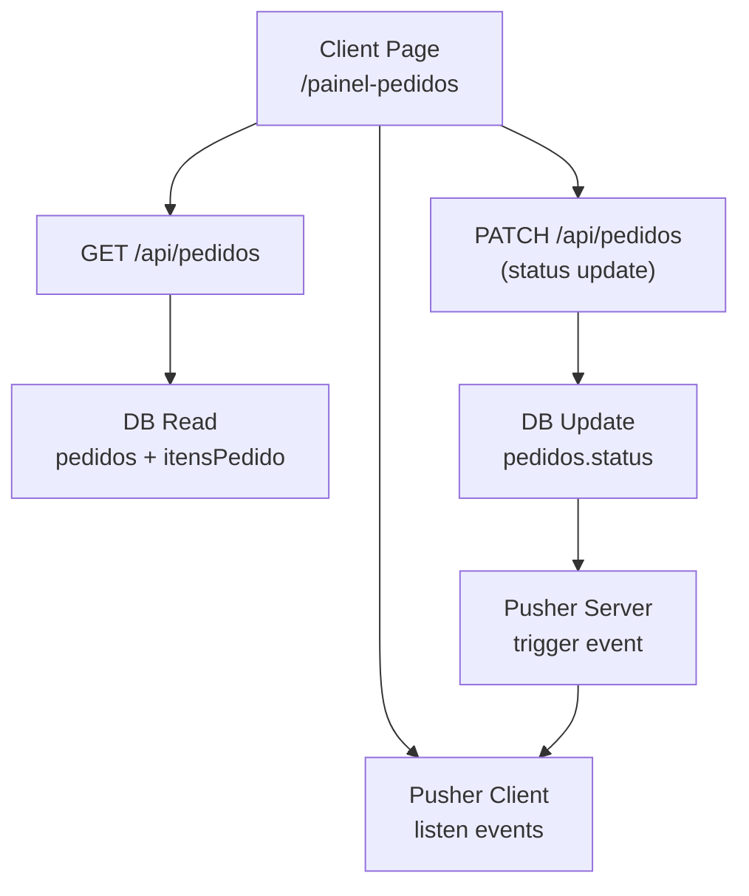
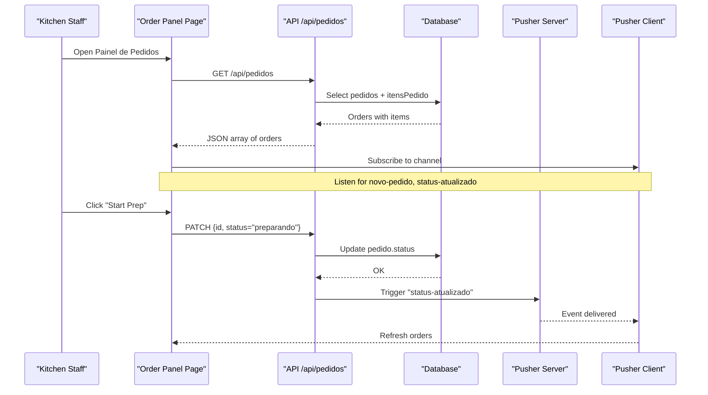
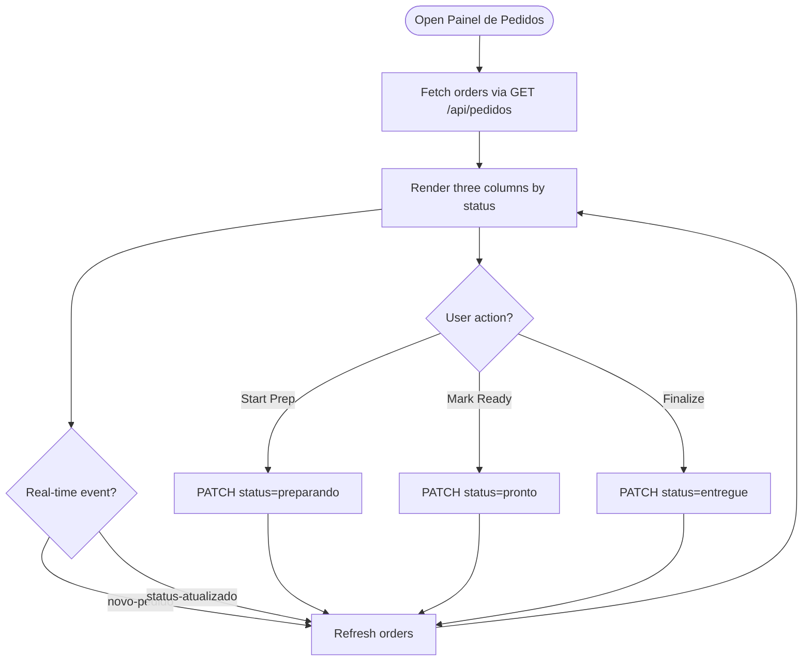
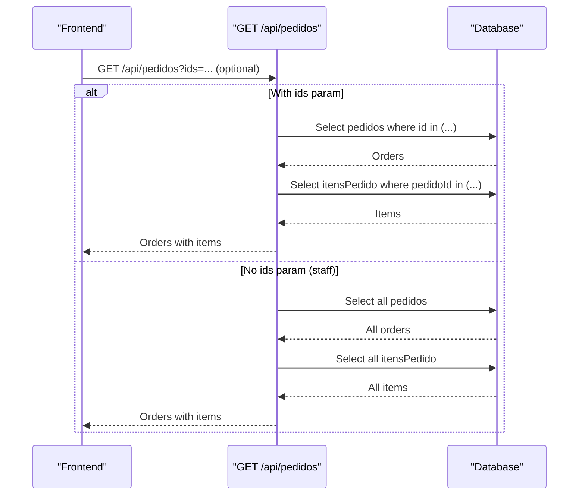
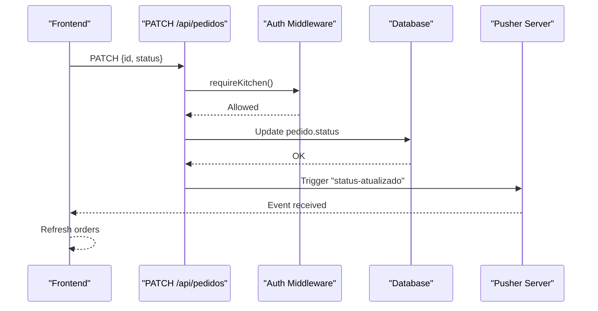
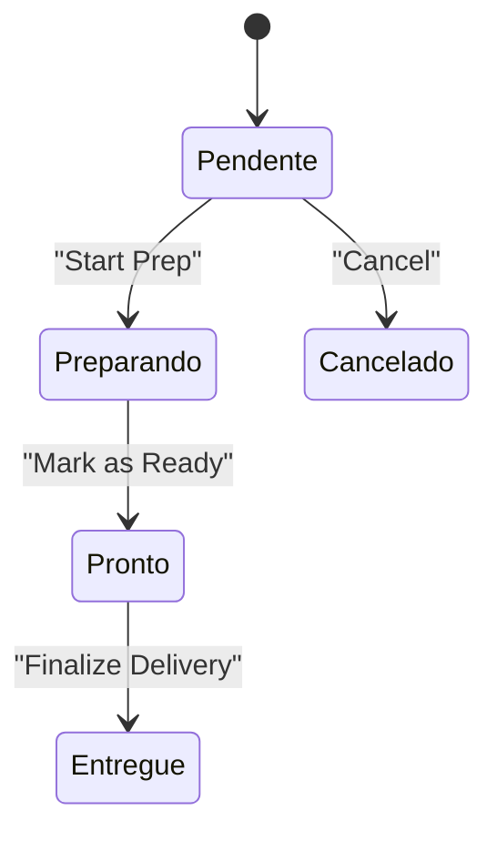
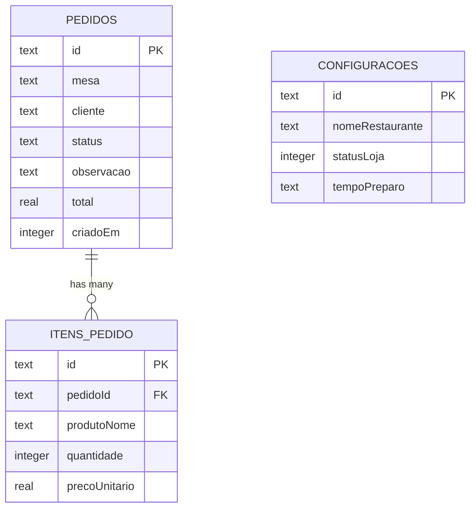
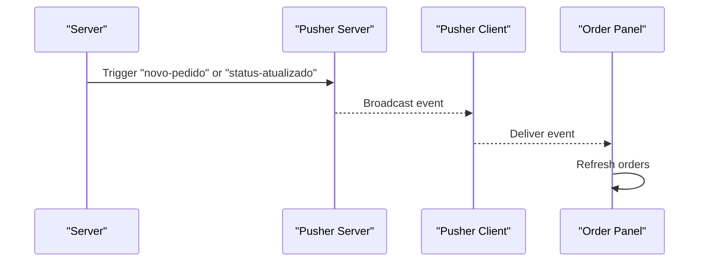
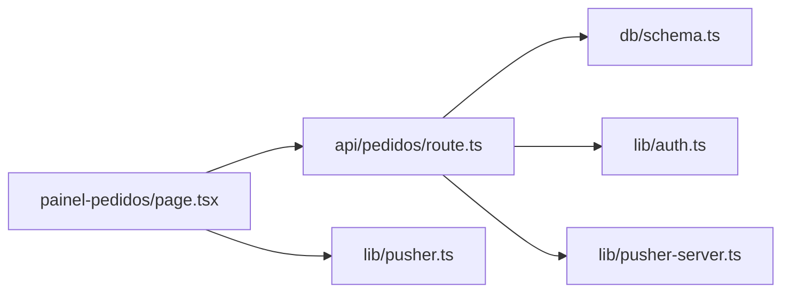

# Order Management Interface

<cite>
**Referenced Files in This Document**
- [painel-pedidos/page.tsx](file://src/app/painel-pedidos/page.tsx)
- [pedidos/route.ts](file://src/app/api/pedidos/route.ts)
- [cancelar/route.ts](file://src/app/api/pedidos/cancelar/route.ts)
- [pusher.ts](file://src/lib/pusher.ts)
- [pusher-server.ts](file://src/lib/pusher-server.ts)
- [schema.ts](file://src/db/schema.ts)
- [auth.ts](file://src/lib/auth.ts)
- [orders/page.tsx](file://src/app/orders/page.tsx)
</cite>

## Table of Contents
1. [Introduction](#introduction)
2. [Project Structure](#project-structure)
3. [Core Components](#core-components)
4. [Architecture Overview](#architecture-overview)
5. [Detailed Component Analysis](#detailed-component-analysis)
6. [Dependency Analysis](#dependency-analysis)
7. [Performance Considerations](#performance-considerations)
8. [Troubleshooting Guide](#troubleshooting-guide)
9. [Conclusion](#conclusion)

## Introduction
This document explains the order management interface focused on the painel de pedidos (order panel). It covers:
- The three-column layout for pending, preparing, and ready orders
- How kitchen staff view incoming orders with table numbers, customer names, items, quantities, and special observations
- The status transition workflow from pendente to preparando to pronto to entregue
- API integration for fetching orders via GET /api/pedidos and updating status via PATCH requests
- Responsive design and mobile navigation bar
- Performance considerations for large order volumes and real-time updates

## Project Structure
The order panel is implemented as a client-side Next.js page that:
- Loads all active orders from the backend API
- Subscribes to real-time events to refresh the UI when new orders arrive or statuses change
- Renders a responsive three-column board with actions to move orders through their lifecycle
- Uses role-based authentication to protect write operations

**Diagram sources**
- [painel-pedidos/page.tsx:34-76](file://src/app/painel-pedidos/page.tsx#L34-L76)
- [pedidos/route.ts:15-63](file://src/app/api/pedidos/route.ts#L15-L63)
- [pedidos/route.ts:192-235](file://src/app/api/pedidos/route.ts#L192-L235)
- [pusher.ts:1-9](file://src/lib/pusher.ts#L1-L9)
- [pusher-server.ts:1-11](file://src/lib/pusher-server.ts#L1-L11)

**Section sources**
- [painel-pedidos/page.tsx:1-295](file://src/app/painel-pedidos/page.tsx#L1-L295)
- [pedidos/route.ts:1-253](file://src/app/api/pedidos/route.ts#L1-L253)
- [pusher.ts:1-9](file://src/lib/pusher.ts#L1-L9)
- [pusher-server.ts:1-11](file://src/lib/pusher-server.ts#L1-L11)

## Core Components
- Order Panel Page: Displays three columns (pending, preparing, ready), shows order details, and provides status transitions.
- Orders API: Provides endpoints to list orders, update status, cancel orders, and delete orders.
- Real-time Updates: Pusher client listens for new orders and status changes; server triggers events after DB writes.
- Data Model: Orders and order items stored in SQLite via Drizzle ORM.
- Authentication: Role-based middleware protects write endpoints.

Key responsibilities:
- Frontend fetches orders and subscribes to real-time events to keep the UI current.
- Backend validates inputs, enforces roles, persists changes, and emits events.
- Database schema defines orders and items with timestamps and totals.

**Section sources**
- [painel-pedidos/page.tsx:9-24](file://src/app/painel-pedidos/page.tsx#L9-L24)
- [pedidos/route.ts:15-63](file://src/app/api/pedidos/route.ts#L15-L63)
- [pedidos/route.ts:192-235](file://src/app/api/pedidos/route.ts#L192-L235)
- [schema.ts:14-32](file://src/db/schema.ts#L14-L32)
- [auth.ts:63-82](file://src/lib/auth.ts#L63-L82)

## Architecture Overview
The system uses a client-server architecture with real-time synchronization:
- The order panel page calls GET /api/pedidos to load orders and renders them in three columns based on status.
- When a user moves an order to the next stage, the page sends a PATCH request to update the status.
- After successful persistence, the server triggers a Pusher event so other clients can update instantly without polling.

**Diagram sources**
- [painel-pedidos/page.tsx:34-95](file://src/app/painel-pedidos/page.tsx#L34-L95)
- [pedidos/route.ts:15-63](file://src/app/api/pedidos/route.ts#L15-L63)
- [pedidos/route.ts:192-235](file://src/app/api/pedidos/route.ts#L192-L235)
- [pusher.ts:1-9](file://src/lib/pusher.ts#L1-L9)
- [pusher-server.ts:1-11](file://src/lib/pusher-server.ts#L1-L11)

## Detailed Component Analysis

### Order Panel Page (Three-Column Layout)
- Columns:
  - Novos Pedidos (Pending): Shows orders with status pendente, including table number, customer name, items with quantities, and optional observations. Action: start preparation.
  - Em Preparo (Preparing): Shows orders with status preparando. Action: mark as ready.
  - Prontos (Ready): Shows orders with status pronto. Action: finalize delivery.
- Real-time behavior:
  - Initial load via GET /api/pedidos
  - Subscribes to Pusher channel and listens for novo-pedido and status-atualizado events to refresh data automatically
- Mobile navigation:
  - Fixed bottom nav for touch devices with quick access to key sections

**Diagram sources**
- [painel-pedidos/page.tsx:34-95](file://src/app/painel-pedidos/page.tsx#L34-L95)
- [painel-pedidos/page.tsx:157-267](file://src/app/painel-pedidos/page.tsx#L157-L267)

**Section sources**
- [painel-pedidos/page.tsx:107-295](file://src/app/painel-pedidos/page.tsx#L107-L295)

### API Integration: Fetching Orders (GET /api/pedidos)
- Behavior:
  - Unauthenticated clients can fetch only their own orders by passing a comma-separated ids query parameter
  - Authenticated staff (admin, cozinha, atendente) can list all orders
- Response shape:
  - Array of orders, each enriched with its items
- Error handling:
  - Returns error responses on internal failures

**Diagram sources**
- [pedidos/route.ts:15-63](file://src/app/api/pedidos/route.ts#L15-L63)

**Section sources**
- [pedidos/route.ts:15-63](file://src/app/api/pedidos/route.ts#L15-L63)

### API Integration: Updating Status (PATCH /api/pedidos)
- Authorization:
  - Requires admin or cozinha role
- Input validation:
  - Must include id and status
  - Status must be one of the allowed values
- Side effects:
  - Persists status change
  - Triggers Pusher event to notify clients

**Diagram sources**
- [pedidos/route.ts:192-235](file://src/app/api/pedidos/route.ts#L192-L235)
- [auth.ts:76-82](file://src/lib/auth.ts#L76-L82)

**Section sources**
- [pedidos/route.ts:192-235](file://src/app/api/pedidos/route.ts#L192-L235)
- [auth.ts:63-82](file://src/lib/auth.ts#L63-L82)

### Status Transition Workflow
- Valid statuses: pendente, preparando, pronto, entregue, cancelado
- Typical flow:
  - pendente → preparing via “Start Prep” button
  - preparando → ready via “Mark as Ready” button
  - pronto → delivered via “Finalize (Delivered)” link/button
- Cancelation:
  - Pending orders can be canceled before preparation starts

**Diagram sources**
- [pedidos/route.ts:192-235](file://src/app/api/pedidos/route.ts#L192-L235)
- [cancelar/route.ts:6-21](file://src/app/api/pedidos/cancelar/route.ts#L6-L21)

**Section sources**
- [pedidos/route.ts:192-235](file://src/app/api/pedidos/route.ts#L192-L235)
- [cancelar/route.ts:6-21](file://src/app/api/pedidos/cancelar/route.ts#L6-L21)

### Data Model and Relationships
- Orders contain fields such as table, customer, status, observation, total, and creation timestamp
- Each order has multiple items with product name, quantity, and unit price
- Configuration stores store-level settings like open/closed status and prep time

**Diagram sources**
- [schema.ts:14-40](file://src/db/schema.ts#L14-L40)

**Section sources**
- [schema.ts:14-40](file://src/db/schema.ts#L14-L40)

### Real-Time Updates with Pusher
- Client subscription:
  - Subscribes to a restaurant channel and listens for novo-pedido and status-atualizado events
- Server triggers:
  - On new order creation and on status updates, the server triggers corresponding events
- Benefits:
  - Eliminates need for polling on the order panel
  - Keeps all connected screens synchronized

**Diagram sources**
- [painel-pedidos/page.tsx:53-76](file://src/app/painel-pedidos/page.tsx#L53-L76)
- [pedidos/route.ts:173-180](file://src/app/api/pedidos/route.ts#L173-L180)
- [pedidos/route.ts:220-228](file://src/app/api/pedidos/route.ts#L220-L228)
- [pusher.ts:1-9](file://src/lib/pusher.ts#L1-L9)
- [pusher-server.ts:1-11](file://src/lib/pusher-server.ts#L1-L11)

**Section sources**
- [painel-pedidos/page.tsx:53-76](file://src/app/painel-pedidos/page.tsx#L53-L76)
- [pedidos/route.ts:173-180](file://src/app/api/pedidos/route.ts#L173-L180)
- [pedidos/route.ts:220-228](file://src/app/api/pedidos/route.ts#L220-L228)

### Responsive Design and Mobile Navigation
- Desktop:
  - Three-column grid layout using responsive Tailwind classes
- Mobile:
  - Single column stack
  - Fixed bottom navigation bar for quick access to key sections
- Accessibility:
  - Icons with titles for clarity
  - Clear labels and visual hierarchy

**Section sources**
- [painel-pedidos/page.tsx:107-155](file://src/app/painel-pedidos/page.tsx#L107-L155)
- [painel-pedidos/page.tsx:270-291](file://src/app/painel-pedidos/page.tsx#L270-L291)

## Dependency Analysis
- Frontend dependencies:
  - React hooks for state and side effects
  - Next.js router for navigation
  - Pusher client for real-time events
- Backend dependencies:
  - Next.js API routes
  - Drizzle ORM for database queries
  - Pusher server for event broadcasting
  - Authentication helpers for role checks

**Diagram sources**
- [painel-pedidos/page.tsx:1-76](file://src/app/painel-pedidos/page.tsx#L1-L76)
- [pedidos/route.ts:1-7](file://src/app/api/pedidos/route.ts#L1-L7)
- [schema.ts:1-40](file://src/db/schema.ts#L1-L40)
- [auth.ts:63-82](file://src/lib/auth.ts#L63-L82)
- [pusher.ts:1-9](file://src/lib/pusher.ts#L1-L9)
- [pusher-server.ts:1-11](file://src/lib/pusher-server.ts#L1-L11)

**Section sources**
- [painel-pedidos/page.tsx:1-76](file://src/app/painel-pedidos/page.tsx#L1-L76)
- [pedidos/route.ts:1-7](file://src/app/api/pedidos/route.ts#L1-L7)
- [schema.ts:1-40](file://src/db/schema.ts#L1-L40)
- [auth.ts:63-82](file://src/lib/auth.ts#L63-L82)
- [pusher.ts:1-9](file://src/lib/pusher.ts#L1-L9)
- [pusher-server.ts:1-11](file://src/lib/pusher-server.ts#L1-L11)

## Performance Considerations
- Real-time updates:
  - Use Pusher to avoid polling on the order panel; this reduces network overhead and keeps UI consistent across devices
- Efficient rendering:
  - Filter orders by status in-memory to render columns efficiently
- Network optimization:
  - For unauthenticated clients, pass specific order IDs to limit payload size
- Scalability:
  - Ensure Pusher configuration is set to handle concurrent connections
  - Consider indexing frequently queried fields (e.g., status, created timestamp) if dataset grows significantly
- Error resilience:
  - Graceful fallbacks when Pusher is unavailable; ensure UI remains usable even if real-time features fail

[No sources needed since this section provides general guidance]

## Troubleshooting Guide
- Cannot fetch orders:
  - Verify authentication cookies for staff roles
  - Check network errors and console logs
- Status updates not reflected:
  - Confirm PATCH endpoint returns success
  - Ensure Pusher environment variables are configured correctly
  - Verify client is subscribed to the correct channel and listening for events
- Real-time events not received:
  - Validate Pusher keys and cluster settings
  - Check server logs for trigger errors
- Canceling orders:
  - Only pending orders can be canceled; attempting to cancel later stages will return an error

**Section sources**
- [pedidos/route.ts:15-63](file://src/app/api/pedidos/route.ts#L15-L63)
- [pedidos/route.ts:192-235](file://src/app/api/pedidos/route.ts#L192-L235)
- [cancelar/route.ts:6-21](file://src/app/api/pedidos/cancelar/route.ts#L6-L21)
- [pusher.ts:1-9](file://src/lib/pusher.ts#L1-L9)
- [pusher-server.ts:1-11](file://src/lib/pusher-server.ts#L1-L11)

## Conclusion
The order management interface provides a clear, responsive, and real-time experience for kitchen staff to manage orders across stages. The three-column layout organizes work efficiently, while the API and Pusher integration ensure accurate and timely updates. Proper authentication and validation protect critical operations, and the design adapts seamlessly to different screen sizes for optimal usability in busy environments.