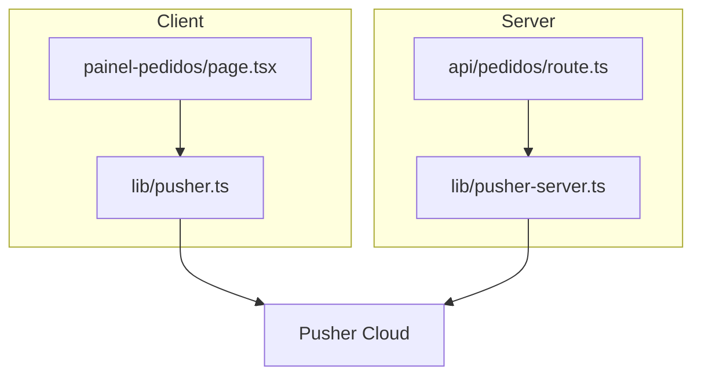
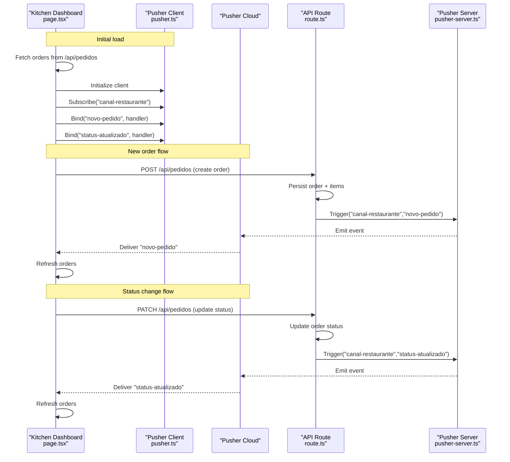
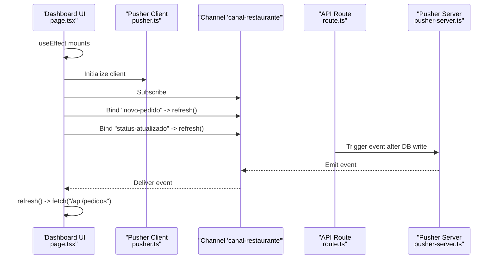
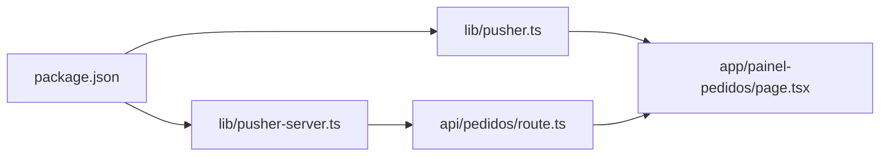

# Real-time Order Updates

<cite>
**Referenced Files in This Document**
- [pusher-server.ts](file://src/lib/pusher-server.ts)
- [pusher.ts](file://src/lib/pusher.ts)
- [route.ts](file://src/app/api/pedidos/route.ts)
- [page.tsx](file://src/app/painel-pedidos/page.tsx)
- [package.json](file://package.json)
</cite>

## Table of Contents
1. [Introduction](#introduction)
2. [Project Structure](#project-structure)
3. [Core Components](#core-components)
4. [Architecture Overview](#architecture-overview)
5. [Detailed Component Analysis](#detailed-component-analysis)
6. [Dependency Analysis](#dependency-analysis)
7. [Performance Considerations](#performance-considerations)
8. [Troubleshooting Guide](#troubleshooting-guide)
9. [Conclusion](#conclusion)

## Introduction
This document explains the real-time order update system built with Pusher. The kitchen dashboard subscribes to a shared channel and listens for two events:
- novo-pedido: emitted when a new order is created
- status-atualizado: emitted when an order’s status changes

The client-side implementation uses a React useEffect hook to maintain the WebSocket connection, subscribe to the channel, bind event listeners, and refresh the order list when events arrive. On the server side, API endpoints emit these events after persisting data to the database. The documentation also covers error handling, reconnection considerations, graceful degradation, performance optimization for high-frequency updates, and memory management for WebSocket connections.

## Project Structure
The real-time feature spans three layers:
- Client library initialization (Pusher client)
- Server library initialization (Pusher server)
- API routes that trigger events
- Dashboard page that consumes events and refreshes UI

**Diagram sources**
- [page.tsx:1-100](file://src/app/painel-pedidos/page.tsx#L1-L100)
- [pusher.ts:1-9](file://src/lib/pusher.ts#L1-L9)
- [route.ts:1-60](file://src/app/api/pedidos/route.ts#L1-L60)
- [pusher-server.ts:1-11](file://src/lib/pusher-server.ts#L1-L11)

**Section sources**
- [page.tsx:1-100](file://src/app/painel-pedidos/page.tsx#L1-L100)
- [pusher.ts:1-9](file://src/lib/pusher.ts#L1-L9)
- [route.ts:1-60](file://src/app/api/pedidos/route.ts#L1-L60)
- [pusher-server.ts:1-11](file://src/lib/pusher-server.ts#L1-L11)

## Core Components
- Pusher client singleton: Initializes the Pusher client using public environment variables and exposes it for use in components.
- Pusher server singleton: Initializes the Pusher server instance using private environment variables and exposes it for emitting events from API routes.
- API route handlers: Persist orders and status changes to the database, then emit corresponding Pusher events on the shared channel.
- Kitchen dashboard component: Subscribes to the channel, binds event listeners, and refreshes the order list upon receiving events.

Key responsibilities:
- Client: Subscribe to channel, bind listeners, unsubscribe on cleanup, fetch initial data.
- Server: Validate inputs, persist data, emit events, handle errors gracefully.

**Section sources**
- [pusher.ts:1-9](file://src/lib/pusher.ts#L1-L9)
- [pusher-server.ts:1-11](file://src/lib/pusher-server.ts#L1-L11)
- [route.ts:65-190](file://src/app/api/pedidos/route.ts#L65-L190)
- [page.tsx:53-76](file://src/app/painel-pedidos/page.tsx#L53-L76)

## Architecture Overview
The system follows a publish-subscribe pattern via Pusher:
- Clients connect to Pusher and subscribe to a single channel.
- Server emits events to this channel after successful operations.
- All subscribed clients receive events and react by refreshing their local state.

**Diagram sources**
- [page.tsx:53-76](file://src/app/painel-pedidos/page.tsx#L53-L76)
- [pusher.ts:1-9](file://src/lib/pusher.ts#L1-L9)
- [route.ts:147-190](file://src/app/api/pedidos/route.ts#L147-L190)
- [pusher-server.ts:1-11](file://src/lib/pusher-server.ts#L1-L11)

## Detailed Component Analysis

### Pusher Client Initialization
- Creates a Pusher client instance using public key and cluster from environment variables.
- Returns null if required variables are missing, enabling graceful degradation.

Implementation highlights:
- Conditional instantiation based on environment presence.
- Single exported client used across components.

**Section sources**
- [pusher.ts:1-9](file://src/lib/pusher.ts#L1-L9)

### Pusher Server Initialization
- Creates a Pusher server instance using app ID, secret, key, and cluster from environment variables.
- Enables TLS for secure communication.
- Returns null if required variables are missing, allowing safe fallbacks.

Implementation highlights:
- Guarded initialization to avoid runtime errors when env vars are absent.
- Centralized configuration for server-side event emission.

**Section sources**
- [pusher-server.ts:1-11](file://src/lib/pusher-server.ts#L1-L11)

### API Route: Create Order and Emit Event
- Validates request body and business rules.
- Persists order and items within a transaction.
- Emits a novo-pedido event on the shared channel after successful persistence.
- Logs errors without failing the response path.

Event emission details:
- Channel: canal-restaurante
- Event: novo-pedido
- Payload includes a message indicating a new order.

Error handling:
- Try/catch around event emission ensures database success even if Pusher fails.
- Errors are logged for observability.

**Section sources**
- [route.ts:65-190](file://src/app/api/pedidos/route.ts#L65-L190)

### API Route: Update Order Status and Emit Event
- Requires authentication for kitchen staff.
- Validates status values against allowed set.
- Persists status update.
- Emits a status-atualizado event on the shared channel after successful persistence.

Event emission details:
- Channel: canal-restaurante
- Event: status-atualizado
- Payload includes order id and new status.

Error handling:
- Try/catch around event emission ensures database success even if Pusher fails.
- Errors are logged for observability.

**Section sources**
- [route.ts:192-235](file://src/app/api/pedidos/route.ts#L192-L235)

### Kitchen Dashboard: Real-time Subscription and Refresh
- Uses two useEffect hooks:
  - First loads initial orders from the API.
  - Second initializes Pusher client, subscribes to canal-restaurante, and binds listeners for novo-pedido and status-atualizado.
- On each event, triggers a refresh of the orders list.
- Unsubscribes from the channel on component unmount to prevent memory leaks.

Event binding details:
- Channel: canal-restaurante
- Events: novo-pedido, status-atualizado
- Handler behavior: call carregarPedidos() to refresh the list

Cleanup:
- Ensures client.unsubscribe("canal-restaurante") runs on unmount.

**Section sources**
- [page.tsx:34-76](file://src/app/painel-pedidos/page.tsx#L34-L76)

#### Sequence Diagram: Event-driven Refresh Flow

**Diagram sources**
- [page.tsx:53-76](file://src/app/painel-pedidos/page.tsx#L53-L76)
- [route.ts:173-190](file://src/app/api/pedidos/route.ts#L173-L190)
- [pusher-server.ts:1-11](file://src/lib/pusher-server.ts#L1-L11)
- [pusher.ts:1-9](file://src/lib/pusher.ts#L1-L9)

## Dependency Analysis
The real-time feature depends on:
- pusher-js for client-side WebSocket connectivity
- pusher for server-side event emission
- Next.js API routes for business logic and persistence
- React hooks for lifecycle management and state updates

**Diagram sources**
- [package.json:17-30](file://package.json#L17-L30)
- [pusher.ts:1-9](file://src/lib/pusher.ts#L1-L9)
- [pusher-server.ts:1-11](file://src/lib/pusher-server.ts#L1-L11)
- [route.ts:1-60](file://src/app/api/pedidos/route.ts#L1-L60)
- [page.tsx:1-100](file://src/app/painel-pedidos/page.tsx#L1-L100)

**Section sources**
- [package.json:17-30](file://package.json#L17-L30)
- [pusher.ts:1-9](file://src/lib/pusher.ts#L1-L9)
- [pusher-server.ts:1-11](file://src/lib/pusher-server.ts#L1-L11)
- [route.ts:1-60](file://src/app/api/pedidos/route.ts#L1-L60)
- [page.tsx:1-100](file://src/app/painel-pedidos/page.tsx#L1-L100)

## Performance Considerations
High-frequency updates can cause excessive network requests and UI re-renders. Recommendations:
- Debounce or throttle refresh calls triggered by rapid events to avoid redundant fetches.
- Use optimistic UI updates where appropriate to reduce perceived latency.
- Minimize payload size by selecting only necessary fields from the API.
- Avoid unnecessary rebindings; ensure subscriptions are established once per component lifecycle.
- Monitor memory usage and ensure proper cleanup of event listeners and subscriptions.

[No sources needed since this section provides general guidance]

## Troubleshooting Guide
Common issues and resolutions:
- Missing environment variables:
  - Ensure NEXT_PUBLIC_PUSHER_KEY and NEXT_PUBLIC_PUSHER_CLUSTER are set for the client.
  - Ensure PUSHER_APP_ID, PUSHER_SECRET, and NEXT_PUBLIC_PUSHER_CLUSTER are set for the server.
  - If variables are missing, client/server instances will be null, disabling real-time features gracefully.
- Connection failures:
  - Verify network connectivity and firewall settings allow WebSocket traffic to Pusher.
  - Check browser console for Pusher errors and inspect channel subscription status.
- Reconnection logic:
  - Pusher-js handles automatic reconnection by default; monitor connection state if custom behavior is needed.
- Graceful degradation:
  - When Pusher is unavailable, users can still interact via manual refresh buttons and polling if implemented.
- Error logging:
  - Server logs Pusher emission errors without failing database operations; review logs to diagnose delivery issues.

**Section sources**
- [pusher.ts:1-9](file://src/lib/pusher.ts#L1-L9)
- [pusher-server.ts:1-11](file://src/lib/pusher-server.ts#L1-L11)
- [route.ts:173-190](file://src/app/api/pedidos/route.ts#L173-L190)
- [route.ts:220-235](file://src/app/api/pedidos/route.ts#L220-L235)
- [page.tsx:53-76](file://src/app/painel-pedidos/page.tsx#L53-L76)

## Conclusion
The real-time order update system leverages Pusher to provide instant notifications to the kitchen dashboard. The architecture cleanly separates client and server concerns, with robust error handling ensuring resilience. By following the recommended performance optimizations and troubleshooting steps, the system can scale effectively under high-frequency updates while maintaining a responsive user experience.

[No sources needed since this section summarizes without analyzing specific files]