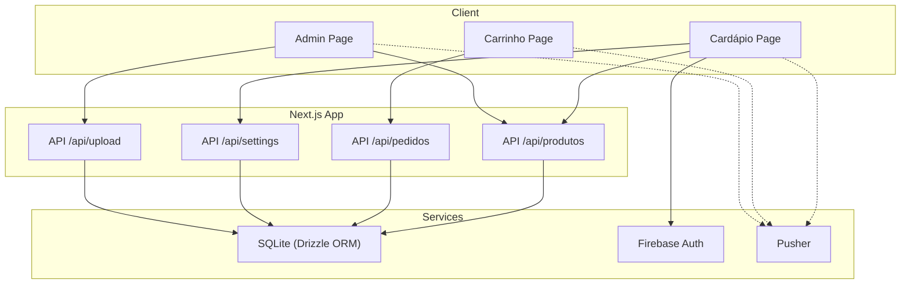
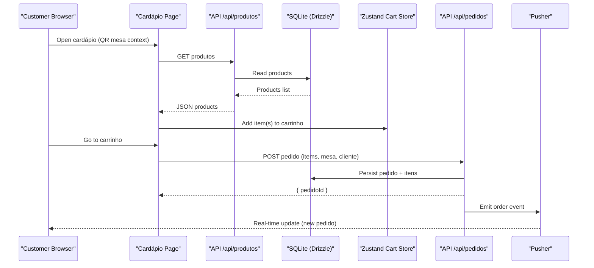
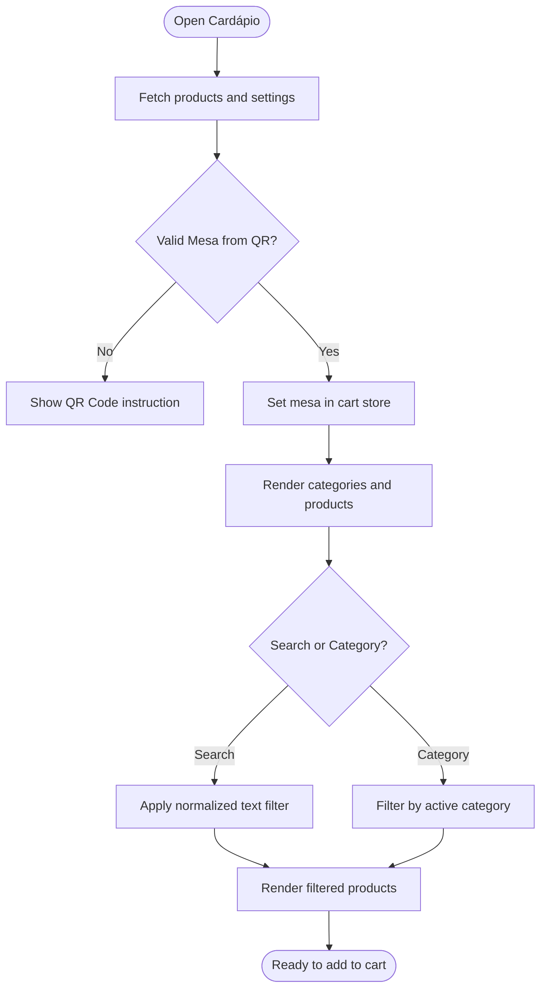
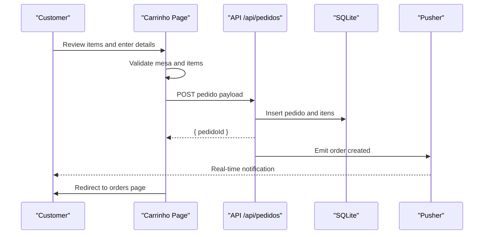
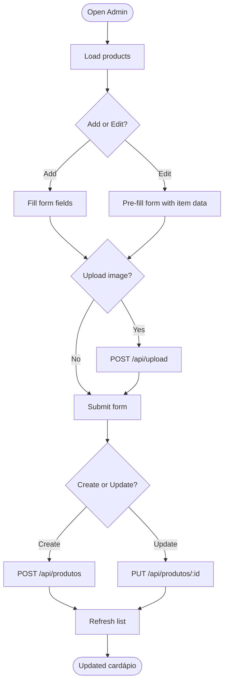
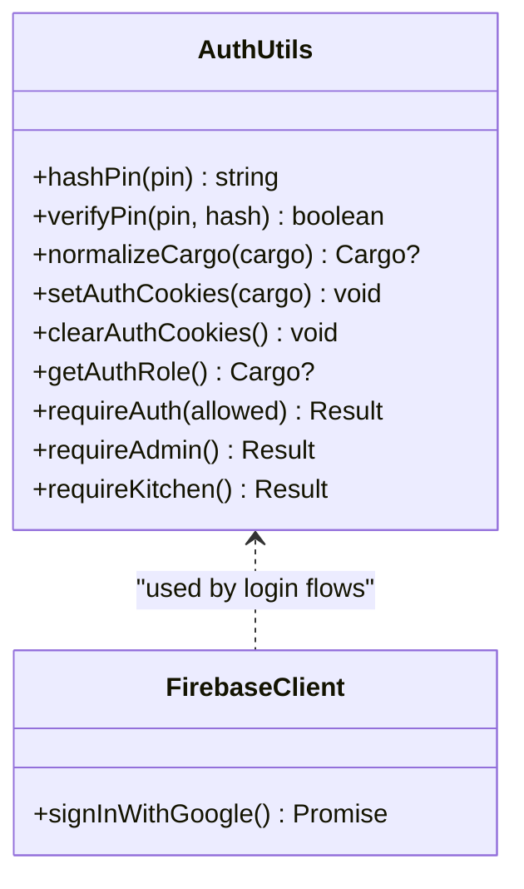
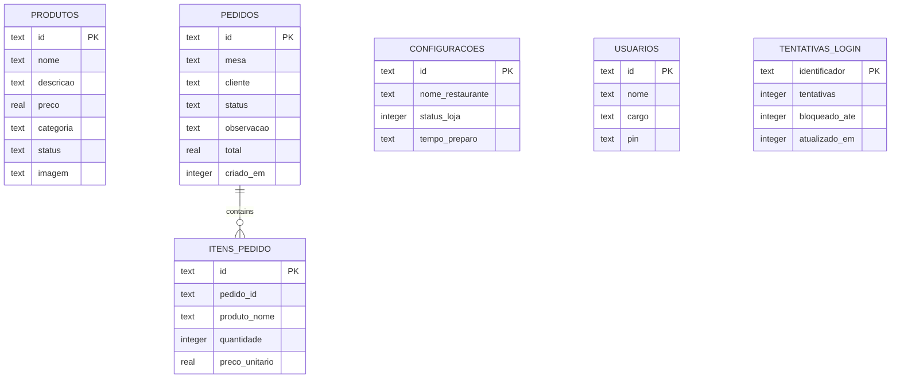
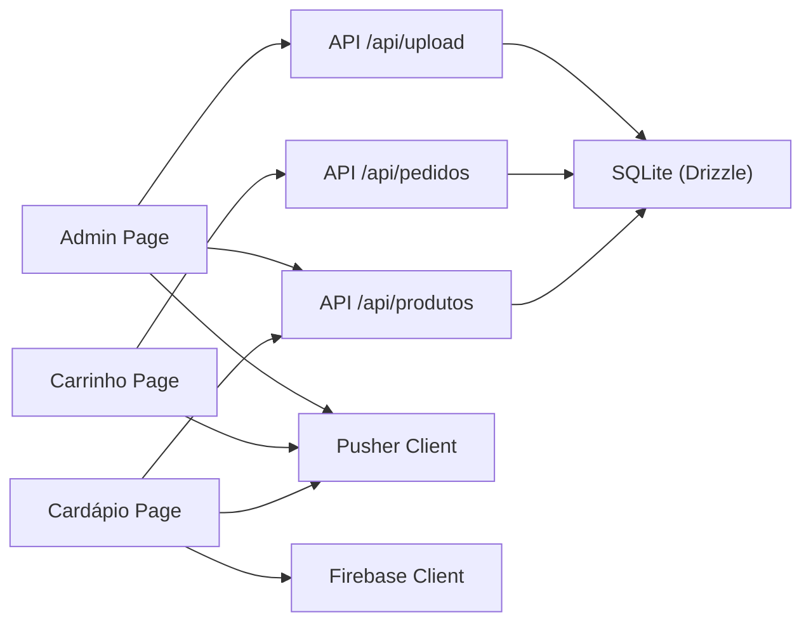

# Project Overview

<cite>
**Referenced Files in This Document**
- [package.json](file://package.json)
- [layout.tsx](file://src/app/layout.tsx)
- [page.tsx](file://src/app/page.tsx)
- [cardapio/page.tsx](file://src/app/cardapio/page.tsx)
- [carrinho/page.tsx](file://src/app/carrinho/page.tsx)
- [admin/page.tsx](file://src/app/admin/page.tsx)
- [cartStore.ts](file://src/contexts/cartStore.ts)
- [schema.ts](file://src/db/schema.ts)
- [auth.ts](file://src/lib/auth.ts)
- [firebase-client.ts](file://src/lib/firebase-client.ts)
- [pusher.ts](file://src/lib/pusher.ts)
</cite>

## Table of Contents
1. Introduction
2. Project Structure
3. Core Components
4. Architecture Overview
5. Detailed Component Analysis
6. Dependency Analysis
7. Performance Considerations
8. Troubleshooting Guide
9. Conclusion

## Introduction
Meu Cardápio is a full-stack Next.js digital menu and ordering system designed for restaurants. It enables customers to browse the cardápio (menu), add items to their carrinho (shopping cart), and place pedidos (orders) from their table by scanning a QR code. Restaurant staff can manage orders and products through dedicated admin and kitchen interfaces, while administrators handle configuration and user roles. The application emphasizes real-time order updates and role-based access control, providing a smooth experience for both customers and staff.

Key features:
- Real-time order updates via Pusher
- Role-based authentication with Firebase and server-side cookies
- Admin dashboard for managing cardápio items and settings
- Kitchen interface for viewing and updating pedido status
- Shopping cart with persistent state across sessions
- QR-code-driven table context for accurate order routing

Technology stack highlights:
- Next.js 16 with React 19
- Drizzle ORM with SQLite database
- Firebase Authentication (Google sign-in)
- Pusher for real-time communication
- Zustand for client-side state management

Conceptual overview for beginners:
- Customers scan a QR code at their table to open the cardápio on their phone
- They browse categories, search items, and add products to their carrinho
- When ready, they submit a pedido with their name and optional notes
- Staff see new pedidos in real time and update them as they are prepared or served

Technical overview for experienced developers:
- Client pages fetch data from Next.js API routes
- Server-side auth middleware enforces role-based access using cookie tokens
- Data models are defined with Drizzle ORM and stored in SQLite
- Real-time events are broadcast via Pusher to keep interfaces synchronized

## Project Structure
The project follows a feature-oriented layout within the Next.js App Router:
- app: Pages and API routes organized by domain (cardápio, carrinho, admin, api/*, etc.)
- components: Reusable UI components such as product cards
- contexts: Global client state like the shopping cart
- db: Database schema and seeding scripts
- lib: Shared utilities for authentication, Firebase client, caching, and Pusher

**Diagram sources**
- [cardapio/page.tsx:52-65](file://src/app/cardapio/page.tsx#L52-L65)
- [carrinho/page.tsx:26-57](file://src/app/carrinho/page.tsx#L26-L57)
- [admin/page.tsx:37-49](file://src/app/admin/page.tsx#L37-L49)
- [schema.ts:1-56](file://src/db/schema.ts#L1-L56)
- [firebase-client.ts:1-26](file://src/lib/firebase-client.ts#L1-L26)
- [pusher.ts:1-9](file://src/lib/pusher.ts#L1-L9)

**Section sources**
- [package.json:1-45](file://package.json#L1-L45)
- [layout.tsx:1-34](file://src/app/layout.tsx#L1-L34)

## Core Components
- Cardápio (Menu): Displays products, supports category filtering and search, and integrates with the shopping cart. It also validates table context from QR codes and shows store status and preparation time.
- Carrinho (Shopping Cart): Manages selected items, quantities, totals, and checkout flow. Validates table context and submits pedidos to the backend.
- Admin Dashboard: Allows creating, editing, and deleting cardápio items; uploading images; and renaming categories.
- Authentication: Role-based access using Firebase sign-in and server-side cookie validation for protected routes and APIs.
- Real-time Updates: Pusher client integration to receive live updates for pedidos and other events.

Practical examples:
- Customer ordering flow: Scan QR code → open cardápio → add items to carrinho → submit pedido → view order status
- Kitchen order management: Log in with kitchen role → view incoming pedidos → update status as items are prepared
- Administrative tasks: Manage cardápio items, upload images, rename categories, and configure store settings

**Section sources**
- [cardapio/page.tsx:24-119](file://src/app/cardapio/page.tsx#L24-L119)
- [carrinho/page.tsx:8-57](file://src/app/carrinho/page.tsx#L8-L57)
- [admin/page.tsx:16-183](file://src/app/admin/page.tsx#L16-L183)
- [auth.ts:21-82](file://src/lib/auth.ts#L21-L82)
- [pusher.ts:1-9](file://src/lib/pusher.ts#L1-L9)

## Architecture Overview
The system combines client-side pages with server-side API routes and a SQLite database managed by Drizzle ORM. Authentication uses Firebase on the client and cookie-based session checks on the server. Real-time updates are delivered via Pusher.

**Diagram sources**
- [cardapio/page.tsx:52-65](file://src/app/cardapio/page.tsx#L52-L65)
- [carrinho/page.tsx:26-57](file://src/app/carrinho/page.tsx#L26-L57)
- [schema.ts:14-32](file://src/db/schema.ts#L14-L32)
- [pusher.ts:1-9](file://src/lib/pusher.ts#L1-L9)

## Detailed Component Analysis

### Cardápio (Menu) Interface
- Loads products and settings via API calls
- Supports category filtering and text search
- Validates table context from QR codes and sets it in the cart store
- Shows store status and preparation time hints
- Provides navigation to orders and cart

**Diagram sources**
- [cardapio/page.tsx:40-91](file://src/app/cardapio/page.tsx#L40-L91)
- [cardapio/page.tsx:103-119](file://src/app/cardapio/page.tsx#L103-L119)

**Section sources**
- [cardapio/page.tsx:24-119](file://src/app/cardapio/page.tsx#L24-L119)

### Carrinho (Shopping Cart) and Checkout
- Maintains cart items and quantities in Zustand with persistence
- Validates that the cardápio was opened via QR code before checkout
- Collects customer name, delivery preference (table vs counter), and optional notes
- Submits pedido to the backend and redirects to order tracking

**Diagram sources**
- [carrinho/page.tsx:26-57](file://src/app/carrinho/page.tsx#L26-L57)
- [schema.ts:14-32](file://src/db/schema.ts#L14-L32)
- [pusher.ts:1-9](file://src/lib/pusher.ts#L1-L9)

**Section sources**
- [carrinho/page.tsx:8-57](file://src/app/carrinho/page.tsx#L8-L57)
- [cartStore.ts:11-69](file://src/contexts/cartStore.ts#L11-L69)

### Admin Dashboard
- Lists all cardápio items with image previews and pricing
- Supports adding new items, editing existing ones, and deleting items
- Handles image uploads via an API endpoint
- Enables renaming categories across all related products

**Diagram sources**
- [admin/page.tsx:37-183](file://src/app/admin/page.tsx#L37-L183)

**Section sources**
- [admin/page.tsx:16-183](file://src/app/admin/page.tsx#L16-L183)

### Authentication and Roles
- Client-side Google sign-in via Firebase
- Server-side role enforcement using cookie-based tokens
- Roles include admin, cozinha (kitchen), and atendente (attendant)
- Protected endpoints return appropriate errors when unauthorized

**Diagram sources**
- [auth.ts:21-82](file://src/lib/auth.ts#L21-L82)
- [firebase-client.ts:1-26](file://src/lib/firebase-client.ts#L1-L26)

**Section sources**
- [auth.ts:21-82](file://src/lib/auth.ts#L21-L82)
- [firebase-client.ts:1-26](file://src/lib/firebase-client.ts#L1-L26)

### Data Models (Database Schema)
- Produtos: cardápio items with name, description, price, category, status, and image
- Pedidos: orders with table, customer, status, observation, total, and creation timestamp
- ItensPedido: order line items linking to pedido and product details
- Configuracoes: restaurant settings including store status and preparation time
- Usuarios: staff accounts with name, role, and PIN
- TentativasLogin: login attempt tracking for rate limiting

**Diagram sources**
- [schema.ts:1-56](file://src/db/schema.ts#L1-L56)

**Section sources**
- [schema.ts:1-56](file://src/db/schema.ts#L1-L56)

## Dependency Analysis
- Client pages depend on API routes for data operations
- API routes depend on Drizzle ORM and SQLite for persistence
- Authentication depends on Firebase client and server-side cookie utilities
- Real-time features depend on Pusher client and server broadcasting

**Diagram sources**
- [cardapio/page.tsx:52-65](file://src/app/cardapio/page.tsx#L52-L65)
- [carrinho/page.tsx:26-57](file://src/app/carrinho/page.tsx#L26-L57)
- [admin/page.tsx:37-183](file://src/app/admin/page.tsx#L37-L183)
- [schema.ts:1-56](file://src/db/schema.ts#L1-L56)
- [firebase-client.ts:1-26](file://src/lib/firebase-client.ts#L1-L26)
- [pusher.ts:1-9](file://src/lib/pusher.ts#L1-L9)

**Section sources**
- [package.json:17-29](file://package.json#L17-L29)

## Performance Considerations
- Use category filters and search locally on the client to reduce unnecessary network requests
- Cache product lists where appropriate to minimize repeated API calls
- Keep cart state lightweight and persisted to avoid re-fetching on reload
- Ensure Pusher events are handled efficiently to prevent excessive re-renders
- Optimize image uploads and previews to improve admin UX

[No sources needed since this section provides general guidance]

## Troubleshooting Guide
Common issues and resolutions:
- QR code not recognized: Ensure the URL includes a valid mesa parameter matching the expected pattern
- Empty cart submission: Verify that items exist and the mesa context is set before checkout
- Login failures: Confirm Firebase environment variables are configured and roles are assigned correctly
- Unauthorized access: Check server-side role cookies and ensure required roles are set for protected endpoints
- Real-time updates not appearing: Validate Pusher key and cluster configuration and confirm event emission

**Section sources**
- [carrinho/page.tsx:26-57](file://src/app/carrinho/page.tsx#L26-L57)
- [auth.ts:63-82](file://src/lib/auth.ts#L63-L82)
- [firebase-client.ts:6-18](file://src/lib/firebase-client.ts#L6-L18)
- [pusher.ts:1-9](file://src/lib/pusher.ts#L1-L9)

## Conclusion
Meu Cardápio delivers a complete digital menu and ordering solution tailored for restaurants. It combines a customer-friendly cardápio and carrinho with robust admin and kitchen interfaces, powered by Next.js, Drizzle ORM, SQLite, Firebase Authentication, and Pusher. The system ensures secure role-based access, real-time order updates, and a seamless experience from QR code scanning to order fulfillment.

[No sources needed since this section summarizes without analyzing specific files]