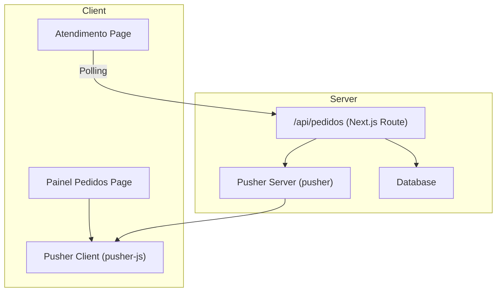
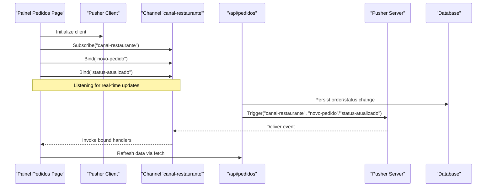

# Connection Management & Error Handling

<cite>
**Referenced Files in This Document**
- [pusher.ts](file://src/lib/pusher.ts)
- [pusher-server.ts](file://src/lib/pusher-server.ts)
- [route.ts](file://src/app/api/pedidos/route.ts)
- [page.tsx](file://src/app/painel-pedidos/page.tsx)
- [page.tsx](file://src/app/atendimento/page.tsx)
- [package.json](file://package.json)
</cite>

## Table of Contents
1. Introduction
2. Project Structure
3. Core Components
4. Architecture Overview
5. Detailed Component Analysis
6. Dependency Analysis
7. Performance Considerations
8. Troubleshooting Guide
9. Conclusion

## Introduction
This document explains how real-time features are implemented and how to manage connections and errors effectively. The system uses Pusher for event-driven updates between the server and clients, with a fallback polling strategy in one of the client views. It covers connection lifecycle, reconnection strategies, error boundaries, offline indicators, queued message processing, heartbeat mechanisms, health monitoring, testing approaches, and performance optimization for large-scale concurrent connections.

## Project Structure
Real-time functionality is centered around:
- A Pusher client instance used by browser components to subscribe to channels and listen for events.
- A Pusher server instance used by API routes to trigger events after database operations.
- Client pages that either use Pusher or fall back to periodic polling for updates.

**Diagram sources**
- [page.tsx:54-76](file://src/app/painel-pedidos/page.tsx#L54-L76)
- [page.tsx:34-41](file://src/app/atendimento/page.tsx#L34-L41)
- [route.ts:174-180](file://src/app/api/pedidos/route.ts#L174-L180)
- [route.ts:221-228](file://src/app/api/pedidos/route.ts#L221-L228)
- [pusher.ts:1-9](file://src/lib/pusher.ts#L1-L9)
- [pusher-server.ts:1-11](file://src/lib/pusher-server.ts#L1-L11)

**Section sources**
- [pusher.ts:1-9](file://src/lib/pusher.ts#L1-L9)
- [pusher-server.ts:1-11](file://src/lib/pusher-server.ts#L1-L11)
- [route.ts:1-253](file://src/app/api/pedidos/route.ts#L1-L253)
- [page.tsx:1-295](file://src/app/painel-pedidos/page.tsx#L1-L295)
- [page.tsx:1-107](file://src/app/atendimento/page.tsx#L1-L107)
- [package.json:17-30](file://package.json#L17-L30)

## Core Components
- Pusher Client: Initializes a Pusher client using environment variables; returns null if configuration is missing. Used by client pages to subscribe to channels and bind to events.
- Pusher Server: Initializes a Pusher server instance with app credentials and cluster; used by API routes to trigger events after successful operations.
- API Routes: Handle CRUD operations on orders and trigger Pusher events for real-time updates.
- Client Pages: 
  - Painel Pedidos subscribes to Pusher channel and listens for new order and status update events.
  - Atendimento uses polling to refresh data at intervals.

Key responsibilities:
- Connection initialization and subscription management.
- Event binding and unsubscription on component cleanup.
- Triggering events after state changes.
- Graceful degradation when Pusher is unavailable.

**Section sources**
- [pusher.ts:1-9](file://src/lib/pusher.ts#L1-L9)
- [pusher-server.ts:1-11](file://src/lib/pusher-server.ts#L1-L11)
- [route.ts:174-180](file://src/app/api/pedidos/route.ts#L174-L180)
- [route.ts:221-228](file://src/app/api/pedidos/route.ts#L221-L228)
- [page.tsx:54-76](file://src/app/painel-pedidos/page.tsx#L54-L76)
- [page.tsx:34-41](file://src/app/atendimento/page.tsx#L34-L41)

## Architecture Overview
The real-time architecture combines Pusher-based event streaming with a polling fallback:
- Clients subscribe to a shared channel and listen for specific events.
- Server triggers events after persisting changes to the database.
- If Pusher is not configured or fails, clients can rely on polling to keep UI consistent.

**Diagram sources**
- [page.tsx:54-76](file://src/app/painel-pedidos/page.tsx#L54-L76)
- [route.ts:174-180](file://src/app/api/pedidos/route.ts#L174-L180)
- [route.ts:221-228](file://src/app/api/pedidos/route.ts#L221-L228)
- [pusher.ts:1-9](file://src/lib/pusher.ts#L1-L9)
- [pusher-server.ts:1-11](file://src/lib/pusher-server.ts#L1-L11)

## Detailed Component Analysis

### Pusher Client Initialization
- Creates a Pusher client instance only when required environment variables are present.
- Returns null otherwise, enabling graceful fallback behavior in components.

Implementation highlights:
- Conditional instantiation based on NEXT_PUBLIC_PUSHER_KEY and NEXT_PUBLIC_PUSHER_CLUSTER.
- Exported singleton instance for reuse across components.

**Section sources**
- [pusher.ts:1-9](file://src/lib/pusher.ts#L1-L9)

### Pusher Server Initialization
- Creates a Pusher server instance with TLS enabled when all required credentials are available.
- Used exclusively within server-side API routes to trigger events.

Implementation highlights:
- Validates presence of PUSHER_APP_ID, NEXT_PUBLIC_PUSHER_KEY, PUSHER_SECRET, and NEXT_PUBLIC_PUSHER_CLUSTER.
- Exports a singleton instance for safe usage in route handlers.

**Section sources**
- [pusher-server.ts:1-11](file://src/lib/pusher-server.ts#L1-L11)

### Real-Time Event Flow in API Routes
- On POST /api/pedidos: After saving an order, triggers "novo-pedido" event.
- On PATCH /api/pedidos: After updating status, triggers "status-atualizado" event.
- Errors during triggering are caught and logged without failing the primary operation.

Flow details:
- Database transaction ensures consistency before triggering events.
- Event payloads include minimal necessary data to reduce bandwidth.

**Section sources**
- [route.ts:174-180](file://src/app/api/pedidos/route.ts#L174-L180)
- [route.ts:221-228](file://src/app/api/pedidos/route.ts#L221-L228)

### Client-Side Subscription and Cleanup
- Subscribes to "canal-restaurante" and binds to "novo-pedido" and "status-atualizado".
- Unsubscribes on component unmount to prevent memory leaks.
- Triggers data refresh upon receiving events.

Lifecycle considerations:
- useEffect initializes subscription and cleanup.
- Handlers call data-fetching functions to ensure UI consistency.

**Section sources**
- [page.tsx:54-76](file://src/app/painel-pedidos/page.tsx#L54-L76)

### Polling Fallback Strategy
- Atendimento page uses setInterval to poll /api/pedidos every 5 seconds.
- Provides resilience when Pusher is unavailable or misconfigured.

Operational notes:
- Initial load includes a small delay to avoid race conditions.
- Cleanup clears timers on unmount.

**Section sources**
- [page.tsx:34-41](file://src/app/atendimento/page.tsx#L34-L41)

### Error Handling Patterns
- API routes return structured JSON responses with appropriate HTTP status codes.
- Client components display user-friendly alerts on network failures.
- Pusher trigger errors are logged but do not interrupt core workflows.

Best practices observed:
- Try/catch blocks around network calls and Pusher triggers.
- Validation of request bodies and status transitions.

**Section sources**
- [route.ts:174-180](file://src/app/api/pedidos/route.ts#L174-L180)
- [route.ts:221-228](file://src/app/api/pedidos/route.ts#L221-L228)
- [page.tsx:78-95](file://src/app/painel-pedidos/page.tsx#L78-L95)

## Dependency Analysis
External dependencies relevant to real-time features:
- pusher-js: WebSocket-based client library for Pusher.
- pusher: Node.js server SDK for triggering events.

These libraries enable reliable real-time communication with built-in reconnection logic and scaling capabilities.

**Section sources**
- [package.json:17-30](file://package.json#L17-L30)

## Performance Considerations
To optimize for large numbers of concurrent connections and minimize bandwidth:
- Use lightweight event payloads containing only essential fields.
- Avoid unnecessary re-renders by batching state updates.
- Prefer Pusher over frequent polling where possible.
- Implement debounced handlers for high-frequency events.
- Monitor connection health and adjust polling intervals dynamically.
- Leverage Pusher’s built-in scaling and reconnection features.

[No sources needed since this section provides general guidance]

## Troubleshooting Guide
Common issues and resolutions:
- Missing Pusher configuration: Ensure NEXT_PUBLIC_PUSHER_KEY and NEXT_PUBLIC_PUSHER_CLUSTER are set.
- No events received: Verify channel names match exactly ("canal-restaurante").
- Network errors: Check browser console logs and implement retry logic.
- Memory leaks: Confirm subscriptions are cleaned up on component unmount.
- Stale data: Combine Pusher events with periodic refreshes.

Diagnostic steps:
- Log Pusher client initialization and subscription status.
- Inspect API response payloads and error messages.
- Validate environment variables on both client and server.

**Section sources**
- [pusher.ts:1-9](file://src/lib/pusher.ts#L1-L9)
- [pusher-server.ts:1-11](file://src/lib/pusher-server.ts#L1-L11)
- [route.ts:174-180](file://src/app/api/pedidos/route.ts#L174-L180)
- [route.ts:221-228](file://src/app/api/pedidos/route.ts#L221-L228)
- [page.tsx:54-76](file://src/app/painel-pedidos/page.tsx#L54-L76)

## Conclusion
The system implements robust real-time updates using Pusher with a fallback polling mechanism. Proper connection lifecycle management, error handling, and cleanup ensure reliability and performance. By following the patterns outlined here, you can extend real-time features while maintaining scalability and user experience.

[No sources needed since this section summarizes without analyzing specific files]