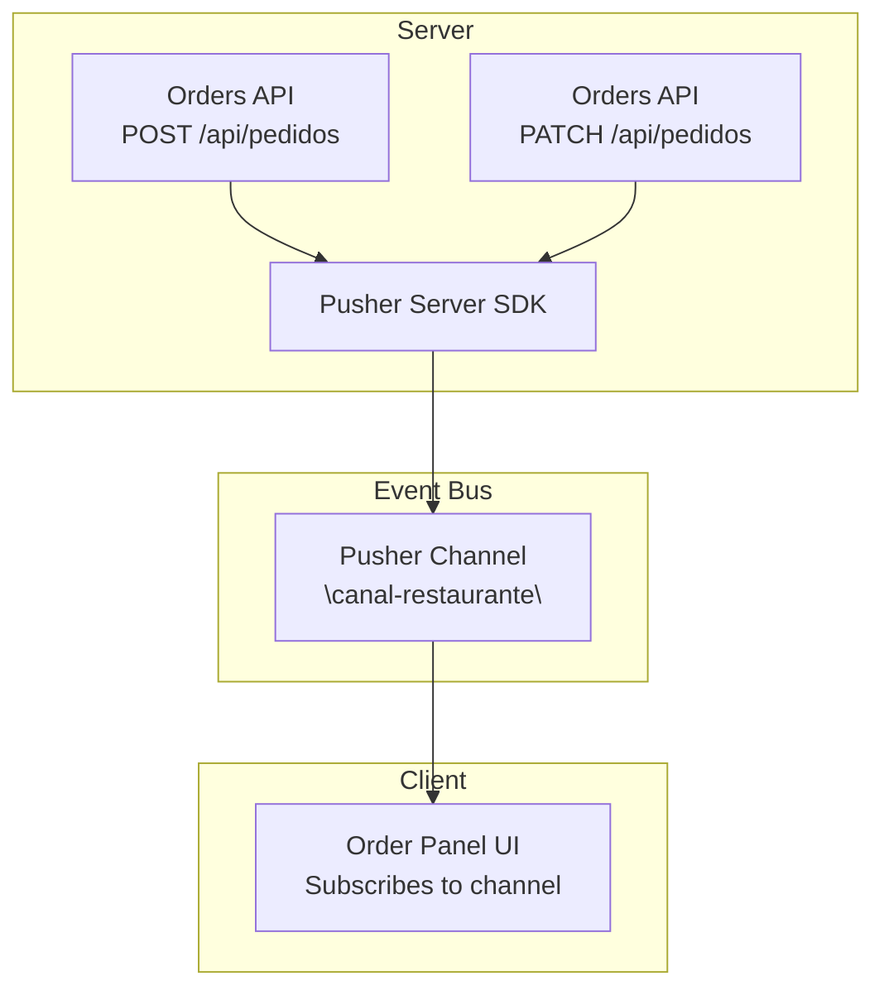
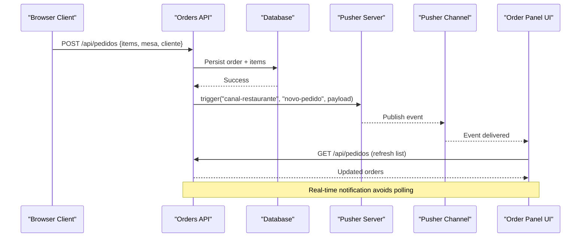
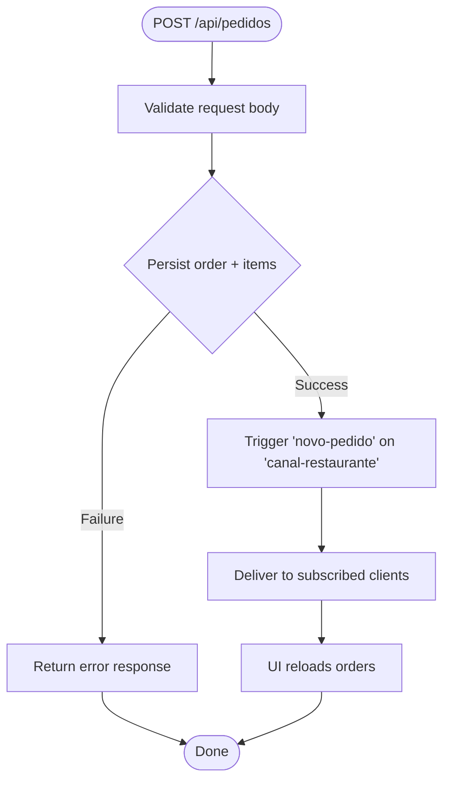
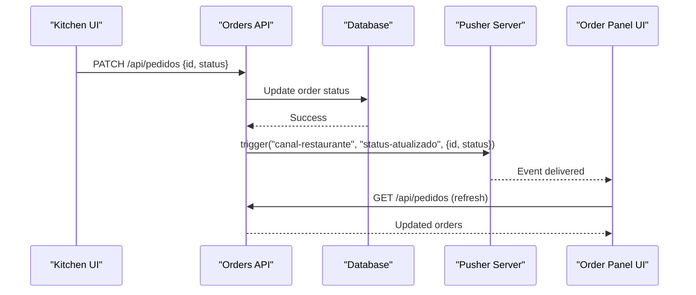
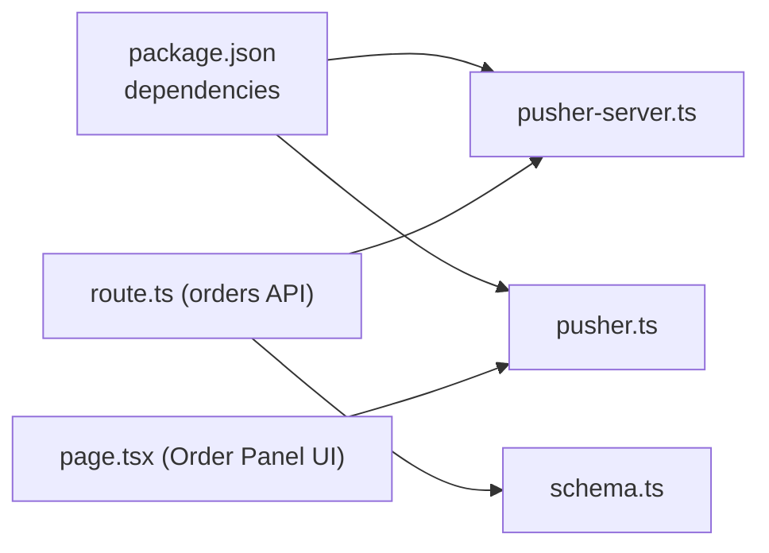

# Event-Driven Architecture

<cite>
**Referenced Files in This Document**
- [pusher-server.ts](file://src/lib/pusher-server.ts)
- [pusher.ts](file://src/lib/pusher.ts)
- [route.ts (orders API)](file://src/app/api/pedidos/route.ts)
- [cancelar route.ts](file://src/app/api/pedidos/cancelar/route.ts)
- [page.tsx (Order Panel UI)](file://src/app/painel-pedidos/page.tsx)
- [cartStore.ts](file://src/contexts/cartStore.ts)
- [schema.ts](file://src/db/schema.ts)
- [package.json](file://package.json)
</cite>

## Table of Contents
1. [Introduction](#introduction)
2. [Project Structure](#project-structure)
3. [Core Components](#core-components)
4. [Architecture Overview](#architecture-overview)
5. [Detailed Component Analysis](#detailed-component-analysis)
6. [Dependency Analysis](#dependency-analysis)
7. [Performance Considerations](#performance-considerations)
8. [Troubleshooting Guide](#troubleshooting-guide)
9. [Conclusion](#conclusion)
10. [Appendices](#appendices)

## Introduction
This document explains the event-driven architecture used to deliver real-time updates across the application. It focuses on how events are created, published, routed, and consumed using Pusher as the event bus. The system currently implements order lifecycle events for new orders and status changes, with a clear separation between server-side publishing and client-side consumption. It also provides guidance for designing custom events for future features such as cart changes and user actions, including versioning and migration strategies.

## Project Structure
The event-driven flow spans server routes that persist state and publish events, and client pages that subscribe to channels and react to events. Key areas:
- Server-side event publishing via Pusher after database writes
- Client-side subscription to a shared channel for real-time updates
- Local state management for cart operations
- Data schema defining entities involved in events

**Diagram sources**
- [route.ts (orders API):65-190](file://src/app/api/pedidos/route.ts#L65-L190)
- [route.ts (orders API):192-235](file://src/app/api/pedidos/route.ts#L192-L235)
- [pusher-server.ts:1-11](file://src/lib/pusher-server.ts#L1-L11)
- [page.tsx (Order Panel UI):54-76](file://src/app/painel-pedidos/page.tsx#L54-L76)

**Section sources**
- [route.ts (orders API):65-190](file://src/app/api/pedidos/route.ts#L65-L190)
- [route.ts (orders API):192-235](file://src/app/api/pedidos/route.ts#L192-L235)
- [pusher-server.ts:1-11](file://src/lib/pusher-server.ts#L1-L11)
- [page.tsx (Order Panel UI):54-76](file://src/app/painel-pedidos/page.tsx#L54-L76)

## Core Components
- Pusher Server SDK: Initializes the server-side client used to trigger events.
- Orders API: Persists order data and publishes events for new orders and status updates.
- Order Panel UI: Subscribes to the restaurant channel and listens for specific events to refresh UI state.
- Cart Store: Manages local cart state; can be extended to emit or consume events for cart changes.
- Database Schema: Defines entities (orders, items, products) whose changes drive events.

Key responsibilities:
- Create events: After successful persistence, the API triggers events.
- Route events: All current events are published to a single shared channel.
- Consume events: The Order Panel subscribes and reacts by reloading data.

**Section sources**
- [pusher-server.ts:1-11](file://src/lib/pusher-server.ts#L1-L11)
- [route.ts (orders API):65-190](file://src/app/api/pedidos/route.ts#L65-L190)
- [route.ts (orders API):192-235](file://src/app/api/pedidos/route.ts#L192-L235)
- [page.tsx (Order Panel UI):54-76](file://src/app/painel-pedidos/page.tsx#L54-L76)
- [cartStore.ts:1-69](file://src/contexts/cartStore.ts#L1-L69)
- [schema.ts:14-32](file://src/db/schema.ts#L14-L32)

## Architecture Overview
The system uses an event bus pattern centered around Pusher:
- Producers: Next.js API routes perform business logic and persist data, then publish domain events.
- Router: Pusher distributes events to subscribers based on channels and event names.
- Consumers: Browser clients subscribe to channels and bind handlers to update UI or trigger side effects.

Current events:
- novo-pedido: Published when a new order is created.
- status-atualizado: Published when an order’s status changes.

Channel strategy:
- A single shared channel “canal-restaurante” is used for all restaurant-facing updates.

**Diagram sources**
- [route.ts (orders API):65-190](file://src/app/api/pedidos/route.ts#L65-L190)
- [page.tsx (Order Panel UI):54-76](file://src/app/painel-pedidos/page.tsx#L54-L76)

**Section sources**
- [route.ts (orders API):65-190](file://src/app/api/pedidos/route.ts#L65-L190)
- [page.tsx (Order Panel UI):54-76](file://src/app/painel-pedidos/page.tsx#L54-L76)

## Detailed Component Analysis

### Event Lifecycle: New Order
- Creation: Client submits order via POST /api/pedidos.
- Persistence: Server validates input, persists order and items within a transaction.
- Publishing: On success, server triggers Pusher event “novo-pedido” on “canal-restaurante”.
- Consumption: Order Panel UI subscribes to the channel and binds to “novo-pedido”, then reloads orders.

**Diagram sources**
- [route.ts (orders API):65-190](file://src/app/api/pedidos/route.ts#L65-L190)
- [page.tsx (Order Panel UI):54-76](file://src/app/painel-pedidos/page.tsx#L54-L76)

**Section sources**
- [route.ts (orders API):65-190](file://src/app/api/pedidos/route.ts#L65-L190)
- [page.tsx (Order Panel UI):54-76](file://src/app/painel-pedidos/page.tsx#L54-L76)

### Event Lifecycle: Status Update
- Trigger: Kitchen staff updates order status via PATCH /api/pedidos.
- Persistence: Server validates allowed statuses and updates the order.
- Publishing: Server triggers “status-atualizado” with order id and new status.
- Consumption: Order Panel UI binds to “status-atualizado” and refreshes the list.

**Diagram sources**
- [route.ts (orders API):192-235](file://src/app/api/pedidos/route.ts#L192-L235)
- [page.tsx (Order Panel UI):54-76](file://src/app/painel-pedidos/page.tsx#L54-L76)

**Section sources**
- [route.ts (orders API):192-235](file://src/app/api/pedidos/route.ts#L192-L235)
- [page.tsx (Order Panel UI):54-76](file://src/app/painel-pedidos/page.tsx#L54-L76)

### Event Types and Payloads
- Channel: “canal-restaurante”
- Events:
  - “novo-pedido”: Indicates a new order was created. Payload includes a message field.
  - “status-atualizado”: Indicates an order status change. Payload includes order id and new status.

These payloads are minimal and sufficient for consumers to fetch updated data from the API.

**Section sources**
- [route.ts (orders API):173-180](file://src/app/api/pedidos/route.ts#L173-L180)
- [route.ts (orders API):220-228](file://src/app/api/pedidos/route.ts#L220-L228)
- [page.tsx (Order Panel UI):58-70](file://src/app/painel-pedidos/page.tsx#L58-L70)

### Routing Mechanism
- Channel-based routing: All current events are published to a single channel “canal-restaurante”.
- Event name binding: Clients bind to specific event names to handle distinct workflows.
- Future extension: Introduce additional channels (e.g., per table or per role) if scoping is required.

**Section sources**
- [page.tsx (Order Panel UI):58-76](file://src/app/painel-pedidos/page.tsx#L58-L76)
- [route.ts (orders API):173-180](file://src/app/api/pedidos/route.ts#L173-L180)
- [route.ts (orders API):220-228](file://src/app/api/pedidos/route.ts#L220-L228)

### Designing Custom Events (Cart Changes, User Actions)
Guidelines to maintain consistency:
- Define a clear event name and channel. For cart changes, consider a dedicated channel like “canal-carrinho” or reuse “canal-restaurante” if appropriate.
- Keep payloads small and stable; include only what consumers need to identify the entity and action.
- Always persist first, then publish events to ensure eventual consistency.
- Use try/catch around event publishing so failures do not block core operations.
- Add logging for both success and failure paths to aid debugging.

Examples:
- Cart item added: Emit “item-adicionado” with itemId, quantity delta, and timestamp.
- Cart cleared: Emit “carrinho-limpo” with userId or sessionId context.
- User action: Emit “acao-usuário” with action type and contextual metadata.

Consumers should:
- Subscribe to the relevant channel.
- Bind to event names and update local state or call APIs to reflect changes.
- Handle reconnection and unsubscribe on component unmount.

[No sources needed since this section provides general guidance]

### Event Versioning and Backward Compatibility
Recommendations:
- Include a version field in event payloads for future evolution.
- Maintain backward compatibility by treating unknown fields as optional.
- Support multiple versions during transitions by emitting dual events or adding versioned fields.
- Deprecate old fields gradually and remove them after consumers have migrated.

[No sources needed since this section provides general guidance]

### Migration Paths for Evolving Schemas
- Add new fields without removing old ones initially.
- Update producers to send both legacy and new fields during transition.
- Update consumers to prefer new fields while falling back to legacy fields.
- Once all consumers are updated, remove legacy fields in a subsequent release.

[No sources needed since this section provides general guidance]

## Dependency Analysis
The event system depends on:
- Pusher SDKs for server and client
- Next.js API routes for orchestration
- Database layer for persistence
- UI components for subscription and reaction

**Diagram sources**
- [package.json:17-30](file://package.json#L17-L30)
- [pusher-server.ts:1-11](file://src/lib/pusher-server.ts#L1-L11)
- [pusher.ts:1-9](file://src/lib/pusher.ts#L1-L9)
- [route.ts (orders API):65-190](file://src/app/api/pedidos/route.ts#L65-L190)
- [page.tsx (Order Panel UI):54-76](file://src/app/painel-pedidos/page.tsx#L54-L76)
- [schema.ts:14-32](file://src/db/schema.ts#L14-L32)

**Section sources**
- [package.json:17-30](file://package.json#L17-L30)
- [pusher-server.ts:1-11](file://src/lib/pusher-server.ts#L1-L11)
- [pusher.ts:1-9](file://src/lib/pusher.ts#L1-L9)
- [route.ts (orders API):65-190](file://src/app/api/pedidos/route.ts#L65-L190)
- [page.tsx (Order Panel UI):54-76](file://src/app/painel-pedidos/page.tsx#L54-L76)
- [schema.ts:14-32](file://src/db/schema.ts#L14-L32)

## Performance Considerations
- Prefer lightweight payloads to reduce bandwidth.
- Batch UI updates where possible to avoid excessive re-renders.
- Ensure event publishing does not block request completion; wrap in try/catch and log errors.
- Consider channel scoping (per table or per role) to limit fan-out as scale increases.
- Monitor Pusher connection health and implement reconnection logic on the client.

[No sources needed since this section provides general guidance]

## Troubleshooting Guide
Common issues and remedies:
- Missing environment variables: Ensure Pusher keys and cluster are set for both server and client modules.
- No events received: Verify the client is subscribed to the correct channel and bound to the correct event names.
- Event not triggering: Confirm the API route successfully persists data before attempting to trigger events.
- Errors during publishing: Check logs around event triggers; failures should not prevent core operations.

Operational tips:
- Log event triggers with correlation ids (e.g., order id).
- Add metrics around event publish and receive counts for monitoring.
- Implement client-side reconnection handling and unsubscribe on cleanup.

**Section sources**
- [pusher-server.ts:1-11](file://src/lib/pusher-server.ts#L1-L11)
- [pusher.ts:1-9](file://src/lib/pusher.ts#L1-L9)
- [route.ts (orders API):173-180](file://src/app/api/pedidos/route.ts#L173-L180)
- [route.ts (orders API):220-228](file://src/app/api/pedidos/route.ts#L220-L228)
- [page.tsx (Order Panel UI):54-76](file://src/app/painel-pedidos/page.tsx#L54-L76)

## Conclusion
The application employs a straightforward event-driven architecture using Pusher to decouple order creation and status updates from UI rendering. Events are published after successful persistence and consumed by subscribing clients to keep interfaces synchronized. This design supports scalability and extensibility, enabling future features like cart changes and user actions through consistent patterns. With careful versioning, robust error handling, and observability, the system can evolve safely while maintaining reliability.

[No sources needed since this section summarizes without analyzing specific files]

## Appendices

### Example: Creating, Publishing, and Consuming Events
- Create and publish:
  - After saving an order, trigger “novo-pedido” on “canal-restaurante”.
  - After updating status, trigger “status-atualizado” with id and status.
- Consume:
  - Subscribe to “canal-restaurante”.
  - Bind to “novo-pedido” and “status-atualizado”.
  - Reload orders or update local state accordingly.

**Section sources**
- [route.ts (orders API):173-180](file://src/app/api/pedidos/route.ts#L173-L180)
- [route.ts (orders API):220-228](file://src/app/api/pedidos/route.ts#L220-L228)
- [page.tsx (Order Panel UI):58-70](file://src/app/painel-pedidos/page.tsx#L58-L70)