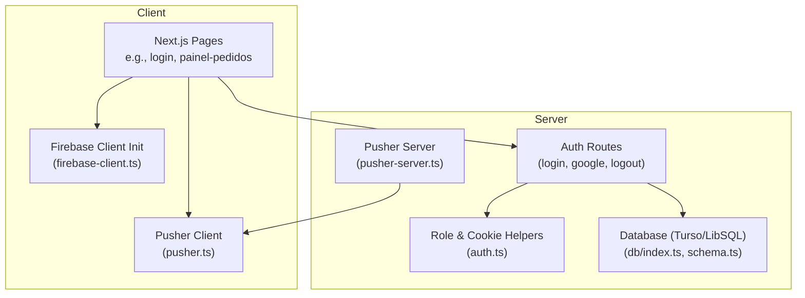
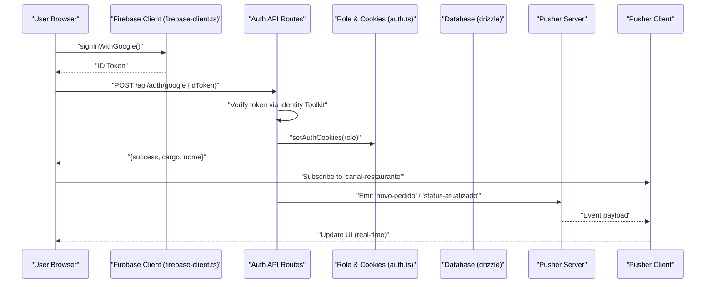
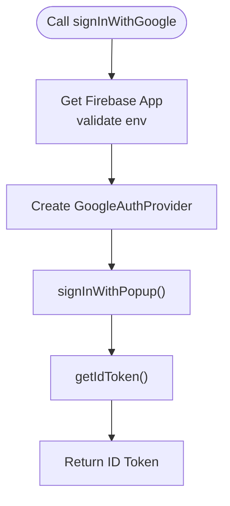
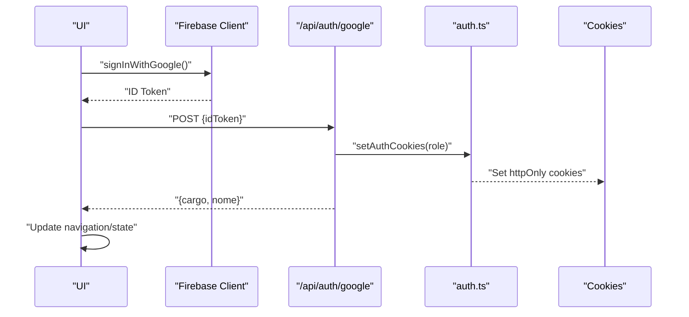
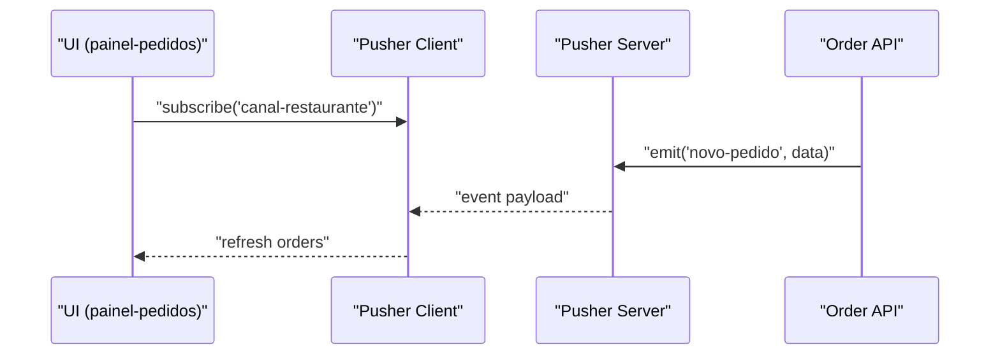
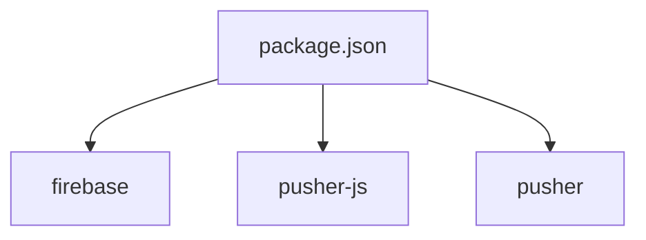
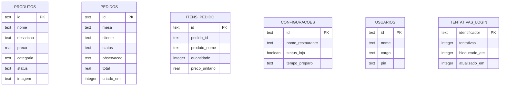

# Firebase Real-time Features

<cite>
**Referenced Files in This Document**
- [firebase-client.ts](file://src/lib/firebase-client.ts)
- [auth.ts](file://src/lib/auth.ts)
- [login route.ts](file://src/app/api/auth/login/route.ts)
- [google auth route.ts](file://src/app/api/auth/google/route.ts)
- [logout route.ts](file://src/app/api/auth/logout/route.ts)
- [package.json](file://package.json)
- [pusher.ts](file://src/lib/pusher.ts)
- [pusher-server.ts](file://src/lib/pusher-server.ts)
- [painel-pedidos page.tsx](file://src/app/painel-pedidos/page.tsx)
- [schema.ts](file://src/db/schema.ts)
- [db index.ts](file://src/db/index.ts)
</cite>

## Table of Contents
1. Introduction
2. Project Structure
3. Core Components
4. Architecture Overview
5. Detailed Component Analysis
6. Dependency Analysis
7. Performance Considerations
8. Troubleshooting Guide
9. Conclusion
10. Appendices

## Introduction
This document explains how to implement Firebase real-time capabilities for authentication state synchronization and cloud messaging within the project. It covers client initialization, authentication state listeners, session management, presence detection, collaborative features, role-based access control integration, UI updates on auth changes, security rules, offline persistence, data synchronization strategies, and conflict resolution for concurrent updates. The codebase currently uses Firebase Authentication via Google sign-in and a Pusher-based real-time channel; this guide shows how to extend it with Firebase Realtime Database or Firestore for true real-time sync and Firebase Cloud Messaging for push notifications.

## Project Structure
The application is a Next.js app with:
- Client-side Firebase initialization and Google sign-in helper
- Server-side API routes for PIN login and Google token validation
- Role-based authorization using cookies
- Real-time eventing via Pusher (client and server)
- Local database schema and Drizzle ORM configuration

**Diagram sources**
- [firebase-client.ts:1-26](file://src/lib/firebase-client.ts#L1-L26)
- [auth.ts:1-82](file://src/lib/auth.ts#L1-L82)
- [login route.ts:1-80](file://src/app/api/auth/login/route.ts#L1-L80)
- [google auth route.ts:1-77](file://src/app/api/auth/google/route.ts#L1-L77)
- [logout route.ts:1-15](file://src/app/api/auth/logout/route.ts#L1-L15)
- [pusher.ts:1-8](file://src/lib/pusher.ts#L1-L8)
- [pusher-server.ts:1-10](file://src/lib/pusher-server.ts#L1-L10)
- [db index.ts:1-14](file://src/db/index.ts#L1-L14)
- [schema.ts:1-56](file://src/db/schema.ts#L1-L56)

**Section sources**
- [firebase-client.ts:1-26](file://src/lib/firebase-client.ts#L1-L26)
- [auth.ts:1-82](file://src/lib/auth.ts#L1-L82)
- [login route.ts:1-80](file://src/app/api/auth/login/route.ts#L1-L80)
- [google auth route.ts:1-77](file://src/app/api/auth/google/route.ts#L1-L77)
- [logout route.ts:1-15](file://src/app/api/auth/logout/route.ts#L1-L15)
- [pusher.ts:1-8](file://src/lib/pusher.ts#L1-L8)
- [pusher-server.ts:1-10](file://src/lib/pusher-server.ts#L1-L10)
- [db index.ts:1-14](file://src/db/index.ts#L1-L14)
- [schema.ts:1-56](file://src/db/schema.ts#L1-L56)

## Core Components
- Firebase client initialization and Google sign-in helper
- Server-side authentication endpoints (PIN and Google)
- Role-based access control middleware
- Real-time eventing via Pusher
- Database layer with Drizzle ORM

Key responsibilities:
- firebase-client.ts: Initialize Firebase app and perform Google sign-in, returning an ID token for server verification.
- auth.ts: Define roles, cookie helpers, and authorization guards.
- API routes: Validate credentials/tokens, set secure cookies, enforce rate limits, and return user metadata.
- Pusher: Provide real-time channels for live updates (e.g., new orders).
- DB: Schema definitions and connection setup for persistent storage.

**Section sources**
- [firebase-client.ts:1-26](file://src/lib/firebase-client.ts#L1-L26)
- [auth.ts:1-82](file://src/lib/auth.ts#L1-L82)
- [login route.ts:1-80](file://src/app/api/auth/login/route.ts#L1-L80)
- [google auth route.ts:1-77](file://src/app/api/auth/google/route.ts#L1-L77)
- [logout route.ts:1-15](file://src/app/api/auth/logout/route.ts#L1-L15)
- [pusher.ts:1-8](file://src/lib/pusher.ts#L1-L8)
- [pusher-server.ts:1-10](file://src/lib/pusher-server.ts#L1-L10)
- [db index.ts:1-14](file://src/db/index.ts#L1-L14)
- [schema.ts:1-56](file://src/db/schema.ts#L1-L56)

## Architecture Overview
The current flow uses Firebase Auth for identity and Pusher for real-time events. To achieve full real-time capabilities, integrate Firebase Realtime Database/Firestore for live data sync and Firebase Cloud Messaging for push notifications.

**Diagram sources**
- [firebase-client.ts:1-26](file://src/lib/firebase-client.ts#L1-L26)
- [google auth route.ts:1-77](file://src/app/api/auth/google/route.ts#L1-L77)
- [auth.ts:1-82](file://src/lib/auth.ts#L1-L82)
- [painel-pedidos page.tsx:58-102](file://src/app/painel-pedidos/page.tsx#L58-L102)
- [pusher-server.ts:1-10](file://src/lib/pusher-server.ts#L1-L10)
- [pusher.ts:1-8](file://src/lib/pusher.ts#L1-L8)

## Detailed Component Analysis

### Firebase Client Initialization and Google Sign-In
- Initializes Firebase app once per runtime and throws if environment variables are missing.
- Provides signInWithGoogle() that returns the user’s ID token for server-side verification.

Implementation highlights:
- Uses getApp()/initializeApp() pattern to avoid duplicate instances.
- Validates required env vars before initializing.
- Returns ID token to be sent to the backend for role assignment.

**Diagram sources**
- [firebase-client.ts:1-26](file://src/lib/firebase-client.ts#L1-L26)

**Section sources**
- [firebase-client.ts:1-26](file://src/lib/firebase-client.ts#L1-L26)

### Authentication State Listener and Session Management
Current behavior:
- After successful login (PIN or Google), the client stores user info in localStorage and navigates based on role.
- Logout clears cookies and local storage, then redirects to login.

To add real-time auth state synchronization:
- Use Firebase Auth onAuthStateChanged listener to react to sign-in/sign-out across tabs and devices.
- Update UI components (navigation, menus, protected routes) based on the current user and role.
- Persist minimal session state (e.g., user id, role) in memory or secure storage and refresh from Firebase when available.

Recommended approach:
- Create a global auth context that subscribes to onAuthStateChanged.
- On change, call a server endpoint to validate the token and fetch role, then update local state.
- Guard routes by checking both client state and server response.

[No sources needed since this section provides general guidance]

### Real-time User Presence Detection
Presence can be implemented using Firebase Realtime Database or Firestore:
- When a user signs in, write a presence node under users/{userId}/isOnline = true with a timestamp.
- Use onDisconnect to clear the presence node when the client disconnects.
- Listen to presence changes to show online/offline indicators and enable collaborative features.

Example strategy:
- Write presence on sign-in.
- Set onDisconnect handler to remove presence.
- Subscribe to presence path to update UI.

[No sources needed since this section provides general guidance]

### Collaborative Features Using Real-time Data
Use Firebase Realtime Database or Firestore to share live state:
- Maintain a shared document per collaboration scope (e.g., order queue, table status).
- Apply optimistic updates locally and reconcile with server state.
- Use transactions or atomic operations to prevent conflicts.

[No sources needed since this section provides general guidance]

### Integration Between Firebase Authentication and Role-Based Access Control
Current system:
- Server validates Google tokens and sets role-specific cookies.
- Authorization functions check cookies to determine allowed actions.

Integration steps:
- After Firebase sign-in, send ID token to /api/auth/google to get role and set cookies.
- For subsequent requests, include cookies and validate role via requireAuth().
- Protect client routes by checking both local state and server responses.

**Diagram sources**
- [firebase-client.ts:1-26](file://src/lib/firebase-client.ts#L1-L26)
- [google auth route.ts:1-77](file://src/app/api/auth/google/route.ts#L1-L77)
- [auth.ts:1-82](file://src/lib/auth.ts#L1-L82)

**Section sources**
- [auth.ts:1-82](file://src/lib/auth.ts#L1-L82)
- [google auth route.ts:1-77](file://src/app/api/auth/google/route.ts#L1-L77)

### Listening to Authentication State Changes and Updating UI
- Implement onAuthStateChanged to detect sign-in/sign-out.
- On sign-in, fetch role from server and update UI elements (menus, buttons, routes).
- On sign-out, clear local state and redirect to login.

[No sources needed since this section provides general guidance]

### Security Rules for Protecting Real-time Data
When using Firebase Realtime Database or Firestore:
- Enforce read/write permissions based on authenticated user IDs and roles.
- Restrict writes to authorized roles (admin, kitchen, attendant).
- Validate data shapes and constraints at the rule level.
- Use indexes and query filters to limit exposure.

[No sources needed since this section provides general guidance]

### Offline Persistence and Data Synchronization Strategies
- Enable offline persistence in Firebase SDKs to cache data locally.
- Use optimistic updates for better UX; reconcile with server on reconnect.
- Handle network errors gracefully and retry failed writes.

[No sources needed since this section provides general guidance]

### Conflict Resolution for Concurrent Updates
- Use transactions or atomic operations to resolve conflicts.
- Implement version fields or timestamps to detect and merge changes.
- Prefer last-write-wins with explicit conflict handling for simple cases; use CRDTs or operational transforms for complex scenarios.

[No sources needed since this section provides general guidance]

### Current Real-time Eventing with Pusher
The app already uses Pusher for real-time updates:
- Client subscribes to a channel and binds to events like "novo-pedido" and "status-atualizado".
- Server emits events after mutating data.

**Diagram sources**
- [painel-pedidos page.tsx:58-102](file://src/app/painel-pedidos/page.tsx#L58-L102)
- [pusher-server.ts:1-10](file://src/lib/pusher-server.ts#L1-L10)
- [pusher.ts:1-8](file://src/lib/pusher.ts#L1-L8)

**Section sources**
- [painel-pedidos page.tsx:58-102](file://src/app/painel-pedidos/page.tsx#L58-L102)
- [pusher.ts:1-8](file://src/lib/pusher.ts#L1-L8)
- [pusher-server.ts:1-10](file://src/lib/pusher-server.ts#L1-L10)

## Dependency Analysis
Firebase and Pusher dependencies are declared in package.json. The app uses Firebase for authentication and Pusher for real-time events.

**Diagram sources**
- [package.json:17-30](file://package.json#L17-L30)

**Section sources**
- [package.json:17-30](file://package.json#L17-L30)

## Performance Considerations
- Minimize re-renders by batching state updates on auth changes.
- Use efficient queries and indexes in Firebase rules and database schemas.
- Cache frequently accessed data locally and invalidate on changes.
- Avoid heavy computations on the main thread; offload where possible.

[No sources needed since this section provides general guidance]

## Troubleshooting Guide
Common issues and resolutions:
- Missing Firebase environment variables: Ensure NEXT_PUBLIC_FIREBASE_API_KEY, authDomain, projectId, appId are set.
- Invalid Google token: Verify token format and allowlist of emails for admin access.
- Rate limiting: Check login attempt counters and retry-after headers.
- Pusher connectivity: Confirm keys and cluster settings; ensure TLS usage on server.

Relevant files:
- firebase-client.ts: Throws error if Firebase config is incomplete.
- google auth route.ts: Validates token and checks allowed emails.
- login route.ts: Enforces PIN length and rate limits.
- logout route.ts: Clears cookies and handles errors.

**Section sources**
- [firebase-client.ts:1-26](file://src/lib/firebase-client.ts#L1-L26)
- [google auth route.ts:1-77](file://src/app/api/auth/google/route.ts#L1-L77)
- [login route.ts:1-80](file://src/app/api/auth/login/route.ts#L1-L80)
- [logout route.ts:1-15](file://src/app/api/auth/logout/route.ts#L1-L15)

## Conclusion
The project currently integrates Firebase Authentication for identity and Pusher for real-time events. To fully realize Firebase real-time capabilities, add Firebase Realtime Database/Firestore for live data sync and Firebase Cloud Messaging for push notifications. Implement onAuthStateChanged for cross-device session sync, presence tracking for online indicators, and robust security rules for data protection. Adopt offline persistence, optimistic updates, and conflict resolution strategies to ensure reliable collaborative experiences.

[No sources needed since this section summarizes without analyzing specific files]

## Appendices

### Database Schema Overview
The schema defines core entities such as products, orders, order items, settings, users, and login attempts.

**Diagram sources**
- [schema.ts:1-56](file://src/db/schema.ts#L1-L56)

**Section sources**
- [schema.ts:1-56](file://src/db/schema.ts#L1-L56)
- [db index.ts:1-14](file://src/db/index.ts#L1-L14)