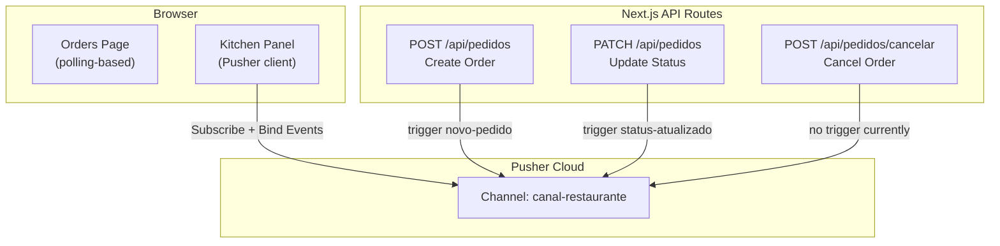
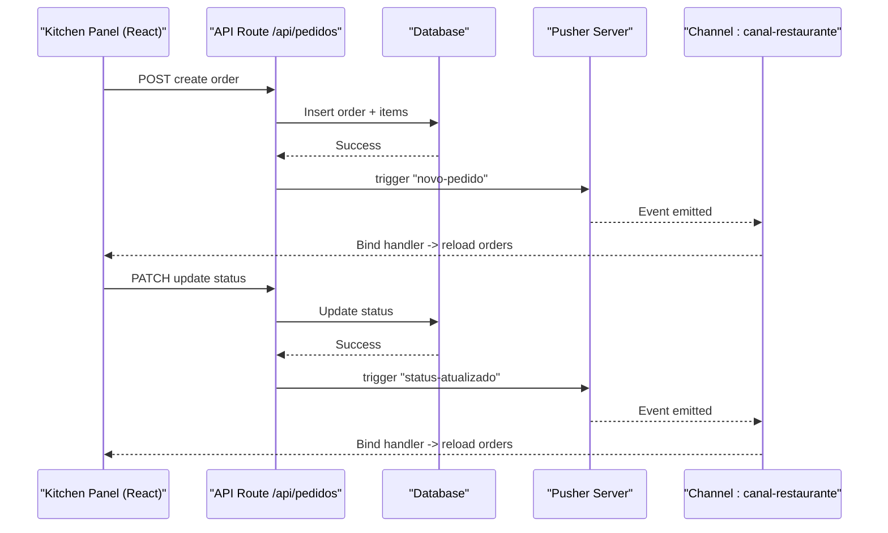

# Pusher Integration

<cite>
**Referenced Files in This Document**
- [pusher.ts](file://src/lib/pusher.ts)
- [pusher-server.ts](file://src/lib/pusher-server.ts)
- [route.ts (orders API)](file://src/app/api/pedidos/route.ts)
- [cancelar route.ts](file://src/app/api/pedidos/cancelar/route.ts)
- [painel-pedidos page.tsx](file://src/app/painel-pedidos/page.tsx)
- [orders page.tsx](file://src/app/orders/page.tsx)
- [package.json](file://package.json)
</cite>

## Table of Contents
1. [Introduction](#introduction)
2. [Project Structure](#project-structure)
3. [Core Components](#core-components)
4. [Architecture Overview](#architecture-overview)
5. [Detailed Component Analysis](#detailed-component-analysis)
6. [Dependency Analysis](#dependency-analysis)
7. [Performance Considerations](#performance-considerations)
8. [Troubleshooting Guide](#troubleshooting-guide)
9. [Conclusion](#conclusion)

## Introduction
This document explains how the application integrates Pusher to deliver real-time order updates and notifications for both customers and kitchen staff. It covers client initialization, channel subscription patterns, event handling for order status changes, server-side broadcasting from API routes, and practical guidance for error handling, reconnection strategies, and performance at scale.

## Project Structure
The Pusher integration spans three layers:
- Client library: a shared Pusher client instance for browser components.
- Server library: a shared Pusher server instance used by Next.js API routes to broadcast events.
- UI pages: React components that subscribe to channels and react to real-time events.

**Diagram sources**
- [pusher.ts:1-8](file://src/lib/pusher.ts#L1-L8)
- [pusher-server.ts:1-10](file://src/lib/pusher-server.ts#L1-L10)
- [route.ts (orders API):165-180](file://src/app/api/pedidos/route.ts#L165-L180)
- [route.ts (orders API):220-228](file://src/app/api/pedidos/route.ts#L220-L228)
- [painel-pedidos page.tsx:54-76](file://src/app/painel-pedidos/page.tsx#L54-L76)

**Section sources**
- [pusher.ts:1-8](file://src/lib/pusher.ts#L1-L8)
- [pusher-server.ts:1-10](file://src/lib/pusher-server.ts#L1-L10)
- [route.ts (orders API):165-180](file://src/app/api/pedidos/route.ts#L165-L180)
- [route.ts (orders API):220-228](file://src/app/api/pedidos/route.ts#L220-L228)
- [painel-pedidos page.tsx:54-76](file://src/app/painel-pedidos/page.tsx#L54-L76)

## Core Components
- Pusher client instance: created once with public key and cluster; returns null if environment variables are missing.
- Pusher server instance: created once with app credentials and TLS enabled; returns null if any required variable is missing.
- API routes: emit Pusher events after database operations succeed.
- Kitchen panel component: subscribes to the restaurant channel and listens for new orders and status updates.

Key responsibilities:
- Client: connect to Pusher, subscribe to channels, bind to events, refresh UI state.
- Server: persist data first, then broadcast minimal payloads to relevant channels.
- Pages: combine polling or real-time subscriptions to keep UI consistent.

**Section sources**
- [pusher.ts:1-8](file://src/lib/pusher.ts#L1-L8)
- [pusher-server.ts:1-10](file://src/lib/pusher-server.ts#L1-L10)
- [route.ts (orders API):165-180](file://src/app/api/pedidos/route.ts#L165-L180)
- [route.ts (orders API):220-228](file://src/app/api/pedidos/route.ts#L220-L228)
- [painel-pedidos page.tsx:54-76](file://src/app/painel-pedidos/page.tsx#L54-L76)

## Architecture Overview
Real-time flow for order lifecycle:
- New order: API creates order in DB, then triggers a “new order” event on the restaurant channel. The kitchen panel receives it and reloads the list.
- Status update: Kitchen updates order status via PATCH; API persists change and triggers a “status updated” event. All subscribers refresh accordingly.
- Customer tracking: The customer’s Orders page currently uses polling to fetch their orders; it can be enhanced to use Pusher for instant updates.

**Diagram sources**
- [route.ts (orders API):147-180](file://src/app/api/pedidos/route.ts#L147-L180)
- [route.ts (orders API):214-228](file://src/app/api/pedidos/route.ts#L214-L228)
- [painel-pedidos page.tsx:54-76](file://src/app/painel-pedidos/page.tsx#L54-L76)

## Detailed Component Analysis

### Pusher Client Initialization
- A single client instance is exported for reuse across components.
- It requires NEXT_PUBLIC_PUSHER_KEY and NEXT_PUBLIC_PUSHER_CLUSTER. If either is missing, the client is null to prevent runtime errors.

Implementation highlights:
- Conditional instantiation guards against misconfiguration.
- Centralized configuration avoids duplication and ensures consistent cluster usage.

**Section sources**
- [pusher.ts:1-8](file://src/lib/pusher.ts#L1-L8)

### Pusher Server Configuration
- A single server instance is exported for API routes.
- Requires PUSHER_APP_ID, NEXT_PUBLIC_PUSHER_KEY, PUSHER_SECRET, and NEXT_PUBLIC_PUSHER_CLUSTER.
- TLS is explicitly enabled for secure connections.

Implementation highlights:
- Guarded creation prevents accidental broadcasts when credentials are incomplete.
- Reusing one instance reduces overhead and simplifies testing.

**Section sources**
- [pusher-server.ts:1-10](file://src/lib/pusher-server.ts#L1-L10)

### Emitting Order Events from API Routes
- On order creation: after saving to the database, the API triggers a “novo-pedido” event on the restaurant channel with a simple message payload.
- On status update: after updating the order status, the API triggers a “status-atualizado” event containing the order id and new status.
- Error handling around broadcasting ensures DB writes are not rolled back due to Pusher failures.

Event details:
- Channel name: canal-restaurante
- Events:
  - novo-pedido: notifies about a new order
  - status-atualizado: notifies about an order status change

**Section sources**
- [route.ts (orders API):165-180](file://src/app/api/pedidos/route.ts#L165-L180)
- [route.ts (orders API):220-228](file://src/app/api/pedidos/route.ts#L220-L228)

### Subscribing to Channels in React Components
- The kitchen panel subscribes to canal-restaurante and binds handlers for novo-pedido and status-atualizado.
- On each event, it reloads the order list to reflect the latest state.
- Cleanup unsubscribes when the component unmounts to avoid memory leaks.

Subscription pattern:
- Subscribe once per component mount.
- Bind to specific events.
- Unsubscribe on cleanup.

**Section sources**
- [painel-pedidos page.tsx:54-76](file://src/app/painel-pedidos/page.tsx#L54-L76)

### Real-Time Order Tracking for Customers
- Current behavior: the Orders page polls the API every few seconds to fetch the user’s orders.
- Recommended enhancement: subscribe to canal-restaurante and listen for status-atualizado events scoped to the current user’s orders, then update the UI without polling.

Polling fallback:
- Polling remains a reliable fallback when Pusher is unavailable or misconfigured.

**Section sources**
- [orders page.tsx:33-58](file://src/app/orders/page.tsx#L33-L58)

### Cancel Flow
- The cancel endpoint validates the order exists and is still pending, then updates its status to canceled.
- Currently, it does not emit a Pusher event; consider adding a broadcast to keep all clients synchronized.

**Section sources**
- [cancelar route.ts:6-20](file://src/app/api/pedidos/cancelar/route.ts#L6-L20)

## Dependency Analysis
External dependencies related to Pusher:
- pusher-js: browser SDK for subscribing to channels and binding events.
- pusher: server SDK for triggering events from API routes.

These are declared in the project’s package manifest.

**Section sources**
- [package.json:25-26](file://package.json#L25-L26)

## Performance Considerations
- Prefer event-driven updates over frequent polling. The kitchen panel already uses Pusher; extend this to the customer view to reduce repeated network requests.
- Keep event payloads small. Only send necessary fields (e.g., order id and status).
- Avoid unnecessary re-renders by batching UI updates or using lightweight state changes.
- For high-frequency updates, consider debouncing UI actions and ensuring the kitchen panel only reloads when needed.
- Scale considerations:
  - Use a single Pusher server instance per process.
  - Ensure environment variables are correctly set in all deployment environments.
  - Monitor Pusher connection metrics and adjust cluster selection based on user geography.

[No sources needed since this section provides general guidance]

## Troubleshooting Guide
Common issues and resolutions:
- Missing environment variables:
  - Symptoms: Pusher client/server instances are null; no real-time updates.
  - Resolution: Ensure NEXT_PUBLIC_PUSHER_KEY, NEXT_PUBLIC_PUSHER_CLUSTER, PUSHER_APP_ID, and PUSHER_SECRET are set.
- Connection failures:
  - Symptoms: No events received; console errors in browser.
  - Resolution: Verify network access to Pusher endpoints; check firewall/proxy settings; confirm correct cluster.
- Reconnection strategies:
  - Use Pusher’s built-in reconnection; add global error handlers to log failures and optionally notify users.
  - Implement a fallback poll interval for critical flows until reconnection succeeds.
- Broadcasting failures:
  - API routes wrap triggers in try/catch so DB writes remain consistent even if Pusher fails.
  - Log errors to aid debugging; consider retry logic for transient failures.

Operational tips:
- Add explicit connection state checks in components before subscribing.
- Provide user feedback when real-time features are unavailable.
- Validate event payloads on the client side to handle unexpected changes gracefully.

**Section sources**
- [pusher.ts:1-8](file://src/lib/pusher.ts#L1-L8)
- [pusher-server.ts:1-10](file://src/lib/pusher-server.ts#L1-L10)
- [route.ts (orders API):173-180](file://src/app/api/pedidos/route.ts#L173-L180)
- [route.ts (orders API):220-228](file://src/app/api/pedidos/route.ts#L220-L228)

## Conclusion
The application implements a solid foundation for real-time order updates using Pusher:
- A centralized client and server ensure consistent configuration.
- API routes broadcast minimal, targeted events after successful database operations.
- The kitchen panel subscribes to the restaurant channel and reacts to new orders and status changes.
To fully realize real-time benefits for customers, extend the Orders page to use Pusher alongside its existing polling fallback. With careful error handling, reconnection strategies, and performance optimizations, the system can scale to support many concurrent users while keeping the experience responsive.

[No sources needed since this section summarizes without analyzing specific files]