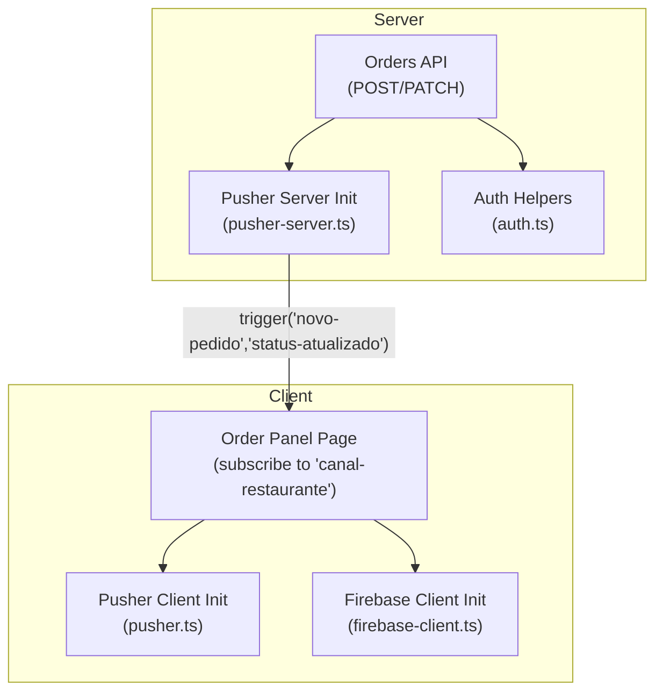
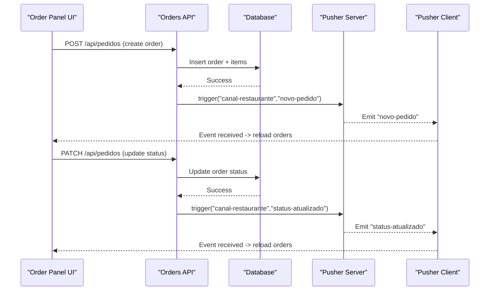
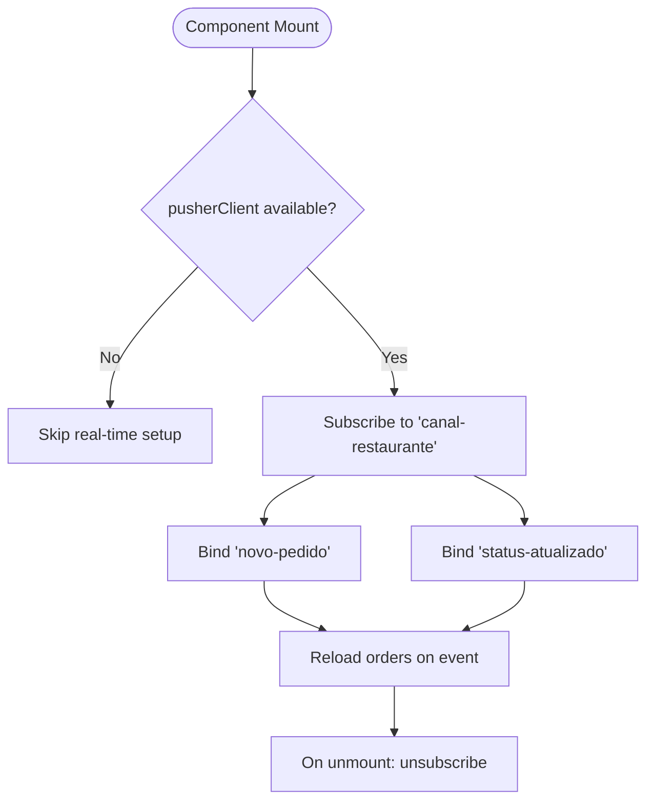
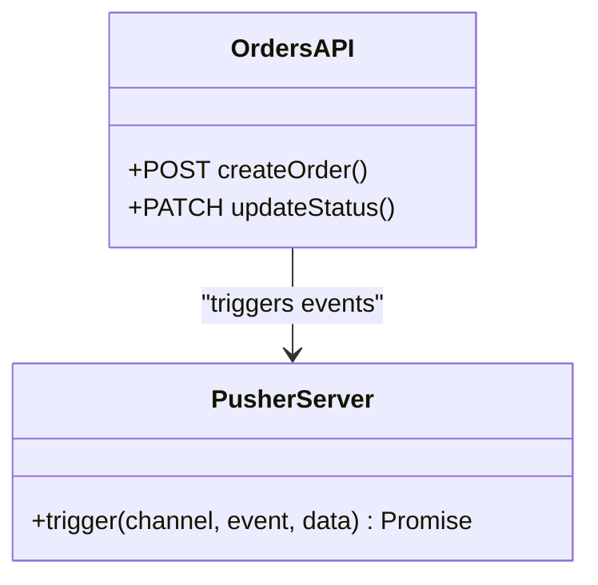
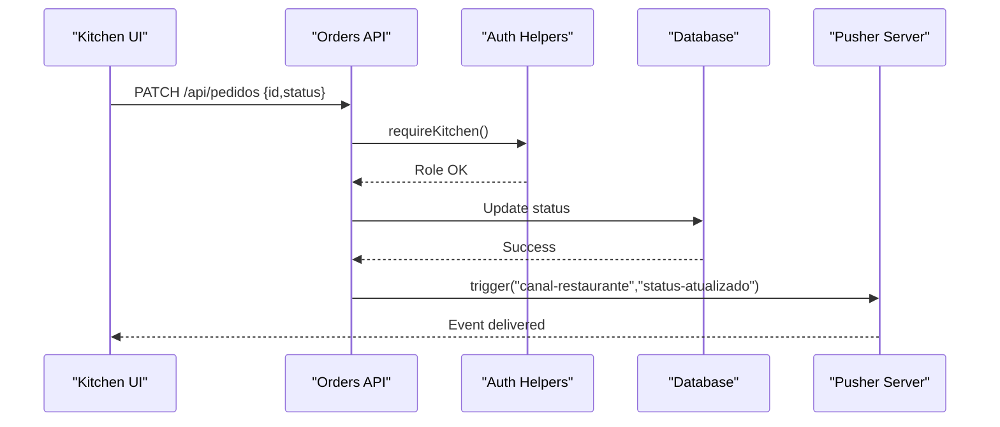
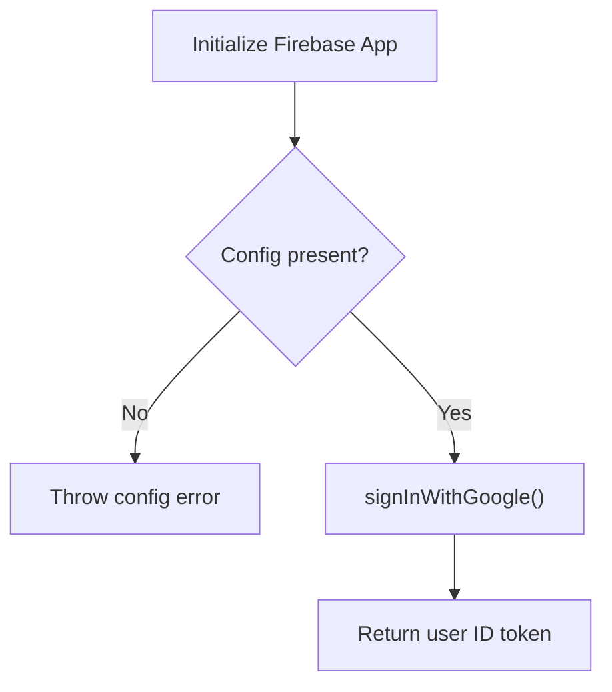
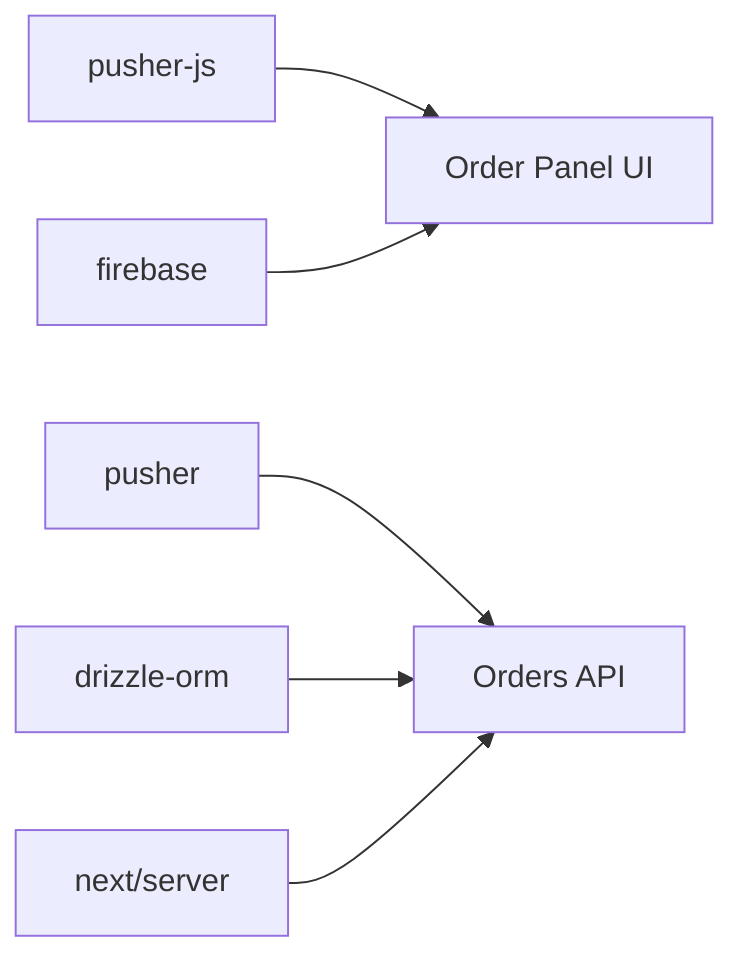

# Real-time Features

<cite>
**Referenced Files in This Document**
- [pusher.ts](file://src/lib/pusher.ts)
- [pusher-server.ts](file://src/lib/pusher-server.ts)
- [firebase-client.ts](file://src/lib/firebase-client.ts)
- [route.ts (Orders API)](file://src/app/api/pedidos/route.ts)
- [page.tsx (Order Panel)](file://src/app/painel-pedidos/page.tsx)
- [auth.ts](file://src/lib/auth.ts)
- [package.json](file://package.json)
</cite>

## Table of Contents
1. Introduction
2. Project Structure
3. Core Components
4. Architecture Overview
5. Detailed Component Analysis
6. Dependency Analysis
7. Performance Considerations
8. Troubleshooting Guide
9. Conclusion

## Introduction
This document explains the real-time communication features implemented in the application, focusing on live order updates and notifications using Pusher for event broadcasting and Firebase for authentication capabilities. It covers how the server triggers events when orders are created or updated, how clients subscribe to channels and react to events, and how Firebase is integrated for Google sign-in flows. It also provides guidance on connection management, error handling, performance considerations, debugging, and scaling strategies for high-frequency updates.

## Project Structure
The real-time system spans client-side libraries, server-side APIs, and UI components:
- Client-side Pusher client initialization and channel subscription occur in the order panel page.
- Server-side Pusher instance is used by the Orders API to broadcast events after database writes.
- Firebase client library initializes the app and supports Google sign-in.

**Diagram sources**
- [page.tsx (Order Panel):54-76](file://src/app/painel-pedidos/page.tsx#L54-L76)
- [pusher.ts:1-8](file://src/lib/pusher.ts#L1-L8)
- [firebase-client.ts:6-25](file://src/lib/firebase-client.ts#L6-L25)
- [route.ts (Orders API):173-180](file://src/app/api/pedidos/route.ts#L173-L180)
- [route.ts (Orders API):220-228](file://src/app/api/pedidos/route.ts#L220-L228)
- [pusher-server.ts:1-10](file://src/lib/pusher-server.ts#L1-L10)
- [auth.ts:63-82](file://src/lib/auth.ts#L63-L82)

**Section sources**
- [pusher.ts:1-8](file://src/lib/pusher.ts#L1-L8)
- [pusher-server.ts:1-10](file://src/lib/pusher-server.ts#L1-L10)
- [firebase-client.ts:6-25](file://src/lib/firebase-client.ts#L6-L25)
- [route.ts (Orders API):173-180](file://src/app/api/pedidos/route.ts#L173-L180)
- [route.ts (Orders API):220-228](file://src/app/api/pedidos/route.ts#L220-L228)
- [page.tsx (Order Panel):54-76](file://src/app/painel-pedidos/page.tsx#L54-L76)
- [auth.ts:63-82](file://src/lib/auth.ts#L63-L82)

## Core Components
- Pusher Client Initialization: Creates a client instance from environment variables; returns null if keys are missing.
- Pusher Server Initialization: Creates a server instance with TLS enabled; returns null if required env vars are missing.
- Orders API: Validates requests, persists changes to the database, then triggers Pusher events for new orders and status updates.
- Order Panel UI: Subscribes to the restaurant channel and listens for new order and status update events to refresh the UI.
- Firebase Client: Initializes Firebase and exposes a Google sign-in function returning an ID token.

Key responsibilities:
- Event-driven broadcasting: The API triggers events after successful DB operations.
- Live UI updates: The UI subscribes to the same channel and reacts to events by reloading data.
- Authentication integration: Firebase provides Google sign-in capability for future use cases.

**Section sources**
- [pusher.ts:1-8](file://src/lib/pusher.ts#L1-L8)
- [pusher-server.ts:1-10](file://src/lib/pusher-server.ts#L1-L10)
- [route.ts (Orders API):173-180](file://src/app/api/pedidos/route.ts#L173-L180)
- [route.ts (Orders API):220-228](file://src/app/api/pedidos/route.ts#L220-L228)
- [page.tsx (Order Panel):54-76](file://src/app/painel-pedidos/page.tsx#L54-L76)
- [firebase-client.ts:6-25](file://src/lib/firebase-client.ts#L6-L25)

## Architecture Overview
The system follows an event-driven architecture:
- Clients subscribe to a shared channel named “canal-restaurante”.
- When a new order is created or an order status changes, the server triggers corresponding events on that channel.
- All subscribed clients receive the event and refresh their local state accordingly.

**Diagram sources**
- [route.ts (Orders API):173-180](file://src/app/api/pedidos/route.ts#L173-L180)
- [route.ts (Orders API):220-228](file://src/app/api/pedidos/route.ts#L220-L228)
- [page.tsx (Order Panel):54-76](file://src/app/painel-pedidos/page.tsx#L54-L76)

## Detailed Component Analysis

### Pusher Client Integration
- Purpose: Initialize the Pusher client in the browser and subscribe to the restaurant channel to listen for real-time events.
- Behavior:
  - If environment variables are missing, the client is null and no subscriptions occur.
  - On mount, the order panel subscribes to “canal-restaurante” and binds listeners for “novo-pedido” and “status-atualizado”.
  - On unmount, it unsubscribes to avoid memory leaks.

**Diagram sources**
- [page.tsx (Order Panel):54-76](file://src/app/painel-pedidos/page.tsx#L54-L76)
- [pusher.ts:1-8](file://src/lib/pusher.ts#L1-L8)

**Section sources**
- [page.tsx (Order Panel):54-76](file://src/app/painel-pedidos/page.tsx#L54-L76)
- [pusher.ts:1-8](file://src/lib/pusher.ts#L1-L8)

### Pusher Server Integration
- Purpose: Provide a server-side instance to trigger events after database operations.
- Behavior:
  - Initialized with app credentials and TLS enabled.
  - Used to trigger “novo-pedido” after creating an order.
  - Used to trigger “status-atualizado” after updating an order’s status.

**Diagram sources**
- [pusher-server.ts:1-10](file://src/lib/pusher-server.ts#L1-L10)
- [route.ts (Orders API):173-180](file://src/app/api/pedidos/route.ts#L173-L180)
- [route.ts (Orders API):220-228](file://src/app/api/pedidos/route.ts#L220-L228)

**Section sources**
- [pusher-server.ts:1-10](file://src/lib/pusher-server.ts#L1-L10)
- [route.ts (Orders API):173-180](file://src/app/api/pedidos/route.ts#L173-L180)
- [route.ts (Orders API):220-228](file://src/app/api/pedidos/route.ts#L220-L228)

### Orders API Event Broadcasting
- New Order Flow:
  - Validates input and business rules.
  - Persists order and items in a transaction.
  - Triggers “novo-pedido” on “canal-restaurante”.
- Status Update Flow:
  - Requires kitchen/admin role via auth helpers.
  - Updates order status in the database.
  - Triggers “status-atualizado” on “canal-restaurante”.

**Diagram sources**
- [route.ts (Orders API):192-234](file://src/app/api/pedidos/route.ts#L192-L234)
- [auth.ts:63-82](file://src/lib/auth.ts#L63-L82)
- [pusher-server.ts:1-10](file://src/lib/pusher-server.ts#L1-L10)

**Section sources**
- [route.ts (Orders API):192-234](file://src/app/api/pedidos/route.ts#L192-L234)
- [auth.ts:63-82](file://src/lib/auth.ts#L63-L82)

### Firebase Authentication Integration
- Purpose: Initialize Firebase and provide Google sign-in capability.
- Behavior:
  - Reads configuration from environment variables.
  - Throws an error if configuration is incomplete.
  - Exposes a function to sign in with Google and return an ID token.

**Diagram sources**
- [firebase-client.ts:6-25](file://src/lib/firebase-client.ts#L6-L25)

**Section sources**
- [firebase-client.ts:6-25](file://src/lib/firebase-client.ts#L6-L25)

## Dependency Analysis
- Client dependencies:
  - pusher-js for real-time messaging.
  - firebase for authentication.
- Server dependencies:
  - pusher for triggering events.
  - drizzle-orm for database access.
  - next/server for API routes.

**Diagram sources**
- [package.json:17-29](file://package.json#L17-L29)
- [route.ts (Orders API):1-6](file://src/app/api/pedidos/route.ts#L1-L6)
- [page.tsx (Order Panel):1-7](file://src/app/painel-pedidos/page.tsx#L1-L7)

**Section sources**
- [package.json:17-29](file://package.json#L17-L29)
- [route.ts (Orders API):1-6](file://src/app/api/pedidos/route.ts#L1-L6)
- [page.tsx (Order Panel):1-7](file://src/app/painel-pedidos/page.tsx#L1-L7)

## Performance Considerations
- High-frequency updates:
  - Prefer lightweight payloads in events (e.g., minimal identifiers and status).
  - Debounce or coalesce UI updates if multiple events arrive rapidly.
- Message queuing:
  - For critical reliability, consider adding a message queue between API and event triggers to handle transient failures gracefully.
- Scaling connections:
  - Use Pusher’s managed infrastructure to scale horizontally without managing WebSocket servers.
  - Monitor event throughput and adjust plan limits as needed.
- Network resilience:
  - Ensure environment variables are always set to avoid null clients.
  - Implement reconnection logic at the client level if needed (e.g., retry subscriptions on reconnect).

[No sources needed since this section provides general guidance]

## Troubleshooting Guide
- Verify environment variables:
  - Ensure NEXT_PUBLIC_PUSHER_KEY, NEXT_PUBLIC_PUSHER_CLUSTER, PUSHER_APP_ID, PUSHER_SECRET are set.
  - Confirm NEXT_PUBLIC_FIREBASE_* values are configured for Firebase.
- Check event flow:
  - Confirm the API triggers events after successful DB operations.
  - Validate that the UI subscribes to “canal-restaurante” and binds the correct events.
- Debugging steps:
  - Inspect browser console for errors during subscription or event binding.
  - Log API responses and errors when creating or updating orders.
  - Use network tab to verify Pusher WebSocket connections.
- Common issues:
  - Missing environment variables result in null client instances and no real-time updates.
  - Incorrect channel names or event names will prevent messages from being received.
  - Authentication failures can block status updates if roles are not properly validated.

**Section sources**
- [pusher.ts:1-8](file://src/lib/pusher.ts#L1-L8)
- [pusher-server.ts:1-10](file://src/lib/pusher-server.ts#L1-L10)
- [firebase-client.ts:6-25](file://src/lib/firebase-client.ts#L6-L25)
- [route.ts (Orders API):173-180](file://src/app/api/pedidos/route.ts#L173-L180)
- [route.ts (Orders API):220-228](file://src/app/api/pedidos/route.ts#L220-L228)
- [page.tsx (Order Panel):54-76](file://src/app/painel-pedidos/page.tsx#L54-L76)

## Conclusion
The application implements a robust event-driven real-time system using Pusher to broadcast order creation and status updates to all connected clients. The Orders API ensures consistency by persisting changes before emitting events, while the Order Panel UI subscribes to the appropriate channel and reacts to events to keep the interface current. Firebase is integrated for authentication capabilities, enabling future enhancements such as authenticated real-time features. By following the guidelines for performance, error handling, and debugging, teams can maintain reliable real-time experiences and scale effectively as usage grows.

[No sources needed since this section summarizes without analyzing specific files]