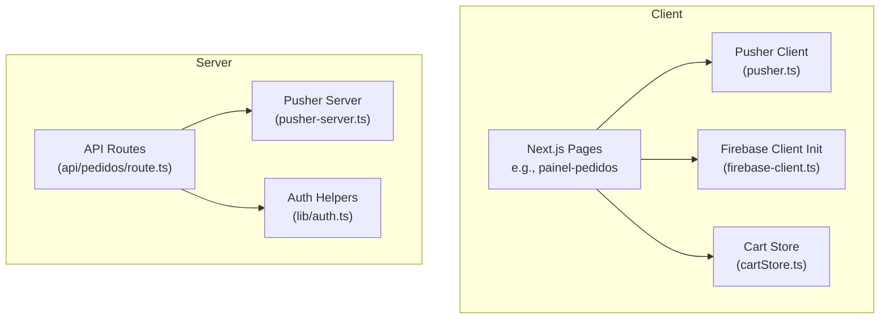
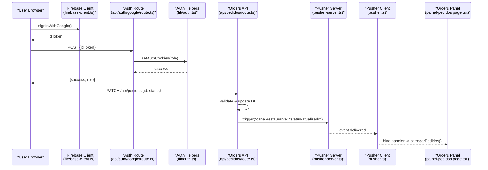
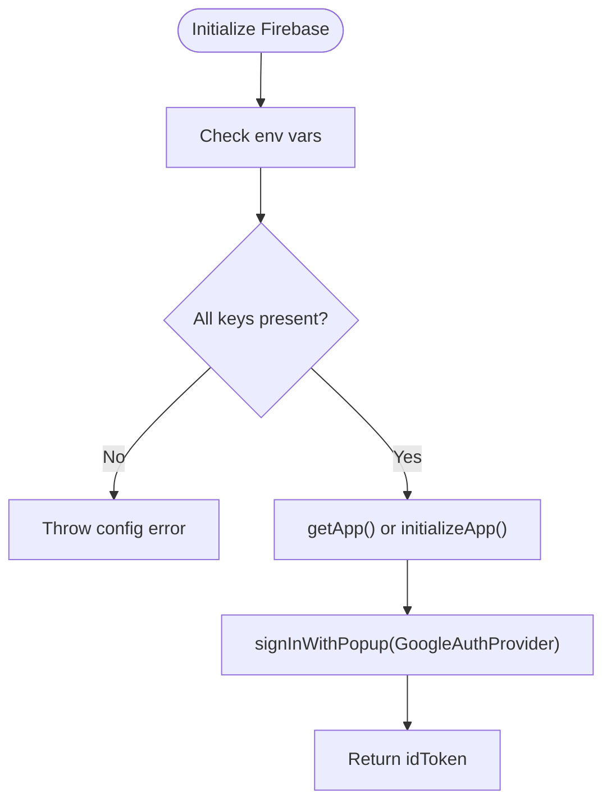
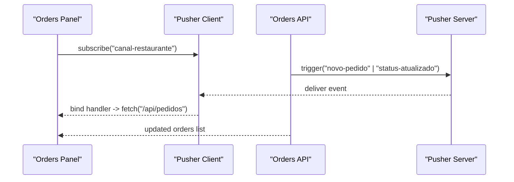
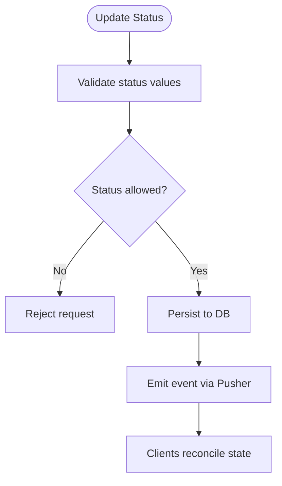
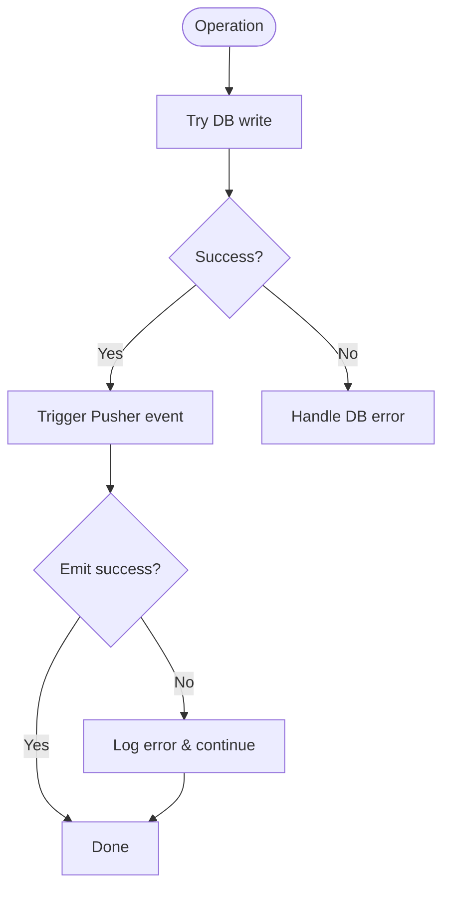
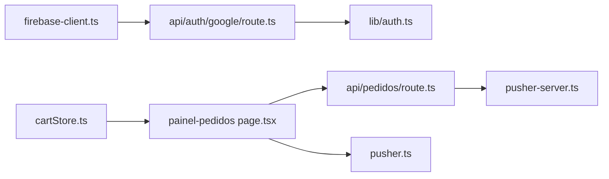

# Firebase State Synchronization

<cite>
**Referenced Files in This Document**
- [firebase-client.ts](file://src/lib/firebase-client.ts)
- [auth.ts](file://src/lib/auth.ts)
- [pusher.ts](file://src/lib/pusher.ts)
- [pusher-server.ts](file://src/lib/pusher-server.ts)
- [route.ts (pedidos)](file://src/app/api/pedidos/route.ts)
- [cancelar/route.ts](file://src/app/api/pedidos/cancelar/route.ts)
- [page.tsx (painel-pedidos)](file://src/app/painel-pedidos/page.tsx)
- [cartStore.ts](file://src/contexts/cartStore.ts)
- [package.json](file://package.json)
</cite>

## Table of Contents
1. [Introduction](#introduction)
2. [Project Structure](#project-structure)
3. [Core Components](#core-components)
4. [Architecture Overview](#architecture-overview)
5. [Detailed Component Analysis](#detailed-component-analysis)
6. [Dependency Analysis](#dependency-analysis)
7. [Performance Considerations](#performance-considerations)
8. [Troubleshooting Guide](#troubleshooting-guide)
9. [Conclusion](#conclusion)
10. [Appendices](#appendices)

## Introduction
This document explains how real-time state synchronization is implemented across clients for collaborative features, with a focus on Firebase client configuration and authentication integration patterns present in the codebase. It also documents the event-driven architecture used to propagate state changes between users in real time, including conflict resolution strategies and offline support mechanisms. The project currently uses Pusher for live updates; however, it includes Firebase client initialization and Google sign-in flow that can be extended to use Firebase Realtime Database or Firestore for true real-time sync. Examples include live order updates, collaborative editing, and synchronized user interfaces. Security considerations, data validation, and performance optimization are covered to help build robust real-time applications.

## Project Structure
The application is a Next.js app with:
- Client-side Firebase initialization and Google sign-in helper
- Server-side API routes handling persistence and publishing events
- Client-side pages subscribing to real-time channels
- Local state management for cart and UI consistency

**Diagram sources**
- [page.tsx (painel-pedidos):1-295](file://src/app/painel-pedidos/page.tsx#L1-L295)
- [pusher.ts:1-9](file://src/lib/pusher.ts#L1-L9)
- [firebase-client.ts:1-26](file://src/lib/firebase-client.ts#L1-L26)
- [cartStore.ts:1-69](file://src/contexts/cartStore.ts#L1-L69)
- [route.ts (pedidos):1-253](file://src/app/api/pedidos/route.ts#L1-L253)
- [auth.ts:1-82](file://src/lib/auth.ts#L1-L82)
- [pusher-server.ts:1-11](file://src/lib/pusher-server.ts#L1-L11)

**Section sources**
- [firebase-client.ts:1-26](file://src/lib/firebase-client.ts#L1-L26)
- [auth.ts:1-82](file://src/lib/auth.ts#L1-L82)
- [pusher.ts:1-9](file://src/lib/pusher.ts#L1-L9)
- [pusher-server.ts:1-11](file://src/lib/pusher-server.ts#L1-L11)
- [route.ts (pedidos):1-253](file://src/app/api/pedidos/route.ts#L1-L253)
- [cancelar/route.ts:1-21](file://src/app/api/pedidos/cancelar/route.ts#L1-L21)
- [page.tsx (painel-pedidos):1-295](file://src/app/painel-pedidos/page.tsx#L1-L295)
- [cartStore.ts:1-69](file://src/contexts/cartStore.ts#L1-L69)
- [package.json:1-45](file://package.json#L1-L45)

## Core Components
- Firebase client initialization and Google sign-in helper: Initializes the Firebase app using environment variables and provides a function to sign in via Google, returning an ID token for server verification.
- Authentication helpers: Role-based access control utilities for server-side authorization and cookie management.
- Pusher client and server: Lightweight real-time messaging layer used by the current implementation to broadcast events like new orders and status updates.
- Order API routes: Persist orders and status changes to the database and publish corresponding events to Pusher channels.
- Cart store: Local state management for cart items persisted in the browser, enabling consistent UI behavior.

Key responsibilities:
- Client: Initialize Firebase, authenticate users, subscribe to real-time channels, update local state.
- Server: Validate requests, persist data, enforce roles, emit real-time events.

**Section sources**
- [firebase-client.ts:1-26](file://src/lib/firebase-client.ts#L1-L26)
- [auth.ts:1-82](file://src/lib/auth.ts#L1-L82)
- [pusher.ts:1-9](file://src/lib/pusher.ts#L1-L9)
- [pusher-server.ts:1-11](file://src/lib/pusher-server.ts#L1-L11)
- [route.ts (pedidos):1-253](file://src/app/api/pedidos/route.ts#L1-L253)
- [cartStore.ts:1-69](file://src/contexts/cartStore.ts#L1-L69)

## Architecture Overview
The system follows an event-driven architecture:
- Clients authenticate via Firebase Google sign-in and obtain an ID token.
- Server validates the token and sets role-based cookies.
- For real-time updates, the server publishes events to Pusher channels after successful database operations.
- Clients subscribe to channels and refresh their UI upon receiving events.

**Diagram sources**
- [firebase-client.ts:1-26](file://src/lib/firebase-client.ts#L1-L26)
- [route.ts (pedidos):1-253](file://src/app/api/pedidos/route.ts#L1-L253)
- [pusher-server.ts:1-11](file://src/lib/pusher-server.ts#L1-L11)
- [pusher.ts:1-9](file://src/lib/pusher.ts#L1-L9)
- [page.tsx (painel-pedidos):1-295](file://src/app/painel-pedidos/page.tsx#L1-L295)

## Detailed Component Analysis

### Firebase Client Configuration and Authentication Integration
- Initialization: The Firebase app is initialized with environment variables for apiKey, authDomain, projectId, and appId. If any are missing, an error is thrown to prevent silent failures.
- Sign-in: A GoogleAuthProvider is used to sign in via popup, returning the user’s ID token for server-side verification.

Implementation highlights:
- Single Firebase app instance reuse via getApps/getApp.
- Strict environment checks ensure secure configuration.
- Token retrieval enables server-side identity verification.

**Diagram sources**
- [firebase-client.ts:1-26](file://src/lib/firebase-client.ts#L1-L26)

**Section sources**
- [firebase-client.ts:1-26](file://src/lib/firebase-client.ts#L1-L26)

### Real-Time Data Listeners and Event-Driven Updates
- Channel subscription: The orders panel subscribes to a shared channel named “canal-restaurante”.
- Events:
  - novo-pedido: triggers when a new order is created.
  - status-atualizado: triggers when order status changes.
- On receiving events, the client reloads orders from the API to keep UI consistent.

**Diagram sources**
- [page.tsx (painel-pedidos):1-295](file://src/app/painel-pedidos/page.tsx#L1-L295)
- [route.ts (pedidos):1-253](file://src/app/api/pedidos/route.ts#L1-L253)
- [pusher.ts:1-9](file://src/lib/pusher.ts#L1-L9)
- [pusher-server.ts:1-11](file://src/lib/pusher-server.ts#L1-L11)

**Section sources**
- [page.tsx (painel-pedidos):1-295](file://src/app/painel-pedidos/page.tsx#L1-L295)
- [route.ts (pedidos):1-253](file://src/app/api/pedidos/route.ts#L1-L253)
- [pusher.ts:1-9](file://src/lib/pusher.ts#L1-L9)
- [pusher-server.ts:1-11](file://src/lib/pusher-server.ts#L1-L11)

### Conflict Resolution Strategies
- Status transitions: The API enforces valid statuses and prevents invalid transitions (e.g., canceling only when pending).
- Idempotency: Repeated PATCH calls result in the same final state due to explicit status setting.
- Optimistic updates: Clients may update UI immediately but reconcile with server state on event reception.

**Diagram sources**
- [route.ts (pedidos):1-253](file://src/app/api/pedidos/route.ts#L1-L253)
- [cancelar/route.ts:1-21](file://src/app/api/pedidos/cancelar/route.ts#L1-L21)

**Section sources**
- [route.ts (pedidos):1-253](file://src/app/api/pedidos/route.ts#L1-L253)
- [cancelar/route.ts:1-21](file://src/app/api/pedidos/cancelar/route.ts#L1-L21)

### Offline Support Mechanisms
- Current approach: Relies on network connectivity; no explicit offline queueing is implemented in the analyzed files.
- Recommended extension: Use Firebase Realtime Database/Firestore with offline persistence to cache writes and sync when online.
- Cache strategy: Leverage localStorage/sessionStorage or service workers to buffer mutations until reconnection.

[No sources needed since this section provides general guidance]

### Error Handling and Reconnection Logic
- Network errors: API routes return appropriate HTTP status codes and messages for validation and internal errors.
- Pusher fallbacks: The server logs errors when triggering Pusher fails, ensuring graceful degradation.
- Client reconnection: Pusher-js handles reconnection automatically; ensure subscriptions are re-established on reconnect if necessary.

**Diagram sources**
- [route.ts (pedidos):1-253](file://src/app/api/pedidos/route.ts#L1-L253)

**Section sources**
- [route.ts (pedidos):1-253](file://src/app/api/pedidos/route.ts#L1-L253)

### Example Implementations
- Live order updates: Orders panel subscribes to Pusher channel and refreshes the list on events.
- Collaborative editing: Extend with Firebase Realtime Database listeners to synchronize edits across clients.
- Synchronized user interfaces: Use local stores (Zustand) combined with real-time events to maintain consistent UI state.

**Section sources**
- [page.tsx (painel-pedidos):1-295](file://src/app/painel-pedidos/page.tsx#L1-L295)
- [cartStore.ts:1-69](file://src/contexts/cartStore.ts#L1-L69)

## Dependency Analysis
The following diagram shows key dependencies among components:

**Diagram sources**
- [firebase-client.ts:1-26](file://src/lib/firebase-client.ts#L1-L26)
- [auth.ts:1-82](file://src/lib/auth.ts#L1-L82)
- [pusher-server.ts:1-11](file://src/lib/pusher-server.ts#L1-L11)
- [pusher.ts:1-9](file://src/lib/pusher.ts#L1-L9)
- [route.ts (pedidos):1-253](file://src/app/api/pedidos/route.ts#L1-L253)
- [page.tsx (painel-pedidos):1-295](file://src/app/painel-pedidos/page.tsx#L1-L295)
- [cartStore.ts:1-69](file://src/contexts/cartStore.ts#L1-L69)

**Section sources**
- [package.json:1-45](file://package.json#L1-L45)

## Performance Considerations
- Minimize unnecessary re-renders: Use memoization and selective state updates in React components.
- Debounce rapid updates: Throttle frequent events to avoid excessive API calls.
- Efficient queries: Fetch only required fields and paginate large datasets.
- Connection pooling: Ensure database connections are reused efficiently.
- Edge caching: Cache static assets and frequently accessed read-only data at the CDN level.

[No sources needed since this section provides general guidance]

## Troubleshooting Guide
Common issues and resolutions:
- Missing Firebase configuration: Ensure all required environment variables are set; otherwise, initialization will throw an error.
- Invalid tokens: Verify the ID token format and expiration; handle 401 responses gracefully.
- Pusher not delivering events: Check server-side trigger calls and network connectivity; inspect logs for errors.
- Rate limiting: Monitor login attempts and respect Retry-After headers.

**Section sources**
- [firebase-client.ts:1-26](file://src/lib/firebase-client.ts#L1-L26)
- [route.ts (pedidos):1-253](file://src/app/api/pedidos/route.ts#L1-L253)
- [login-rate-limit.ts:1-114](file://src/lib/login-rate-limit.ts#L1-L114)

## Conclusion
The application demonstrates a robust event-driven architecture for real-time collaboration using Pusher for live updates and Firebase for authentication. While real-time data synchronization currently relies on Pusher, integrating Firebase Realtime Database or Firestore can enhance offline capabilities and provide native real-time listeners. Proper security practices, data validation, and performance optimizations are essential for scalable real-time applications.

[No sources needed since this section summarizes without analyzing specific files]

## Appendices
- Environment variables: Configure NEXT_PUBLIC_FIREBASE_API_KEY, NEXT_PUBLIC_FIREBASE_AUTH_DOMAIN, NEXT_PUBLIC_FIREBASE_PROJECT_ID, NEXT_PUBLIC_FIREBASE_APP_ID, and Pusher credentials.
- Dependencies: firebase, pusher, pusher-js, zustand, next, react, drizzle-orm.

**Section sources**
- [package.json:1-45](file://package.json#L1-L45)