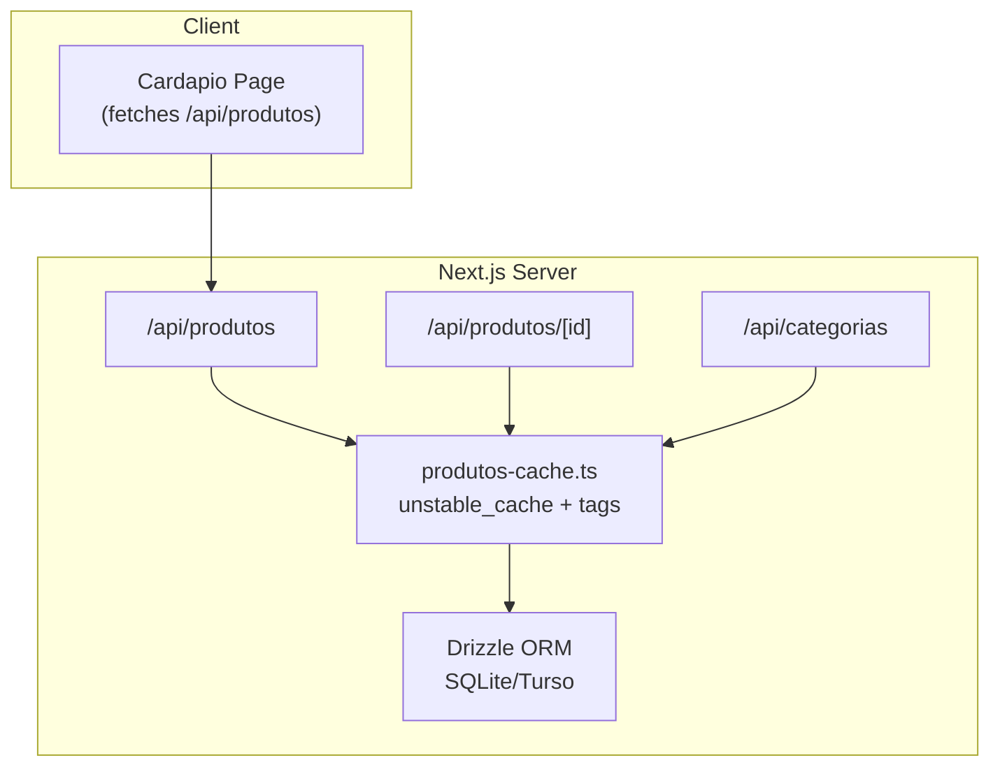
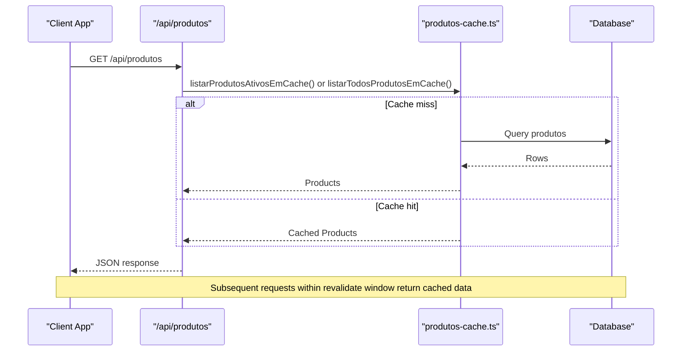
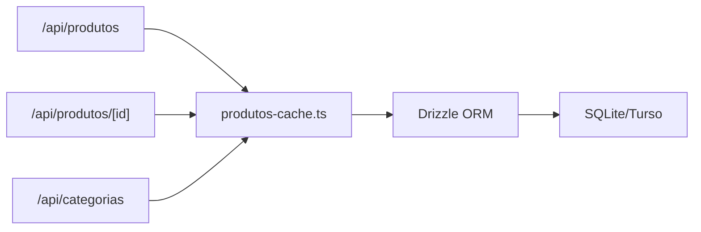

# Product Catalog Caching

<cite>
**Referenced Files in This Document**
- [produtos-cache.ts](file://src/lib/produtos-cache.ts)
- [produtos-cache.ts (local)](file://reserva/cardapio-local/src/lib/produtos-cache.ts)
- [produtos route](file://src/app/api/produtos/route.ts)
- [produtos [id] route](file://src/app/api/produtos/[id]/route.ts)
- [categorias route](file://src/app/api/categorias/route.ts)
- [cardapio page](file://src/app/cardapio/page.tsx)
- [schema.ts](file://src/db/schema.ts)
- [db index.ts](file://src/db/index.ts)
</cite>

## Table of Contents
1. Introduction
2. Project Structure
3. Core Components
4. Architecture Overview
5. Detailed Component Analysis
6. Dependency Analysis
7. Performance Considerations
8. Troubleshooting Guide
9. Conclusion

## Introduction
This document explains the product catalog caching system used to optimize menu loading performance. The system leverages Next.js server-side caching to store frequently accessed product data, reducing database queries and improving application responsiveness. It covers cache strategies, invalidation policies, memory management implications, cache warming considerations, size limits, synchronization with server data, usage patterns, monitoring approaches, and troubleshooting guidance.

## Project Structure
The caching layer is implemented as a small library that wraps database queries with Next.js unstable_cache and uses tags for targeted invalidation. API routes read from these cached functions and invalidate the cache on write operations. Client pages fetch products via an API endpoint, which benefits from server-side caching.

**Diagram sources**
- [produtos route](file://src/app/api/produtos/route.ts)
- [produtos [id] route](file://src/app/api/produtos/[id]/route.ts)
- [categorias route](file://src/app/api/categorias/route.ts)
- [produtos-cache.ts](file://src/lib/produtos-cache.ts)
- [db index.ts](file://src/db/index.ts)

**Section sources**
- [produtos-cache.ts](file://src/lib/produtos-cache.ts)
- [produtos route](file://src/app/api/produtos/route.ts)
- [produtos [id] route](file://src/app/api/produtos/[id]/route.ts)
- [categorias route](file://src/app/api/categorias/route.ts)
- [cardapio page](file://src/app/cardapio/page.tsx)
- [schema.ts](file://src/db/schema.ts)
- [db index.ts](file://src/db/index.ts)

## Core Components
- Cached query functions:
  - Active products list: caches a filtered query by status.
  - All products list: caches the full product set.
- Invalidation function:
  - Invalidates all product-related cache entries using a shared tag.
- API consumers:
  - GET /api/produtos reads from cache based on user role.
  - POST /api/produtos writes and invalidates cache.
  - PUT /api/produtos/[id] updates and invalidates cache.
  - DELETE /api/produtos/[id] deletes and invalidates cache.
  - PUT /api/categorias updates categories and invalidates cache.

Key behaviors:
- Time-based revalidation: both cached queries are configured to revalidate every 300 seconds.
- Tag-based invalidation: all product queries share a common tag so any write operation can invalidate them atomically.
- Role-aware selection: admin users see all products; regular users see only active ones.

**Section sources**
- [produtos-cache.ts](file://src/lib/produtos-cache.ts)
- [produtos route](file://src/app/api/produtos/route.ts)
- [produtos [id] route](file://src/app/api/produtos/[id]/route.ts)
- [categorias route](file://src/app/api/categorias/route.ts)

## Architecture Overview
The caching architecture centers around Next.js server-side caching primitives:
- unstable_cache wraps database queries and returns cached results until revalidation or explicit invalidation.
- Tags group related cache entries; invalidating a tag clears all associated entries immediately.
- API routes orchestrate reads and writes while ensuring cache consistency through tag invalidation.

**Diagram sources**
- [produtos route](file://src/app/api/produtos/route.ts)
- [produtos-cache.ts](file://src/lib/produtos-cache.ts)
- [db index.ts](file://src/db/index.ts)

## Detailed Component Analysis

### Cached Query Functions
- Active products cache:
  - Purpose: Serve frequently requested active products quickly.
  - Behavior: Filters by status and caches result with a 300s revalidation window.
- All products cache:
  - Purpose: Serve complete product catalog for administrative contexts.
  - Behavior: Caches entire table with a 300s revalidation window.
- Shared tag:
  - Both caches use the same tag to enable unified invalidation across all product queries.

Implementation notes:
- Uses Drizzle ORM to query the products table.
- Returns plain arrays suitable for JSON serialization.

**Section sources**
- [produtos-cache.ts](file://src/lib/produtos-cache.ts)
- [schema.ts](file://src/db/schema.ts)

### Invalidation Function
- invalidarCacheProdutos():
  - Purpose: Invalidate all product-related cache entries immediately upon mutations.
  - Mechanism: Calls revalidateTag with the shared tag and immediate expiration.
  - Usage: Invoked after create, update, delete, and category changes.

**Section sources**
- [produtos-cache.ts](file://src/lib/produtos-cache.ts)

### API Routes and Cache Interaction

#### GET /api/produtos
- Reads from cache based on authenticated role:
  - Admin: returns all products via the “all” cache.
  - Non-admin: returns active products via the “active” cache.
- Benefits:
  - Reduces DB load during high traffic.
  - Ensures consistent responses within the revalidation window.

**Section sources**
- [produtos route](file://src/app/api/produtos/route.ts)

#### POST /api/produtos
- Creates a new product and invalidates the product cache.
- Validation ensures required fields and valid price.
- On success, returns created product metadata.

**Section sources**
- [produtos route](file://src/app/api/produtos/route.ts)

#### PUT /api/produtos/[id]
- Updates an existing product and invalidates the product cache.
- Validates input and applies updates via Drizzle ORM.

**Section sources**
- [produtos [id] route](file://src/app/api/produtos/[id]/route.ts)

#### DELETE /api/produtos/[id]
- Deletes a product and invalidates the product cache.
- Returns success message upon completion.

**Section sources**
- [produtos [id] route](file://src/app/api/produtos/[id]/route.ts)

#### PUT /api/categorias
- Renames categories across products and invalidates the product cache.
- Ensures both old and new category names are provided.

**Section sources**
- [categorias route](file://src/app/api/categorias/route.ts)

### Client-Side Fetching Pattern
- The client cardapio page fetches products from /api/produtos on mount.
- The API layer serves cached data when available, minimizing latency and DB pressure.

**Section sources**
- [cardapio page](file://src/app/cardapio/page.tsx)

### Data Model
- Products table includes id, name, description, price, category, status, and image.
- Status field drives the active vs. all products split in caching.

**Section sources**
- [schema.ts](file://src/db/schema.ts)

### Database Layer
- Drizzle ORM configured with libsql client, supporting local file or remote Turso database.
- Environment variables control connection URL and optional auth token.

**Section sources**
- [db index.ts](file://src/db/index.ts)

## Dependency Analysis
The caching layer depends on Next.js caching primitives and Drizzle ORM. API routes depend on the cache module for reads and invalidation.

**Diagram sources**
- [produtos route](file://src/app/api/produtos/route.ts)
- [produtos [id] route](file://src/app/api/produtos/[id]/route.ts)
- [categorias route](file://src/app/api/categorias/route.ts)
- [produtos-cache.ts](file://src/lib/produtos-cache.ts)
- [db index.ts](file://src/db/index.ts)

**Section sources**
- [produtos route](file://src/app/api/produtos/route.ts)
- [produtos [id] route](file://src/app/api/produtos/[id]/route.ts)
- [categorias route](file://src/app/api/categorias/route.ts)
- [produtos-cache.ts](file://src/lib/produtos-cache.ts)
- [db index.ts](file://src/db/index.ts)

## Performance Considerations
- Cache hit ratio:
  - Frequent reads of active products benefit most due to short revalidation windows and stable content.
- Revalidation strategy:
  - 300-second revalidation balances freshness with reduced DB load.
- Memory usage:
  - Server-side cache stores query results in process memory; large catalogs may increase memory footprint.
- Concurrency:
  - Next.js caches per-process; multiple instances may have separate caches unless externalized.
- I/O reduction:
  - Fewer DB queries under load improve latency and throughput.

[No sources needed since this section provides general guidance]

## Troubleshooting Guide

Common issues and resolutions:
- Stale data after updates:
  - Ensure invalidarCacheProdutos is called on all mutation endpoints (create, update, delete, category rename).
  - Verify that the shared tag matches across all cached queries.
- High memory usage:
  - Monitor process memory; consider reducing dataset size or increasing revalidation intervals if appropriate.
- Cache not invalidated:
  - Confirm that invalidation calls execute successfully and are not blocked by errors.
- Local vs. production behavior differences:
  - Check environment configuration for database connections and ensure consistent schema.

Operational checks:
- Validate API responses before and after mutations to confirm cache invalidation.
- Inspect logs for errors in API routes and cache invalidation paths.

**Section sources**
- [produtos route](file://src/app/api/produtos/route.ts)
- [produtos [id] route](file://src/app/api/produtos/[id]/route.ts)
- [categorias route](file://src/app/api/categorias/route.ts)
- [produtos-cache.ts](file://src/lib/produtos-cache.ts)

## Conclusion
The product catalog caching system effectively reduces database load and improves menu loading performance through Next.js server-side caching and tag-based invalidation. By separating active and all products into distinct cached queries and unifying invalidation via a shared tag, the system maintains consistency while optimizing read-heavy workloads. For further enhancements, consider externalizing cache storage, implementing cache warming strategies, and adding detailed metrics to monitor hit ratios and memory usage.

[No sources needed since this section summarizes without analyzing specific files]