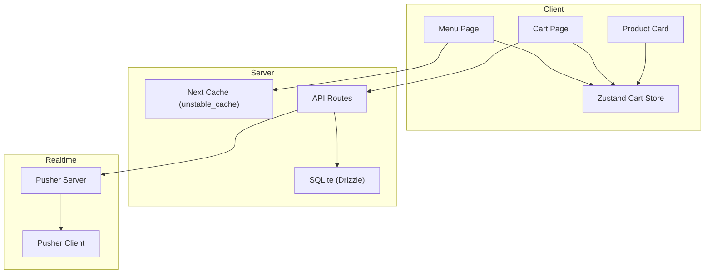
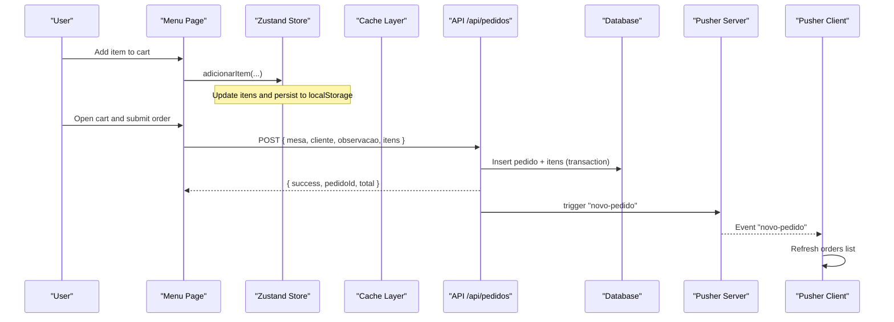
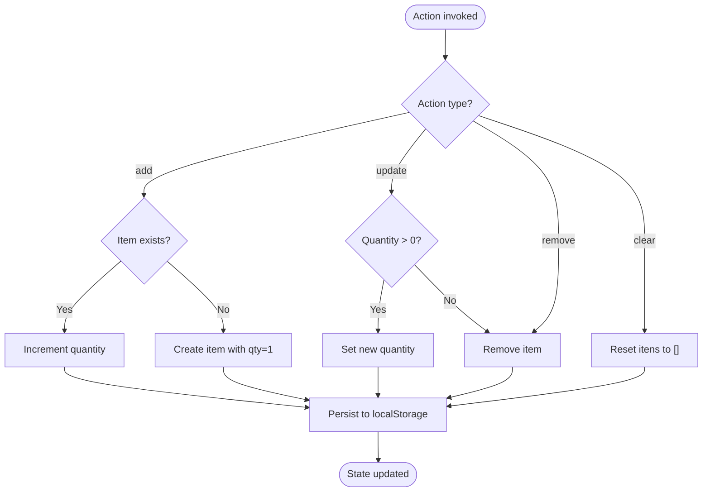
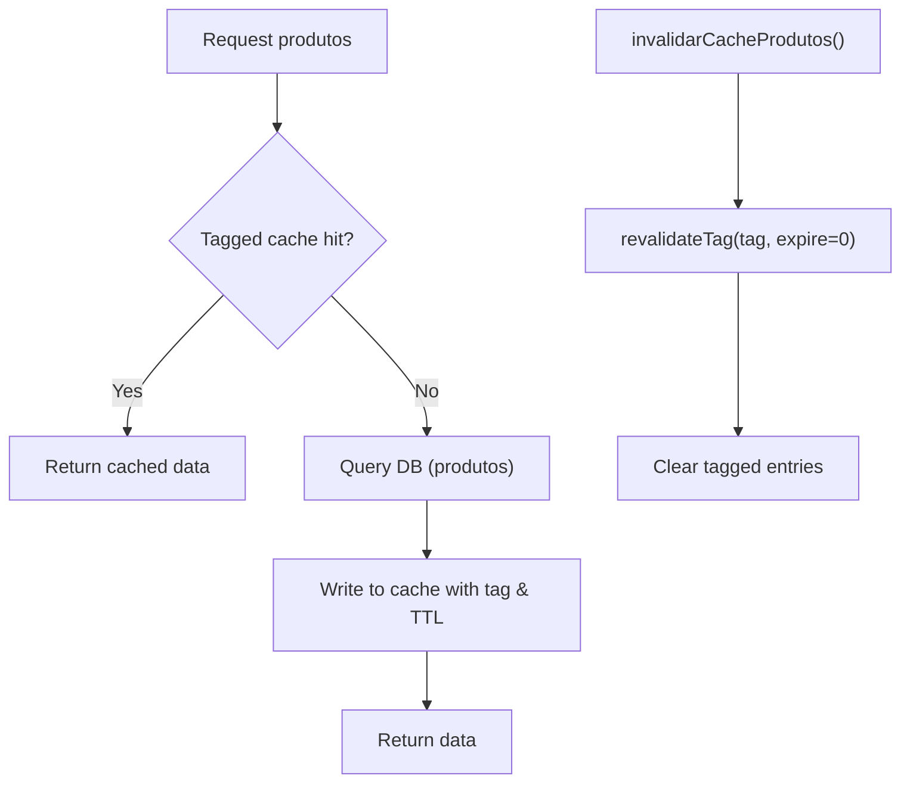
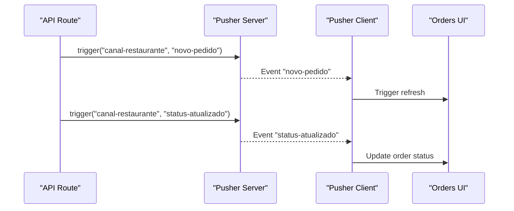
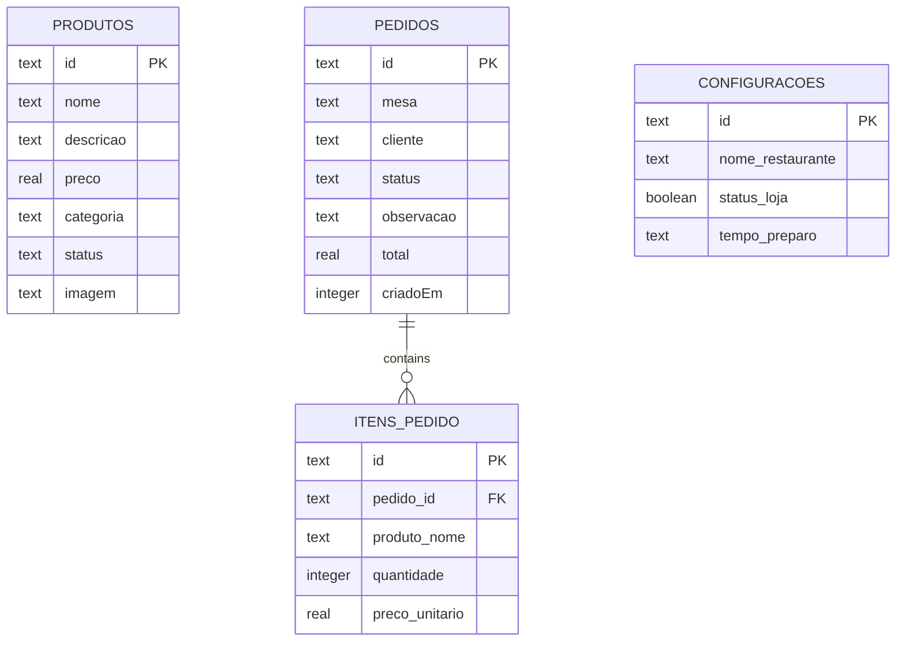
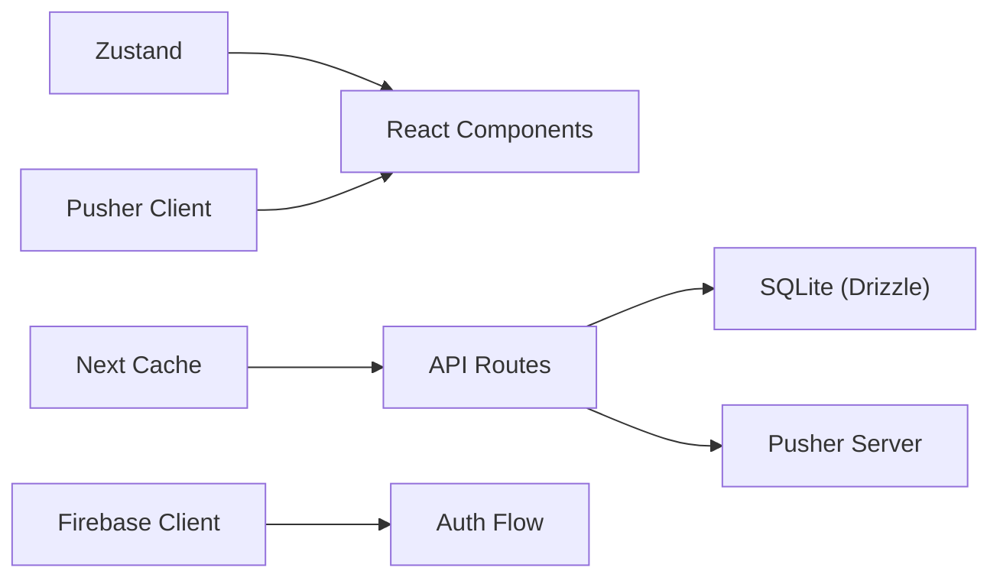

# State Management

<cite>
**Referenced Files in This Document**
- [cartStore.ts](file://src/contexts/cartStore.ts)
- [produtos-cache.ts](file://src/lib/produtos-cache.ts)
- [firebase-client.ts](file://src/lib/firebase-client.ts)
- [pusher-server.ts](file://src/lib/pusher-server.ts)
- [pusher.ts](file://src/lib/pusher.ts)
- [route.ts (pedidos API)](file://src/app/api/pedidos/route.ts)
- [page.tsx (carrinho)](file://src/app/carrinho/page.tsx)
- [page.tsx (cardapio)](file://src/app/cardapio/page.tsx)
- [CardProduto.tsx](file://src/components/CardProduto.tsx)
- [schema.ts](file://src/db/schema.ts)
- [package.json](file://package.json)
</cite>

## Table of Contents
1. [Introduction](#introduction)
2. [Project Structure](#project-structure)
3. [Core Components](#core-components)
4. [Architecture Overview](#architecture-overview)
5. [Detailed Component Analysis](#detailed-component-analysis)
6. [Dependency Analysis](#dependency-analysis)
7. [Performance Considerations](#performance-considerations)
8. [Troubleshooting Guide](#troubleshooting-guide)
9. [Conclusion](#conclusion)
10. [Appendices](#appendices)

## Introduction
This document explains the state management architecture for a Next.js restaurant ordering application. It focuses on:
- Client-side state with Zustand for shopping cart and table context
- Server-side caching for product catalog to optimize menu loading
- Real-time collaboration and live updates via Pusher (and Firebase client setup for authentication)
- Persistence strategies, synchronization patterns, and conflict handling
- Performance considerations for large datasets and memory optimization
- Testing strategies and debugging approaches
- Guidelines for extending the system consistently

## Project Structure
The state management spans several layers:
- Client store: Zustand-based cart store with local persistence
- UI components: Menu and cart pages consume the store
- Server cache: Next.js unstable_cache for product catalog queries
- Real-time layer: Pusher server triggers and client subscriptions
- Authentication: Firebase client initialization and Google sign-in helper

**Diagram sources**
- [cartStore.ts:1-69](file://src/contexts/cartStore.ts#L1-L69)
- [produtos-cache.ts:1-23](file://src/lib/produtos-cache.ts#L1-L23)
- [route.ts (pedidos API):1-253](file://src/app/api/pedidos/route.ts#L1-L253)
- [pusher-server.ts:1-11](file://src/lib/pusher-server.ts#L1-L11)
- [pusher.ts:1-9](file://src/lib/pusher.ts#L1-L9)

**Section sources**
- [cartStore.ts:1-69](file://src/contexts/cartStore.ts#L1-L69)
- [produtos-cache.ts:1-23](file://src/lib/produtos-cache.ts#L1-L23)
- [route.ts (pedidos API):1-253](file://src/app/api/pedidos/route.ts#L1-L253)
- [pusher-server.ts:1-11](file://src/lib/pusher-server.ts#L1-L11)
- [pusher.ts:1-9](file://src/lib/pusher.ts#L1-L9)

## Core Components
- Shopping cart store (Zustand + persist middleware)
  - Manages items, quantities, and table context
  - Persists across sessions using localStorage under a dedicated key
- Product catalog cache (server-side)
  - Caches active and all products with tags and revalidation windows
- Real-time updates (Pusher)
  - Server triggers events on order creation and status changes
  - Clients subscribe to channels to refresh UI
- Authentication helper (Firebase client)
  - Initializes Firebase app and provides Google sign-in flow

**Section sources**
- [cartStore.ts:1-69](file://src/contexts/cartStore.ts#L1-L69)
- [produtos-cache.ts:1-23](file://src/lib/produtos-cache.ts#L1-L23)
- [route.ts (pedidos API):1-253](file://src/app/api/pedidos/route.ts#L1-L253)
- [firebase-client.ts:1-26](file://src/lib/firebase-client.ts#L1-L26)

## Architecture Overview
The system separates concerns between client state, server data, and real-time signals:
- Zustand holds ephemeral and persisted client state for the cart and current table
- Next.js caches product queries to reduce database load and improve performance
- API routes validate orders, persist them to SQLite, and emit real-time events
- Clients subscribe to Pusher channels to react to new orders and status updates

**Diagram sources**
- [cartStore.ts:21-67](file://src/contexts/cartStore.ts#L21-L67)
- [page.tsx (carrinho):26-57](file://src/app/carrinho/page.tsx#L26-L57)
- [route.ts (pedidos API):65-189](file://src/app/api/pedidos/route.ts#L65-L189)
- [pusher-server.ts:1-11](file://src/lib/pusher-server.ts#L1-L11)

## Detailed Component Analysis

### Shopping Cart Store (Zustand + Persist)
Responsibilities:
- Maintain cart items with id, name, price, quantity
- Track current table context
- Provide actions to add/remove/update items and clear cart
- Persist state to localStorage automatically

Key behaviors:
- Adding an existing item increments its quantity; otherwise creates a new entry
- Quantity changes enforce non-negative values; zero removes the item
- Table context is set from QR code or URL parameters and persists

Persistence:
- Uses zustand/middleware persist with a storage key to survive page reloads

**Diagram sources**
- [cartStore.ts:21-67](file://src/contexts/cartStore.ts#L21-L67)

**Section sources**
- [cartStore.ts:1-69](file://src/contexts/cartStore.ts#L1-L69)
- [page.tsx (carrinho):1-99](file://src/app/carrinho/page.tsx#L1-L99)
- [CardProduto.tsx:1-51](file://src/components/CardProduto.tsx#L1-L51)

### Product Catalog Caching Mechanism
Purpose:
- Reduce database queries for product listings
- Improve menu load times by serving cached results

Implementation:
- Two cached functions: one for active products, another for all products
- Both use tags and revalidation intervals to balance freshness and performance
- An invalidation function allows explicit cache busting when needed

**Diagram sources**
- [produtos-cache.ts:1-23](file://src/lib/produtos-cache.ts#L1-L23)

**Section sources**
- [produtos-cache.ts:1-23](file://src/lib/produtos-cache.ts#L1-L23)

### Real-Time Synchronization with Pusher
Server-side:
- On order creation and status updates, the API triggers Pusher events
- Events include messages and payload details for clients to act upon

Client-side:
- Subscribes to a channel and listens for specific events
- Reacts by refreshing relevant lists or UI states

**Diagram sources**
- [route.ts (pedidos API):173-180](file://src/app/api/pedidos/route.ts#L173-L180)
- [route.ts (pedidos API):220-228](file://src/app/api/pedidos/route.ts#L220-L228)
- [pusher-server.ts:1-11](file://src/lib/pusher-server.ts#L1-L11)
- [pusher.ts:1-9](file://src/lib/pusher.ts#L1-L9)

**Section sources**
- [route.ts (pedidos API):173-180](file://src/app/api/pedidos/route.ts#L173-L180)
- [route.ts (pedidos API):220-228](file://src/app/api/pedidos/route.ts#L220-L228)
- [pusher-server.ts:1-11](file://src/lib/pusher-server.ts#L1-L11)
- [pusher.ts:1-9](file://src/lib/pusher.ts#L1-L9)

### Data Models and Relationships
The database schema defines core entities used by the state and APIs:
- Products: id, nome, descricao, preco, categoria, status, imagem
- Orders: id, mesa, cliente, status, observacao, total, criadoEm
- Order Items: id, pedidoId, produtoNome, quantidade, precoUnitario
- Configurations: restaurante settings including open status
- Users and login attempts tables for auth and rate limiting

**Diagram sources**
- [schema.ts:1-56](file://src/db/schema.ts#L1-L56)

**Section sources**
- [schema.ts:1-56](file://src/db/schema.ts#L1-L56)

### State Persistence Strategies
- LocalStorage persistence for cart and table context via Zustand persist middleware
- Additional local tracking for user orders stored in localStorage after successful submission
- Server-side caching for product catalog to minimize repeated queries

Patterns:
- Ephemeral vs persistent state separation: cart is persistent; transient UI flags are not
- Cache invalidation strategy using tags for consistent updates

**Section sources**
- [cartStore.ts:21-67](file://src/contexts/cartStore.ts#L21-L67)
- [page.tsx (carrinho):46-48](file://src/app/carrinho/page.tsx#L46-L48)
- [produtos-cache.ts:1-23](file://src/lib/produtos-cache.ts#L1-L23)

### Data Synchronization Patterns
- Write path: Client sends order to API; API persists to DB and emits real-time event
- Read path: Clients fetch data via API; UI subscribes to Pusher for live updates
- Conflict resolution:
  - Server validates inputs and enforces business rules (e.g., product availability, totals)
  - Transactions ensure atomicity of order and items insertion
  - Status transitions are validated against allowed values

**Section sources**
- [route.ts (pedidos API):65-189](file://src/app/api/pedidos/route.ts#L65-L189)
- [route.ts (pedidos API):192-235](file://src/app/api/pedidos/route.ts#L192-L235)

### Performance Considerations
- Use cached product queries to reduce DB load and latency
- Keep cart state minimal and normalized; avoid deep nesting
- Debounce or throttle UI-heavy operations if necessary
- Leverage tags for targeted cache invalidation instead of full cache flushes
- Monitor memory usage for large menus; consider pagination or virtualization at the UI level

[No sources needed since this section provides general guidance]

### Testing Strategies
- Unit tests for store actions:
  - Verify add/increment behavior for duplicate items
  - Validate quantity update edge cases (zero/negative)
  - Ensure clear resets state correctly
- Integration tests for API:
  - Validate order creation with valid/invalid payloads
  - Confirm transactional writes and error responses
- Real-time tests:
  - Mock Pusher server/client to assert event emissions and client reactions
- Snapshot tests for UI components that depend on store state

[No sources needed since this section provides general guidance]

### Debugging Tools
- Browser DevTools:
  - Inspect localStorage for cart persistence
  - Network tab to verify API calls and responses
- Console logs:
  - API route errors and Pusher trigger failures are logged for diagnostics
- State inspection:
  - Use Zustand devtools extension to inspect store mutations and history

**Section sources**
- [route.ts (pedidos API):59-62](file://src/app/api/pedidos/route.ts#L59-L62)
- [route.ts (pedidos API):186-189](file://src/app/api/pedidos/route.ts#L186-L189)
- [route.ts (pedidos API):231-234](file://src/app/api/pedidos/route.ts#L231-L234)

## Dependency Analysis
Key dependencies and their roles:
- Zustand: Client state management with persistence
- Next.js caching: Server-side product catalog caching
- Drizzle ORM + SQLite: Data modeling and persistence
- Pusher: Real-time event signaling
- Firebase: Client-side authentication helper

**Diagram sources**
- [cartStore.ts:1-69](file://src/contexts/cartStore.ts#L1-L69)
- [produtos-cache.ts:1-23](file://src/lib/produtos-cache.ts#L1-L23)
- [route.ts (pedidos API):1-253](file://src/app/api/pedidos/route.ts#L1-L253)
- [pusher-server.ts:1-11](file://src/lib/pusher-server.ts#L1-L11)
- [pusher.ts:1-9](file://src/lib/pusher.ts#L1-L9)
- [firebase-client.ts:1-26](file://src/lib/firebase-client.ts#L1-L26)

**Section sources**
- [package.json:17-30](file://package.json#L17-L30)

## Performance Considerations
- Large datasets:
  - Implement pagination or infinite scrolling for large menus
  - Use virtualized lists to render many items efficiently
- Memory management:
  - Avoid storing unnecessary fields in the cart
  - Clean up subscriptions (e.g., unsubscribe from Pusher channels on unmount)
- State optimization:
  - Select only required slices of state in components to reduce re-renders
  - Normalize data structures where possible

[No sources needed since this section provides general guidance]

## Troubleshooting Guide
Common issues and resolutions:
- Cart not persisting:
  - Verify browser localStorage contains the cart key
  - Ensure no third-party scripts block localStorage access
- Menu not updating after product changes:
  - Confirm cache invalidation is triggered when products change
- Real-time events not received:
  - Check Pusher environment variables and network connectivity
  - Validate channel names and event names match server triggers
- Order submission fails:
  - Inspect API response for validation errors
  - Review console logs for server-side errors

**Section sources**
- [cartStore.ts:21-67](file://src/contexts/cartStore.ts#L21-L67)
- [produtos-cache.ts:20-23](file://src/lib/produtos-cache.ts#L20-L23)
- [route.ts (pedidos API):65-189](file://src/app/api/pedidos/route.ts#L65-L189)

## Conclusion
The application employs a layered state management approach:
- Zustand for robust, persistent client state
- Server-side caching for efficient data retrieval
- Pusher for real-time collaboration and live updates
- Strong validation and transactions for reliable data integrity

This design balances performance, scalability, and maintainability while providing a responsive user experience.

[No sources needed since this section summarizes without analyzing specific files]

## Appendices

### Extending the State Management System
Guidelines:
- Define clear interfaces for new state slices
- Encapsulate logic in store actions to keep components thin
- Use tags for targeted cache invalidation when related data changes
- Introduce real-time events sparingly; prefer batching updates when possible
- Maintain consistency in naming conventions for stores, actions, and events

[No sources needed since this section provides general guidance]