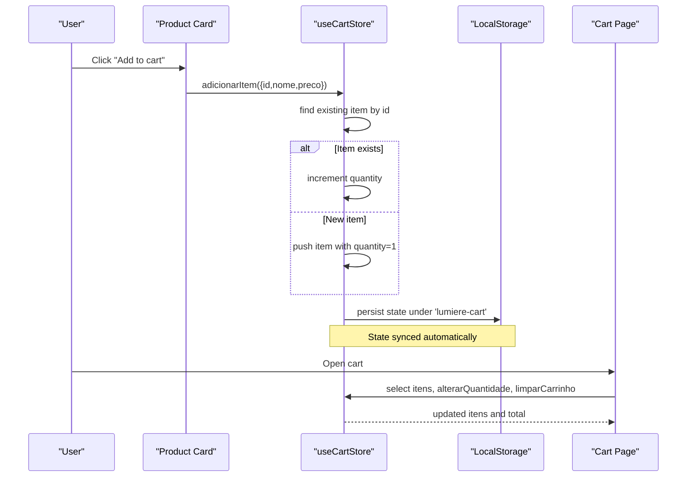
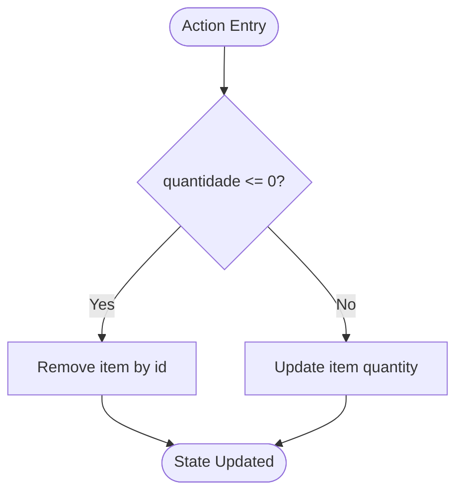
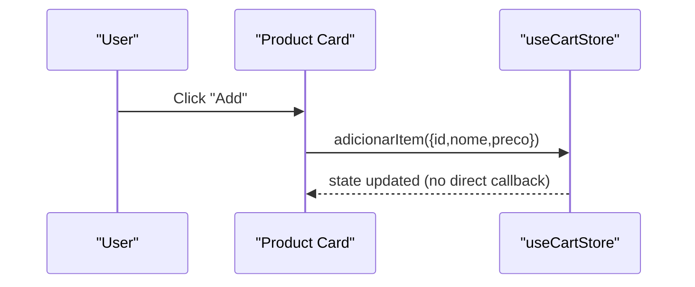
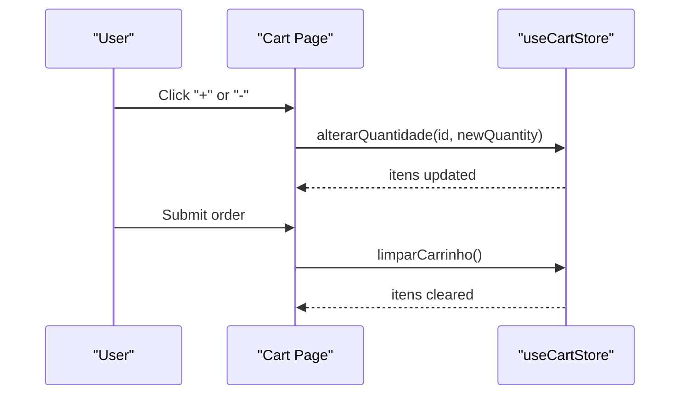
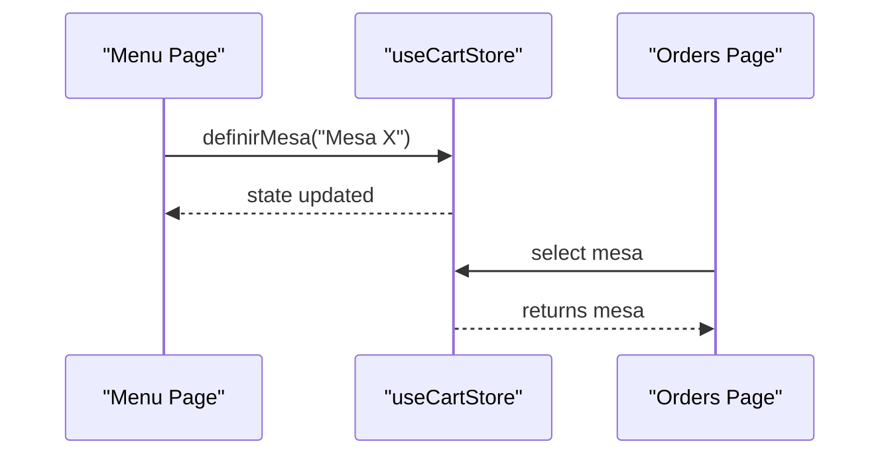
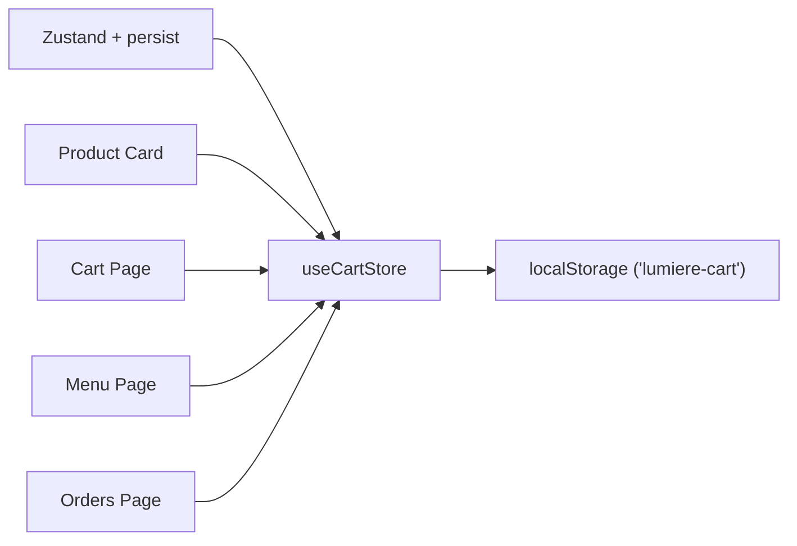

# Zustand Cart Store

<cite>
**Referenced Files in This Document**
- [cartStore.ts](file://src/contexts/cartStore.ts)
- [CardProduto.tsx](file://src/components/CardProduto.tsx)
- [page.tsx (carrinho)](file://src/app/carrinho/page.tsx)
- [page.tsx (cardapio)](file://src/app/cardapio/page.tsx)
- [page.tsx (orders)](file://src/app/orders/page.tsx)
</cite>

## Table of Contents
1. [Introduction](#introduction)
2. [Project Structure](#project-structure)
3. [Core Components](#core-components)
4. [Architecture Overview](#architecture-overview)
5. [Detailed Component Analysis](#detailed-component-analysis)
6. [Dependency Analysis](#dependency-analysis)
7. [Performance Considerations](#performance-considerations)
8. [Troubleshooting Guide](#troubleshooting-guide)
9. [Conclusion](#conclusion)
10. [Appendices](#appendices)

## Introduction
This document explains the Zustand-based shopping cart store implementation used across the application. It covers the cart state model, all available operations, persistence configuration with local storage, and practical usage patterns in React components. The goal is to help developers understand how items are added, removed, and managed, and how the cart integrates with menu and order pages.

## Project Structure
The cart functionality centers around a single Zustand store and is consumed by several UI components:
- Store definition and middleware configuration live in the contexts folder.
- Product cards trigger adding items to the cart.
- The cart page displays items, updates quantities, and finalizes orders.
- Menu and order pages read cart state for navigation and context (e.g., table association).

```mermaid
graph TB
subgraph "UI"
Card["Product Card<br/>src/components/CardProduto.tsx"]
CartPage["Cart Page<br/>src/app/carrinho/page.tsx"]
MenuPage["Menu Page<br/>src/app/cardapio/page.tsx"]
OrdersPage["Orders Page<br/>src/app/orders/page.tsx"]
end
Store["Zustand Store<br/>src/contexts/cartStore.ts"]
LS["Local Storage<br/>key 'lumiere-cart'"]
Card --> Store
CartPage --> Store
MenuPage --> Store
OrdersPage --> Store
Store < --> LS
```

**Diagram sources**
- [cartStore.ts:1-69](file://src/contexts/cartStore.ts#L1-L69)
- [CardProduto.tsx:1-51](file://src/components/CardProduto.tsx#L1-L51)
- [page.tsx (carrinho):1-99](file://src/app/carrinho/page.tsx#L1-L99)
- [page.tsx (cardapio):1-200](file://src/app/cardapio/page.tsx#L1-L200)
- [page.tsx (orders):1-156](file://src/app/orders/page.tsx#L1-L156)

**Section sources**
- [cartStore.ts:1-69](file://src/contexts/cartStore.ts#L1-L69)
- [CardProduto.tsx:1-51](file://src/components/CardProduto.tsx#L1-L51)
- [page.tsx (carrinho):1-99](file://src/app/carrinho/page.tsx#L1-L99)
- [page.tsx (cardapio):1-200](file://src/app/cardapio/page.tsx#L1-L200)
- [page.tsx (orders):1-156](file://src/app/orders/page.tsx#L1-L156)

## Core Components
- ItemCarrinho interface defines each cart item with id, nome, preco, and quantidade.
- CartState holds itens array and mesa (table) identifier, plus methods to manipulate the cart.
- useCartStore exposes the store instance with persist middleware enabled.

Key responsibilities:
- State shape: itens (ItemCarrinho[]) and mesa (string | null).
- Operations: adicionarItem, removerItem, alterarQuantidade, limparCarrinho, definirMesa.
- Persistence: configured to sync state to localStorage under key 'lumiere-cart'.

**Section sources**
- [cartStore.ts:4-19](file://src/contexts/cartStore.ts#L4-L19)
- [cartStore.ts:21-68](file://src/contexts/cartStore.ts#L21-L68)

## Architecture Overview
The store is created with Zustand and wrapped with persist middleware. Components subscribe to selected slices of state and call actions to mutate it. The cart integrates with:
- Product card component to add items.
- Cart page to manage quantities and finalize orders.
- Menu page to set table context from URL parameters.
- Orders page to read current table context.



**Diagram sources**
- [cartStore.ts:21-68](file://src/contexts/cartStore.ts#L21-L68)
- [CardProduto.tsx:14-45](file://src/components/CardProduto.tsx#L14-L45)
- [page.tsx (carrinho):8-57](file://src/app/carrinho/page.tsx#L8-L57)

## Detailed Component Analysis

### Store Model and Actions
- State:
  - itens: array of ItemCarrinho objects.
  - mesa: string or null representing the associated table.
- Actions:
  - adicionarItem(produto): Adds a product; if an item with the same id exists, increments its quantity by 1; otherwise, adds a new item with quantity 1.
  - removerItem(id): Removes the item with the given id.
  - alterarQuantidade(id, quantidade): Updates quantity; if quantidade <= 0, removes the item; otherwise sets the new quantity.
  - limparCarrinho(): Clears all items.
  - definirMesa(mesa): Sets the table context.



**Diagram sources**
- [cartStore.ts:51-61](file://src/contexts/cartStore.ts#L51-L61)

**Section sources**
- [cartStore.ts:4-19](file://src/contexts/cartStore.ts#L4-L19)
- [cartStore.ts:21-68](file://src/contexts/cartStore.ts#L21-L68)

### Adding Items from Product Cards
- The product card component reads the adicionarItem action from the store and calls it when the user clicks the add button.
- It passes minimal product data (id, nome, preco), which the store uses to create or update cart entries.



**Diagram sources**
- [CardProduto.tsx:14-45](file://src/components/CardProduto.tsx#L14-L45)
- [cartStore.ts:27-44](file://src/contexts/cartStore.ts#L27-L44)

**Section sources**
- [CardProduto.tsx:14-45](file://src/components/CardProduto.tsx#L14-L45)
- [cartStore.ts:27-44](file://src/contexts/cartStore.ts#L27-L44)

### Managing Quantities and Clearing the Cart
- The cart page subscribes to itens and actions like alterarQuantidade and limparCarrinho.
- Users can increase/decrease quantities; negative or zero quantities remove the item.
- After successful order submission, the cart is cleared.



**Diagram sources**
- [page.tsx (carrinho):8-57](file://src/app/carrinho/page.tsx#L8-L57)
- [cartStore.ts:51-64](file://src/contexts/cartStore.ts#L51-L64)

**Section sources**
- [page.tsx (carrinho):8-57](file://src/app/carrinho/page.tsx#L8-L57)
- [cartStore.ts:51-64](file://src/contexts/cartStore.ts#L51-L64)

### Table Association via definirMesa
- The menu page sets the table context based on URL parameters using definirMesa.
- The cart and orders pages read the stored mesa value to determine delivery context.



**Diagram sources**
- [page.tsx (cardapio):34-42](file://src/app/cardapio/page.tsx#L34-L42)
- [page.tsx (orders):18-31](file://src/app/orders/page.tsx#L18-L31)
- [cartStore.ts:64-64](file://src/contexts/cartStore.ts#L64-L64)

**Section sources**
- [page.tsx (cardapio):34-42](file://src/app/cardapio/page.tsx#L34-L42)
- [page.tsx (orders):18-31](file://src/app/orders/page.tsx#L18-L31)
- [cartStore.ts:64-64](file://src/contexts/cartStore.ts#L64-L64)

## Dependency Analysis
- The store depends on Zustand and its persist middleware.
- UI components depend on the store for reading state and invoking actions.
- Local storage is used transparently by persist middleware to keep cart state across sessions.



**Diagram sources**
- [cartStore.ts:1-3](file://src/contexts/cartStore.ts#L1-L3)
- [cartStore.ts:21-68](file://src/contexts/cartStore.ts#L21-L68)
- [CardProduto.tsx:1-51](file://src/components/CardProduto.tsx#L1-L51)
- [page.tsx (carrinho):1-99](file://src/app/carrinho/page.tsx#L1-L99)
- [page.tsx (cardapio):1-200](file://src/app/cardapio/page.tsx#L1-L200)
- [page.tsx (orders):1-156](file://src/app/orders/page.tsx#L1-L156)

**Section sources**
- [cartStore.ts:1-3](file://src/contexts/cartStore.ts#L1-L3)
- [cartStore.ts:21-68](file://src/contexts/cartStore.ts#L21-L68)

## Performance Considerations
- Large item lists:
  - Prefer selecting only needed state slices in components (e.g., itens.length, specific fields) to minimize re-renders.
  - Avoid unnecessary computations inside render; compute totals outside JSX where possible.
- Quantity changes:
  - alteraQuantidade removes items when quantity <= 0, preventing invalid states.
- Persist overhead:
  - persist writes to localStorage on every state change; consider batching frequent updates if needed.
- Rendering optimization:
  - Use stable keys (item.id) for list rendering.
  - Memoize derived values (e.g., total) if recalculated frequently.

[No sources needed since this section provides general guidance]

## Troubleshooting Guide
- Empty cart alerts:
  - The cart page validates that the cart has items before submitting an order and shows an alert if empty.
- Table validation:
  - The cart page requires a valid table context (from QR code) to proceed; otherwise, it prompts to open the menu via QR code.
- Network errors:
  - Order submission catches fetch errors and displays user-friendly messages.
- Local storage issues:
  - If persist fails due to quota or browser restrictions, cart state may not survive reloads; check browser storage settings.

**Section sources**
- [page.tsx (carrinho):26-57](file://src/app/carrinho/page.tsx#L26-L57)
- [page.tsx (carrinho):59-61](file://src/app/carrinho/page.tsx#L59-L61)
- [cartStore.ts:21-68](file://src/contexts/cartStore.ts#L21-L68)

## Conclusion
The Zustand cart store provides a simple, persistent, and reactive state management solution for the shopping cart. It supports adding items with duplicate handling, removing items, managing quantities with validation, clearing the cart, and associating orders with tables. Integration points across product cards, cart, menu, and orders pages demonstrate a cohesive flow from browsing to ordering. For large catalogs and high-frequency interactions, apply memoization and selective subscriptions to maintain performance.

[No sources needed since this section summarizes without analyzing specific files]

## Appendices

### Practical Examples of Cart State Manipulation
- Add an item:
  - From a product card, call adicionarItem with { id, nome, preco }.
  - If the item already exists, its quantity increases by one.
- Remove an item:
  - Call removerItem with the item id to delete it from the cart.
- Change quantity:
  - Call alterarQuantidade with id and desired quantity.
  - If quantity <= 0, the item is removed automatically.
- Clear the cart:
  - Call limparCarrinho to reset itens to an empty array.
- Set table context:
  - Call definirMesa with a table identifier (e.g., "Mesa 1").

**Section sources**
- [cartStore.ts:27-64](file://src/contexts/cartStore.ts#L27-L64)
- [CardProduto.tsx:39-45](file://src/components/CardProduto.tsx#L39-L45)
- [page.tsx (carrinho):74-85](file://src/app/carrinho/page.tsx#L74-L85)
- [page.tsx (cardapio):34-42](file://src/app/cardapio/page.tsx#L34-L42)

### Best Practices for Using the Cart Store in React Components
- Subscribe to minimal state:
  - Use selectors to pick only what you need (e.g., itens, mesa) to avoid unnecessary re-renders.
- Keep business logic in the store:
  - Let the store handle duplicates, validations, and removals; components should focus on UI interactions.
- Handle async flows outside the store:
  - Perform API calls (e.g., order submission) in components and then update the store (e.g., clear cart).
- Validate inputs at boundaries:
  - Ensure required context (like mesa) is present before allowing actions that depend on it.
- Optimize lists:
  - Use stable keys and avoid inline functions in list items to reduce re-renders.

**Section sources**
- [page.tsx (carrinho):8-57](file://src/app/carrinho/page.tsx#L8-L57)
- [page.tsx (cardapio):34-42](file://src/app/cardapio/page.tsx#L34-L42)
- [cartStore.ts:21-68](file://src/contexts/cartStore.ts#L21-L68)