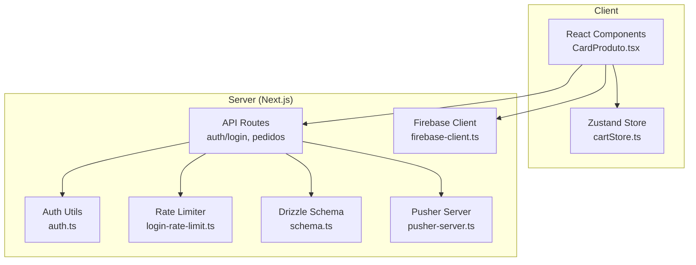
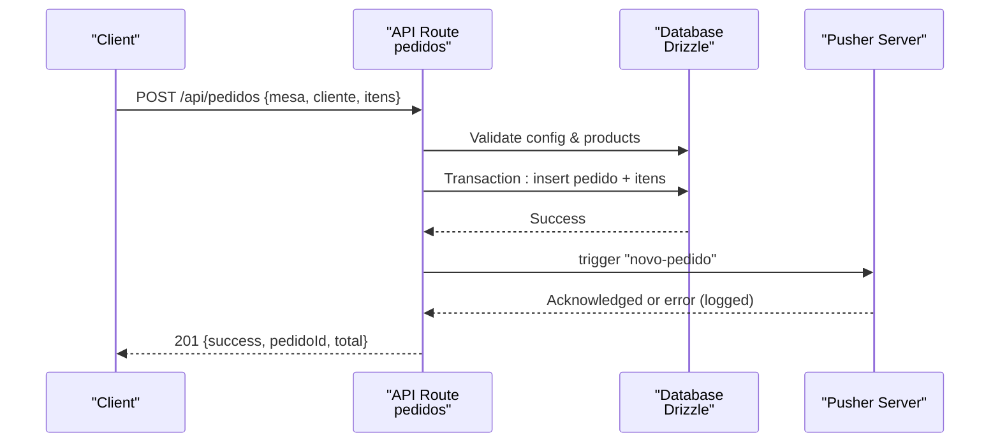
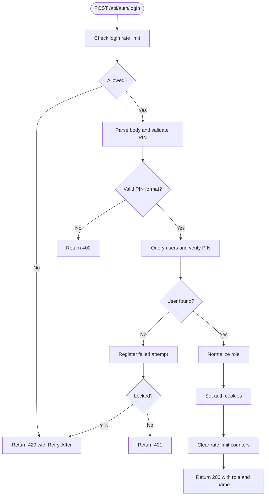
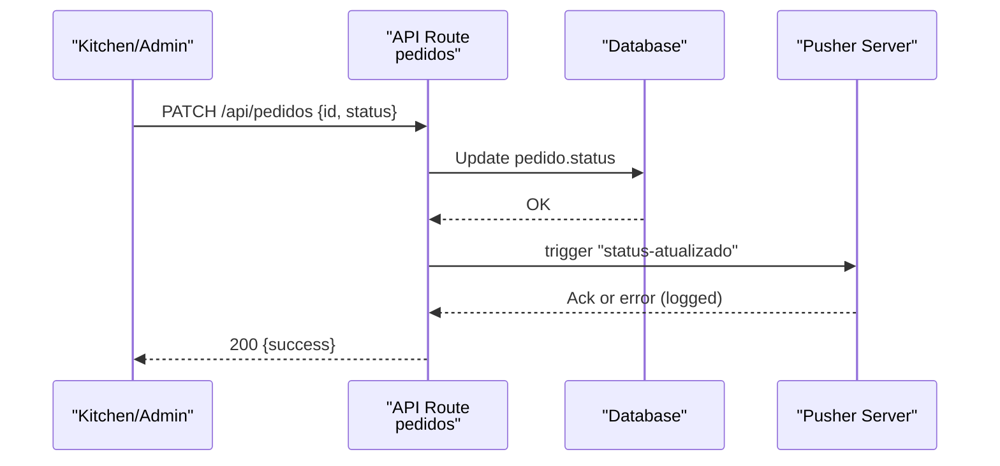
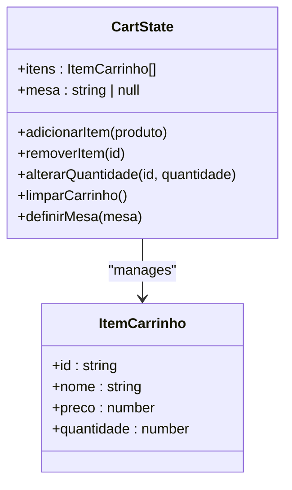
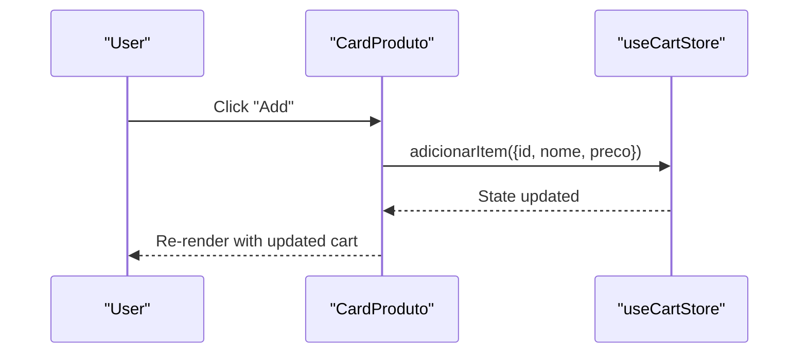
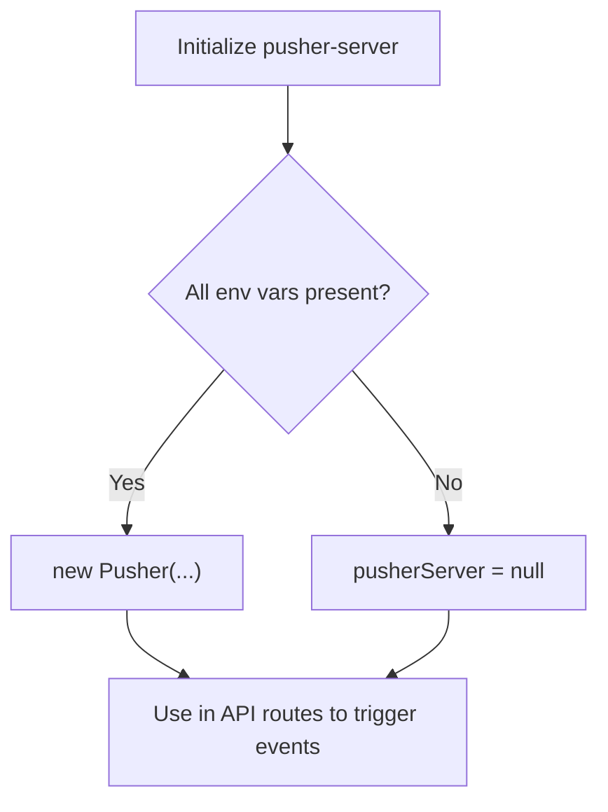
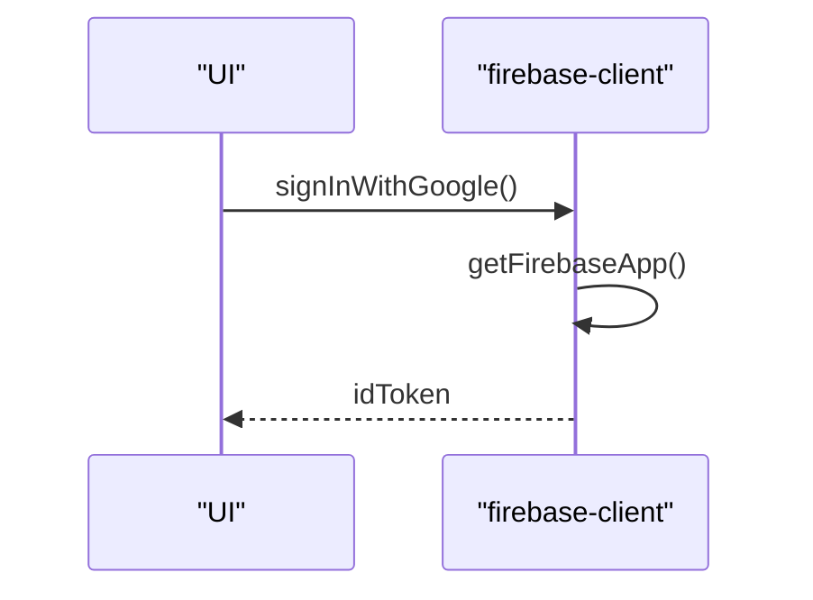
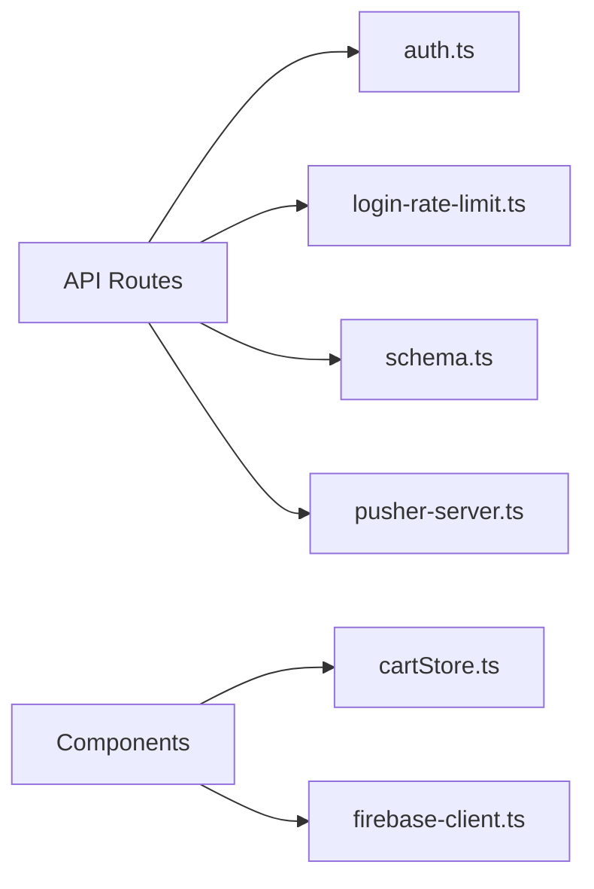
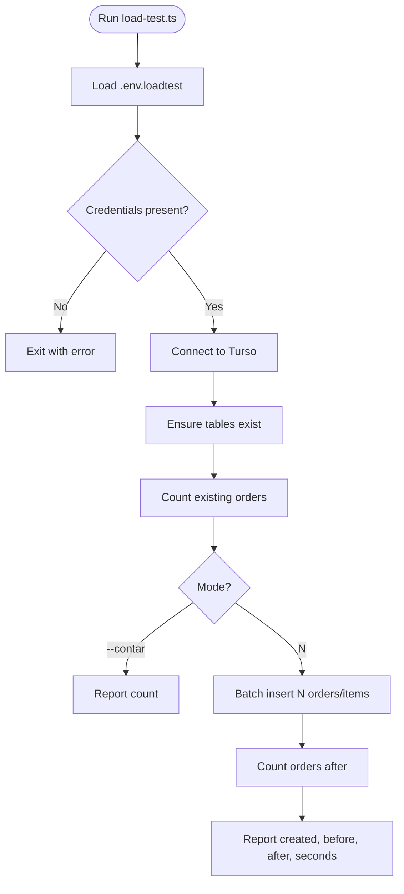

# Testing Strategy

<cite>
**Referenced Files in This Document**
- [package.json](file://package.json)
- [load-test.ts](file://scripts/load-test.ts)
- [route.ts (login)](file://src/app/api/auth/login/route.ts)
- [route.ts (pedidos)](file://src/app/api/pedidos/route.ts)
- [auth.ts](file://src/lib/auth.ts)
- [login-rate-limit.ts](file://src/lib/login-rate-limit.ts)
- [schema.ts](file://src/db/schema.ts)
- [CardProduto.tsx](file://src/components/CardProduto.tsx)
- [cartStore.ts](file://src/contexts/cartStore.ts)
- [pusher-server.ts](file://src/lib/pusher-server.ts)
- [firebase-client.ts](file://src/lib/firebase-client.ts)
</cite>

## Table of Contents
1. Introduction
2. Project Structure
3. Core Components
4. Architecture Overview
5. Detailed Component Analysis
6. Dependency Analysis
7. Performance Considerations
8. Troubleshooting Guide
9. Conclusion

## Introduction
This document defines a comprehensive testing strategy for the Meu Cardápio application. It covers unit testing for React components, API routes, and utilities; integration testing for database operations and external services; end-to-end workflows; load testing using the provided script; best practices for real-time features, authentication flows, and state management; guidelines for maintainable tests, mocking, environments; continuous integration and coverage; plus common scenarios and debugging techniques.

## Project Structure
The application is a Next.js app with:
- API routes under src/app/api handling authentication, orders, products, users, settings, and uploads
- Shared server-side utilities for auth and rate limiting
- A Drizzle ORM schema defining tables for products, orders, order items, settings, users, and login attempts
- Client-side UI components and a Zustand store for cart state
- Real-time signaling via Pusher (server and client)
- Optional Google sign-in via Firebase client
- A Node-based load test script that writes to Turso (libSQL)

**Diagram sources**
- [CardProduto.tsx:1-51](file://src/components/CardProduto.tsx#L1-L51)
- [cartStore.ts:1-69](file://src/contexts/cartStore.ts#L1-L69)
- [route.ts (login):1-80](file://src/app/api/auth/login/route.ts#L1-L80)
- [route.ts (pedidos):1-253](file://src/app/api/pedidos/route.ts#L1-L253)
- [auth.ts:1-82](file://src/lib/auth.ts#L1-L82)
- [login-rate-limit.ts:1-115](file://src/lib/login-rate-limit.ts#L1-L115)
- [schema.ts:1-56](file://src/db/schema.ts#L1-L56)
- [pusher-server.ts:1-11](file://src/lib/pusher-server.ts#L1-L11)
- [firebase-client.ts:1-26](file://src/lib/firebase-client.ts#L1-L26)

**Section sources**
- [package.json:1-45](file://package.json#L1-L45)

## Core Components
Key areas requiring robust testing:
- Authentication flow (PIN login, role-based access, cookies)
- Order lifecycle (create, list, update status, delete)
- Rate limiting on login attempts
- Cart state management (add/remove/update/clear)
- Real-time updates via Pusher
- External integrations (Firebase client)
- Database schema integrity and transactions

Testing priorities:
- Unit tests for pure logic and small utilities
- Route-level tests for API contracts and error paths
- Integration tests against an isolated test database
- E2E tests for critical user journeys
- Load/performance tests for capacity planning

**Section sources**
- [route.ts (login):1-80](file://src/app/api/auth/login/route.ts#L1-L80)
- [route.ts (pedidos):1-253](file://src/app/api/pedidos/route.ts#L1-L253)
- [auth.ts:1-82](file://src/lib/auth.ts#L1-L82)
- [login-rate-limit.ts:1-115](file://src/lib/login-rate-limit.ts#L1-L115)
- [cartStore.ts:1-69](file://src/contexts/cartStore.ts#L1-L69)
- [pusher-server.ts:1-11](file://src/lib/pusher-server.ts#L1-L11)
- [firebase-client.ts:1-26](file://src/lib/firebase-client.ts#L1-L26)
- [schema.ts:1-56](file://src/db/schema.ts#L1-L56)

## Architecture Overview
The system combines REST APIs with optional real-time signaling and third-party integrations. Tests should validate both synchronous request/response behavior and asynchronous side effects like Pusher events and database transactions.

**Diagram sources**
- [route.ts (pedidos):65-190](file://src/app/api/pedidos/route.ts#L65-L190)
- [pusher-server.ts:1-11](file://src/lib/pusher-server.ts#L1-L11)
- [schema.ts:14-32](file://src/db/schema.ts#L14-L32)

## Detailed Component Analysis

### Authentication Flow (PIN Login)
Focus areas:
- Input validation (PIN presence, length)
- Rate limiting checks and lockouts
- User lookup and PIN verification
- Role normalization and cookie setting
- Error responses and headers

**Diagram sources**
- [route.ts (login):16-79](file://src/app/api/auth/login/route.ts#L16-L79)
- [auth.ts:21-42](file://src/lib/auth.ts#L21-L42)
- [login-rate-limit.ts:45-97](file://src/lib/login-rate-limit.ts#L45-L97)

**Section sources**
- [route.ts (login):1-80](file://src/app/api/auth/login/route.ts#L1-L80)
- [auth.ts:1-82](file://src/lib/auth.ts#L1-L82)
- [login-rate-limit.ts:1-115](file://src/lib/login-rate-limit.ts#L1-L115)

### Orders API (Create, List, Update, Delete)
Focus areas:
- Guest vs authenticated listing
- Business rules (store open, valid items, pricing, table/balcony)
- Transactions for order creation and deletion
- Status transitions and validation
- Real-time event emission after DB changes

**Diagram sources**
- [route.ts (pedidos):192-235](file://src/app/api/pedidos/route.ts#L192-L235)
- [pusher-server.ts:1-11](file://src/lib/pusher-server.ts#L1-L11)

**Section sources**
- [route.ts (pedidos):1-253](file://src/app/api/pedidos/route.ts#L1-L253)

### Cart State Management (Zustand)
Focus areas:
- Add item (increment if exists)
- Remove item by id
- Update quantity (remove when <= 0)
- Clear cart
- Persist key and hydration considerations in tests

**Diagram sources**
- [cartStore.ts:4-69](file://src/contexts/cartStore.ts#L4-L69)

**Section sources**
- [cartStore.ts:1-69](file://src/contexts/cartStore.ts#L1-L69)

### Product Card Component
Focus areas:
- Rendering product details and formatted price
- Adding items to cart via Zustand
- Accessibility attributes
- Image fallback behavior

**Diagram sources**
- [CardProduto.tsx:14-50](file://src/components/CardProduto.tsx#L14-L50)
- [cartStore.ts:21-44](file://src/contexts/cartStore.ts#L21-L44)

**Section sources**
- [CardProduto.tsx:1-51](file://src/components/CardProduto.tsx#L1-L51)
- [cartStore.ts:1-69](file://src/contexts/cartStore.ts#L1-L69)

### Real-time Updates (Pusher)
Focus areas:
- Conditional initialization based on environment variables
- Emitting events after successful DB mutations
- Handling failures gracefully without breaking requests

**Diagram sources**
- [pusher-server.ts:1-11](file://src/lib/pusher-server.ts#L1-L11)
- [route.ts (pedidos):173-180](file://src/app/api/pedidos/route.ts#L173-L180)

**Section sources**
- [pusher-server.ts:1-11](file://src/lib/pusher-server.ts#L1-L11)
- [route.ts (pedidos):173-180](file://src/app/api/pedidos/route.ts#L173-L180)

### Google Sign-In (Firebase Client)
Focus areas:
- Environment configuration validation
- Initializing Firebase app once
- Signing in and returning token

**Diagram sources**
- [firebase-client.ts:6-25](file://src/lib/firebase-client.ts#L6-L25)

**Section sources**
- [firebase-client.ts:1-26](file://src/lib/firebase-client.ts#L1-L26)

## Dependency Analysis
Key dependencies and their test implications:
- Drizzle ORM and SQLite/Turso: use an isolated test database per run; reset between tests
- bcryptjs: mock time-sensitive hashing only if needed; prefer deterministic fixtures
- Pusher: conditionally initialized; stub triggers in tests to avoid network calls
- Firebase client: stub signInWithPopup and getIdToken in component tests
- Zustand persist middleware: isolate storage in tests to prevent cross-test pollution

**Diagram sources**
- [route.ts (login):1-80](file://src/app/api/auth/login/route.ts#L1-L80)
- [route.ts (pedidos):1-253](file://src/app/api/pedidos/route.ts#L1-L253)
- [auth.ts:1-82](file://src/lib/auth.ts#L1-L82)
- [login-rate-limit.ts:1-115](file://src/lib/login-rate-limit.ts#L1-L115)
- [schema.ts:1-56](file://src/db/schema.ts#L1-L56)
- [pusher-server.ts:1-11](file://src/lib/pusher-server.ts#L1-L11)
- [cartStore.ts:1-69](file://src/contexts/cartStore.ts#L1-L69)
- [firebase-client.ts:1-26](file://src/lib/firebase-client.ts#L1-L26)

**Section sources**
- [package.json:17-43](file://package.json#L17-L43)

## Performance Considerations
- Use an in-memory or dedicated test database to minimize I/O latency during unit/integration tests
- Batch operations where possible; the codebase already uses transactions and batch writes in the load test
- Avoid heavy rendering in unit tests; shallow render or mount minimal trees for component tests
- For real-time features, assert event emissions without waiting for actual network delivery

[No sources needed since this section provides general guidance]

## Troubleshooting Guide
Common issues and how to address them in tests:
- Missing environment variables for Pusher/Firebase: ensure mocks or conditional branches are exercised
- Rate limiting blocking tests: reset counters or use separate identifiers per test
- Cookie assertions: use Next’s test helpers or mock cookies appropriately
- Database state leakage: wrap tests in transactions or truncate tables between runs
- Flaky real-time assertions: assert emitted events synchronously rather than relying on client subscriptions

**Section sources**
- [route.ts (login):16-79](file://src/app/api/auth/login/route.ts#L16-L79)
- [login-rate-limit.ts:45-115](file://src/lib/login-rate-limit.ts#L45-L115)
- [pusher-server.ts:1-11](file://src/lib/pusher-server.ts#L1-L11)
- [firebase-client.ts:6-25](file://src/lib/firebase-client.ts#L6-L25)

## Conclusion
Adopt a layered testing approach:
- Unit tests for utilities, stores, and components
- Route-level tests for API contracts and error paths
- Integration tests with an isolated database and mocked external services
- E2E tests for critical user journeys across login, ordering, and kitchen workflows
- Load tests using the provided script to benchmark throughput and identify bottlenecks
Enforce CI automation with automated test runs, coverage thresholds, and performance regression checks to keep the application reliable at scale.

[No sources needed since this section summarizes without analyzing specific files]

## Appendices

### Unit Testing Guidelines
- React components:
  - Render with minimal context; mock Zustand store methods to isolate behavior
  - Assert DOM output, accessibility labels, and event handlers
  - Example focus: add-to-cart button triggers store action and re-renders
- API routes:
  - Send crafted requests with valid/invalid payloads
  - Assert status codes, response bodies, and headers (e.g., Retry-After)
  - Verify DB interactions via query logs or transaction boundaries
- Utilities:
  - Test pure functions (e.g., role normalization) with edge cases
  - Mock crypto/time-dependent functions only when necessary

**Section sources**
- [CardProduto.tsx:14-50](file://src/components/CardProduto.tsx#L14-L50)
- [cartStore.ts:21-69](file://src/contexts/cartStore.ts#L21-L69)
- [route.ts (login):16-79](file://src/app/api/auth/login/route.ts#L16-L79)
- [auth.ts:29-37](file://src/lib/auth.ts#L29-L37)

### Integration Testing Strategies
- Database:
  - Use a dedicated test database; reset schema before each suite
  - Validate transactions for create/delete endpoints
  - Ensure referential integrity between orders and items
- External services:
  - Stub Pusher triggers and assert they are called with expected payloads
  - Stub Firebase client methods to avoid network calls
- End-to-end:
  - Simulate full flows: guest browsing menu, adding items, placing order, kitchen updating status

**Section sources**
- [route.ts (pedidos):147-185](file://src/app/api/pedidos/route.ts#L147-L185)
- [pusher-server.ts:1-11](file://src/lib/pusher-server.ts#L1-L11)
- [firebase-client.ts:21-25](file://src/lib/firebase-client.ts#L21-L25)

### Load Testing Implementation
- The provided script creates tables, inserts batches of orders and items, and reports metrics
- Requirements:
  - Provide .env.loadtest with TURSO_DATABASE_URL and TURSO_AUTH_TOKEN
  - Run with a count argument (1–10000) or use --contar to report existing count
- Metrics to capture:
  - Number of records created
  - Time elapsed
  - Before/after counts for validation

**Diagram sources**
- [load-test.ts:4-52](file://scripts/load-test.ts#L4-L52)

**Section sources**
- [load-test.ts:1-53](file://scripts/load-test.ts#L1-L53)

### Best Practices for Real-time Features, Authentication, and State
- Real-time:
  - Assert server emits correct events; do not rely on client subscription timing
  - Handle missing Pusher env gracefully in tests
- Authentication:
  - Test rate limiting with multiple failed attempts and verify lockout windows
  - Validate role-based access control for protected routes
- State management:
  - Isolate Zustand persistence to avoid cross-test contamination
  - Reset store state between tests

**Section sources**
- [login-rate-limit.ts:45-115](file://src/lib/login-rate-limit.ts#L45-L115)
- [auth.ts:51-82](file://src/lib/auth.ts#L51-L82)
- [cartStore.ts:21-69](file://src/contexts/cartStore.ts#L21-L69)

### Writing Maintainable Tests and Mocking
- Keep tests focused on one behavior per test case
- Use factories/fixtures for consistent data
- Mock external dependencies (Pusher, Firebase, DB) to make tests fast and deterministic
- Prefer assertion libraries with clear diffs for complex objects

[No sources needed since this section provides general guidance]

### Test Environments and CI
- Environments:
  - Separate .env files for dev, test, and load testing
  - Use isolated databases per environment
- CI pipeline:
  - Install dependencies, lint, build, run unit tests, integration tests, then load tests
  - Enforce minimum coverage thresholds
  - Cache dependencies to speed up runs

[No sources needed since this section provides general guidance]

### Common Test Scenarios
- Authentication:
  - Successful login with valid PIN returns role and sets cookies
  - Invalid PIN increments failure counter and may lock out
  - Rate-limited requests return 429 with Retry-After
- Orders:
  - Create order with valid items returns 201 and emits event
  - Create order with invalid items returns 400
  - Update status validates allowed values and emits event
  - Delete order removes items and order atomically
- Cart:
  - Add item increments quantity if exists
  - Remove item deletes from cart
  - Update quantity to zero removes item
  - Clear resets cart

**Section sources**
- [route.ts (login):16-79](file://src/app/api/auth/login/route.ts#L16-L79)
- [route.ts (pedidos):65-253](file://src/app/api/pedidos/route.ts#L65-L253)
- [cartStore.ts:21-69](file://src/contexts/cartStore.ts#L21-L69)

### Debugging Failing Tests
- Inspect request payloads and responses for route tests
- Log intermediate states in store tests
- Use database snapshots or queries to verify side effects
- For real-time tests, assert event payloads directly instead of relying on clients
- Pin down flakiness by isolating async boundaries and ensuring proper awaits

**Section sources**
- [route.ts (pedidos):173-180](file://src/app/api/pedidos/route.ts#L173-L180)
- [cartStore.ts:21-69](file://src/contexts/cartStore.ts#L21-L69)