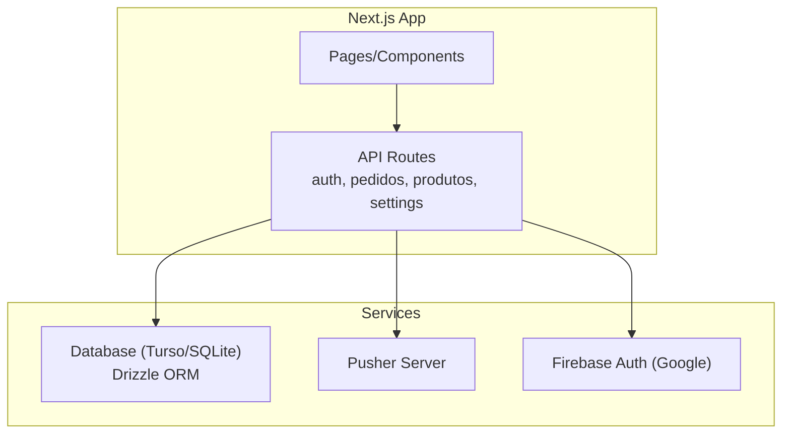
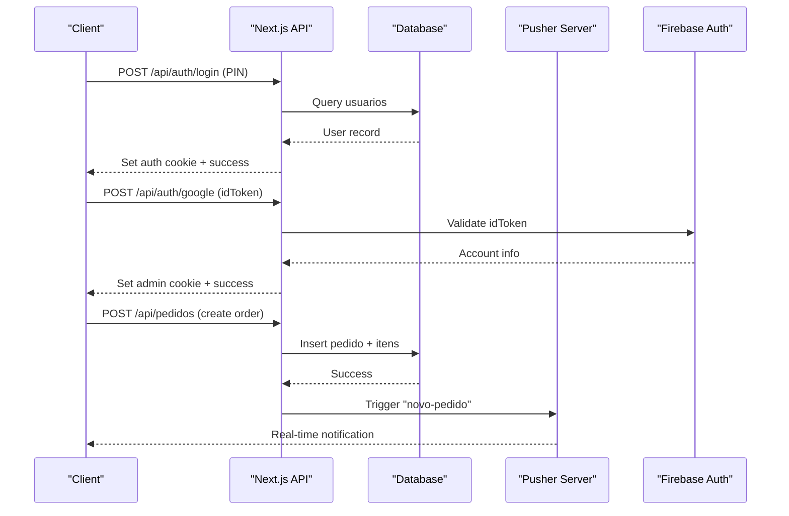
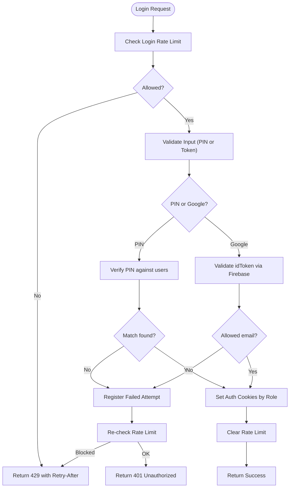
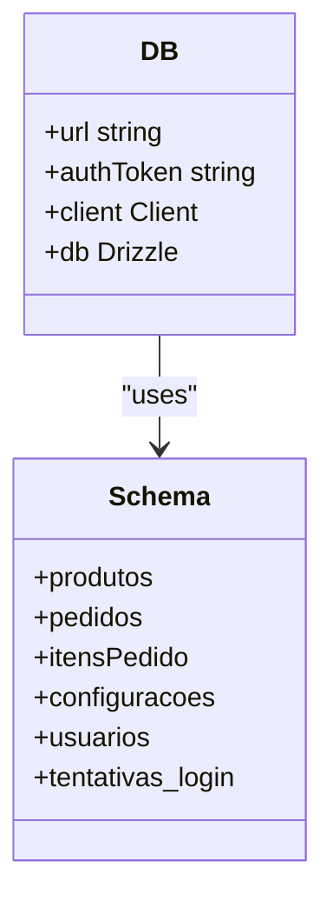
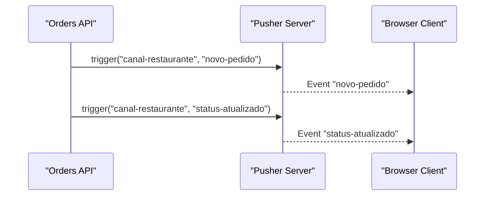
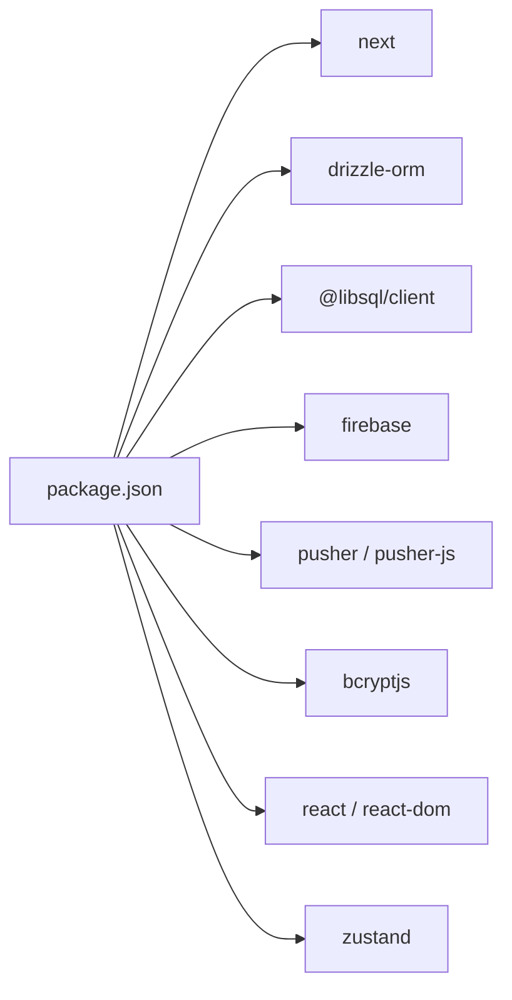

# Troubleshooting & FAQ

<cite>
**Referenced Files in This Document**
- [package.json](file://package.json)
- [drizzle.config.ts](file://drizzle.config.ts)
- [src/db/index.ts](file://src/db/index.ts)
- [src/db/schema.ts](file://src/db/schema.ts)
- [src/db/seed.ts](file://src/db/seed.ts)
- [src/lib/auth.ts](file://src/lib/auth.ts)
- [src/lib/firebase-client.ts](file://src/lib/firebase-client.ts)
- [src/lib/pusher-server.ts](file://src/lib/pusher-server.ts)
- [src/lib/pusher.ts](file://src/lib/pusher.ts)
- [src/lib/login-rate-limit.ts](file://src/lib/login-rate-limit.ts)
- [src/app/api/auth/login/route.ts](file://src/app/api/auth/login/route.ts)
- [src/app/api/auth/google/route.ts](file://src/app/api/auth/google/route.ts)
- [src/app/api/auth/setup/route.ts](file://src/app/api/auth/setup/route.ts)
- [src/app/api/pedidos/route.ts](file://src/app/api/pedidos/route.ts)
- [src/app/api/produtos/route.ts](file://src/app/api/produtos/route.ts)
- [src/app/api/settings/route.ts](file://src/app/api/settings/route.ts)
</cite>

## Table of Contents
1. Introduction
2. Project Structure
3. Core Components
4. Architecture Overview
5. Detailed Component Analysis
6. Dependency Analysis
7. Performance Considerations
8. Troubleshooting Guide
9. Conclusion
10. Appendices

## Introduction
This document provides comprehensive troubleshooting and FAQ guidance for the Meu Cardápio application. It focuses on diagnosing and resolving common issues across authentication, database connectivity, real-time communication (Pusher), and deployment. It includes step-by-step diagnostics, log analysis techniques, debugging strategies, performance optimization tips, security-related troubleshooting, recovery procedures, and escalation paths.

## Project Structure
Meu Cardápio is a Next.js application with:
- API routes under src/app/api for authentication, orders, products, settings, and uploads
- Database schema and Drizzle ORM configuration for Turso/SQLite
- Real-time notifications via Pusher
- Client-side Firebase integration for Google sign-in
- Environment-driven configuration for services and runtime behavior

[No sources needed since this diagram shows conceptual workflow, not actual code structure]

## Core Components
- Authentication: PIN-based login and Google OAuth flow with role-based cookies and rate limiting
- Database: Drizzle ORM over Turso/SQLite with schema definitions and seeding
- Real-time: Pusher server triggers for new orders and status updates; client connection via pusher-js
- Configuration: Settings endpoint to toggle store status and preparation time
- Product management: Admin-only product creation with cache invalidation

**Section sources**
- [src/lib/auth.ts](file://src/lib/auth.ts)
- [src/app/api/auth/login/route.ts](file://src/app/api/auth/login/route.ts)
- [src/app/api/auth/google/route.ts](file://src/app/api/auth/google/route.ts)
- [src/lib/login-rate-limit.ts](file://src/lib/login-rate-limit.ts)
- [src/db/index.ts](file://src/db/index.ts)
- [src/db/schema.ts](file://src/db/schema.ts)
- [src/db/seed.ts](file://src/db/seed.ts)
- [src/lib/pusher-server.ts](file://src/lib/pusher-server.ts)
- [src/lib/pusher.ts](file://src/lib/pusher.ts)
- [src/app/api/pedidos/route.ts](file://src/app/api/pedidos/route.ts)
- [src/app/api/produtos/route.ts](file://src/app/api/produtos/route.ts)
- [src/app/api/settings/route.ts](file://src/app/api/settings/route.ts)

## Architecture Overview
The system uses Next.js API routes as the central control plane. Authentication sets secure cookies based on roles. Orders are persisted in the database and then broadcast via Pusher. Products are cached and invalidated on changes. Settings control operational state like store open/closed.

**Diagram sources**
- [src/app/api/auth/login/route.ts](file://src/app/api/auth/login/route.ts)
- [src/app/api/auth/google/route.ts](file://src/app/api/auth/google/route.ts)
- [src/app/api/pedidos/route.ts](file://src/app/api/pedidos/route.ts)
- [src/lib/pusher-server.ts](file://src/lib/pusher-server.ts)
- [src/lib/firebase-client.ts](file://src/lib/firebase-client.ts)

## Detailed Component Analysis

### Authentication Flow and Rate Limiting
- PIN login validates against hashed PINs stored in users table, sets role-specific cookies, and enforces rate limiting per IP
- Google login validates idToken via Firebase, checks allowed admin emails, and grants admin access
- Rate limiting tracks failed attempts and locks out after threshold using a dedicated table

**Diagram sources**
- [src/app/api/auth/login/route.ts](file://src/app/api/auth/login/route.ts)
- [src/app/api/auth/google/route.ts](file://src/app/api/auth/google/route.ts)
- [src/lib/login-rate-limit.ts](file://src/lib/login-rate-limit.ts)
- [src/lib/auth.ts](file://src/lib/auth.ts)

**Section sources**
- [src/app/api/auth/login/route.ts](file://src/app/api/auth/login/route.ts)
- [src/app/api/auth/google/route.ts](file://src/app/api/auth/google/route.ts)
- [src/lib/login-rate-limit.ts](file://src/lib/login-rate-limit.ts)
- [src/lib/auth.ts](file://src/lib/auth.ts)

### Database Connectivity and Schema
- Connection URL and optional auth token are configured via environment variables
- Drizzle ORM wraps libsql client; schema defines tables for products, orders, items, settings, users, and login attempts
- Seed script initializes default configurations and sample products

**Diagram sources**
- [src/db/index.ts](file://src/db/index.ts)
- [src/db/schema.ts](file://src/db/schema.ts)

**Section sources**
- [src/db/index.ts](file://src/db/index.ts)
- [src/db/schema.ts](file://src/db/schema.ts)
- [src/db/seed.ts](file://src/db/seed.ts)
- [drizzle.config.ts](file://drizzle.config.ts)

### Real-Time Communication (Pusher)
- Server-side Pusher instance created from environment variables; triggers events for new orders and status updates
- Client-side Pusher instance connects using public key and cluster

**Diagram sources**
- [src/app/api/pedidos/route.ts](file://src/app/api/pedidos/route.ts)
- [src/lib/pusher-server.ts](file://src/lib/pusher-server.ts)
- [src/lib/pusher.ts](file://src/lib/pusher.ts)

**Section sources**
- [src/lib/pusher-server.ts](file://src/lib/pusher-server.ts)
- [src/lib/pusher.ts](file://src/lib/pusher.ts)
- [src/app/api/pedidos/route.ts](file://src/app/api/pedidos/route.ts)

### Product Management and Cache Invalidation
- Admin-only product creation with validation and cache invalidation
- GET endpoints return active products for non-admins and all products for admins

**Section sources**
- [src/app/api/produtos/route.ts](file://src/app/api/produtos/route.ts)

### Settings and Store Status
- Admin-only settings update toggles store open/closed and preparation time
- Store closed blocks new orders

**Section sources**
- [src/app/api/settings/route.ts](file://src/app/api/settings/route.ts)
- [src/app/api/pedidos/route.ts](file://src/app/api/pedidos/route.ts)

## Dependency Analysis
Key dependencies include Next.js, Drizzle ORM, libsql client, Firebase SDK, Pusher libraries, bcryptjs, and React/Zustand. Scripts define development, build, and database operations.

**Diagram sources**
- [package.json](file://package.json)

**Section sources**
- [package.json](file://package.json)

## Performance Considerations
- Use caching for product listings and invalidate on changes
- Keep database queries minimal; leverage transactions for order creation
- Monitor Pusher event throughput; ensure network stability
- Profile Node.js memory usage during high load; watch for leaks in long-running processes
- Optimize image handling and CDN usage for product images

[No sources needed since this section provides general guidance]

## Troubleshooting Guide

### Authentication Failures
Symptoms:
- 401 Unauthorized or 403 Forbidden responses
- Repeated 429 Too Many Requests
- Google login blocked despite valid token

Diagnostic steps:
- Verify PIN length and format; check user records exist
- Confirm Google idToken validity and that the email is in the allowed list
- Inspect rate limiting table for lockouts and retry-after headers
- Ensure cookies are set correctly and sameSite/secure flags match environment

Log analysis:
- Look for “Erro no login” and “Erro no login Google” messages
- Check 429 responses and Retry-After values
- Validate environment variables for Firebase keys and allowed emails

Common fixes:
- Reset rate limit counters if necessary
- Update allowed admin emails configuration
- Ensure setup endpoint has been run to create initial admin user

**Section sources**
- [src/app/api/auth/login/route.ts](file://src/app/api/auth/login/route.ts)
- [src/app/api/auth/google/route.ts](file://src/app/api/auth/google/route.ts)
- [src/lib/login-rate-limit.ts](file://src/lib/login-rate-limit.ts)
- [src/app/api/auth/setup/route.ts](file://src/app/api/auth/setup/route.ts)

### Database Connection Issues
Symptoms:
- Errors connecting to Turso or SQLite
- Migration failures or missing tables
- Seed data not applied

Diagnostic steps:
- Confirm TURSO_DATABASE_URL and TURSO_AUTH_TOKEN are set
- Validate drizzle config dialect and credentials
- Run migrations and seed scripts
- Check file permissions for local dev.db when using SQLite

Log analysis:
- Observe errors during db initialization and migration commands
- Review console output from seed script

Common fixes:
- Re-run drizzle push/migrate
- Re-seed data if corrupted
- Ensure correct environment variables for production vs local

**Section sources**
- [src/db/index.ts](file://src/db/index.ts)
- [drizzle.config.ts](file://drizzle.config.ts)
- [src/db/seed.ts](file://src/db/seed.ts)

### Real-Time Communication Errors
Symptoms:
- No Pusher events received
- Events triggered but not delivered
- Client connection fails

Diagnostic steps:
- Verify NEXT_PUBLIC_PUSHER_KEY and NEXT_PUBLIC_PUSHER_CLUSTER are set
- Confirm PUSHER_APP_ID, PUSHER_SECRET, and cluster on server side
- Test Pusher channel subscriptions and event names
- Check network logs for WebSocket connections

Log analysis:
- Watch for Pusher trigger errors in API routes
- Inspect client-side Pusher connection logs

Common fixes:
- Correct environment variables for both client and server
- Ensure TLS is enabled on server Pusher instance
- Validate channel names and event payloads

**Section sources**
- [src/lib/pusher-server.ts](file://src/lib/pusher-server.ts)
- [src/lib/pusher.ts](file://src/lib/pusher.ts)
- [src/app/api/pedidos/route.ts](file://src/app/api/pedidos/route.ts)

### Deployment Challenges
Symptoms:
- Build failures or runtime errors
- Missing environment variables
- Incorrect runtime mode for API routes

Diagnostic steps:
- Ensure required env vars are present in deployment platform
- Verify Next.js runtime settings for Node.js where needed
- Check package scripts and dependency versions

Log analysis:
- Review build logs for dependency resolution issues
- Inspect runtime logs for missing env var errors

Common fixes:
- Add missing environment variables
- Pin dependency versions to avoid drift
- Use appropriate runtime for API routes requiring Node features

**Section sources**
- [package.json](file://package.json)
- [src/app/api/auth/google/route.ts](file://src/app/api/auth/google/route.ts)

### Security-Related Troubleshooting
Symptoms:
- Potential authentication bypass attempts
- Data integrity issues in orders or products
- Vulnerability concerns around tokens and secrets

Diagnostic steps:
- Audit allowed admin emails and token validation logic
- Validate inputs strictly (PIN length, item quantities, prices)
- Ensure secure cookie settings and HTTPS in production
- Monitor failed login attempts and lockout behavior

Common fixes:
- Enforce strict input validation
- Rotate secrets and tokens regularly
- Enable rate limiting and account lockouts
- Review CORS and header policies

**Section sources**
- [src/app/api/auth/google/route.ts](file://src/app/api/auth/google/route.ts)
- [src/app/api/pedidos/route.ts](file://src/app/api/pedidos/route.ts)
- [src/lib/login-rate-limit.ts](file://src/lib/login-rate-limit.ts)
- [src/lib/auth.ts](file://src/lib/auth.ts)

### Recovery Procedures
Corrupted data:
- Restore from backups or re-run seed script to reset defaults
- Validate schema consistency and re-migrate if needed

Failed deployments:
- Roll back to previous known-good version
- Re-validate environment variables and rebuild artifacts

Service outages:
- Restart Next.js process
- Check external service health (Firebase, Pusher, Turso)
- Implement graceful degradation (e.g., disable real-time features temporarily)

[No sources needed since this section provides general guidance]

### Escalation Paths and Support Resources
- Internal escalation: Engage backend team for database and auth issues; frontend team for client-side real-time problems
- External support: Consult Firebase documentation for OAuth issues; Pusher docs for channel/event troubleshooting; Turso docs for database connectivity
- Community assistance: Open issues with detailed logs, environment details, and reproduction steps

[No sources needed since this section provides general guidance]

## Conclusion
This guide consolidates diagnostic procedures, log analysis techniques, and remediation strategies for common Meu Cardápio issues. By following the structured troubleshooting steps and leveraging the provided diagrams and references, teams can quickly identify root causes and restore service reliability. For complex or recurring problems, escalate to specialized support channels and document findings for future reference.

## Appendices

### Frequently Asked Questions (FAQ)
- How do I enable Google login?
  - Configure Firebase environment variables and add allowed admin emails
- Why am I getting 429 Too Many Requests on login?
  - Rate limiting locked your IP after too many failed attempts; wait for retry-after or clear counters
- How do I reset the database to defaults?
  - Re-run seed script and migrations; verify schema and credentials
- Why are Pusher events not arriving?
  - Verify client and server Pusher configuration; check network and TLS settings
- How do I change store status?
  - Use the settings endpoint with admin privileges to toggle open/closed

[No sources needed since this section provides general guidance]